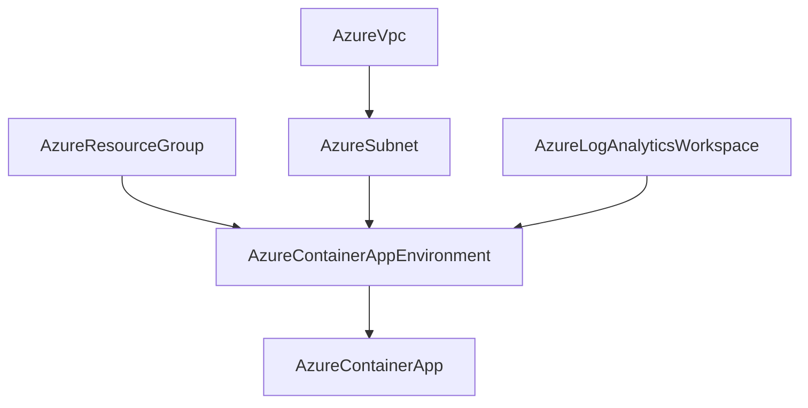

# AzureContainerAppEnvironment Deployment Component

**Date**: February 14, 2026
**Type**: Feature
**Components**: API Definitions, Azure Provider, Pulumi CLI Integration, Terraform Module

## Summary

Added `AzureContainerAppEnvironment` (enum 440, id_prefix `azcae`) as a complete deployment component in OpenMCF. This is the 18th Azure resource kind (R17 in the expansion queue) and the foundation resource for the `container-apps-environment` infra chart. It provisions an Azure Container Apps Managed Environment with full support for VNet injection, Log Analytics integration, internal load balancing, zone redundancy, and dedicated workload profiles.

## Problem Statement / Motivation

Azure Container Apps is Microsoft's fully managed serverless container platform, and the Managed Environment is its core hosting boundary. Without this resource in OpenMCF, users cannot compose container app deployment patterns in infra charts. It is the critical Layer 1 dependency for AzureContainerApp (R18), which defines the actual workloads.

### Pain Points

- No way to provision Azure Container App Environments through OpenMCF
- Cannot build the `container-apps-environment` infra chart without this foundation resource
- AzureContainerApp (R18) is blocked until this environment resource exists

## Solution / What's New

A complete deployment component following the established Azure resource pattern with 8 corrections from the T02 planning spec discovered during deep Terraform provider research.

### Resource Graph

## Implementation Details

### 8 Corrections From T02 Spec

1. **Added `resource_group`** (StringValueOrRef) -- missing from T02 spec, required per DD05
2. **Added `region`** (string) -- missing from T02 spec, per established pattern
3. **Added name validation** -- CEL regex for Azure's naming rules (lowercase, hyphens, starts with letter, 2-60 chars)
4. **Auto-derived `logs_destination`** -- not exposed as a user field; IaC modules set `"log-analytics"` when workspace provided
5. **Workload profiles Consumption handling** -- Azure auto-adds Consumption profile; our field is for dedicated profiles only
6. **Added `platform_reserved_dns_ip_address` output** -- useful for DNS debugging in VNet-injected environments
7. **Dropped `docker_bridge_cidr` output** -- internal networking detail not referenced by any downstream resource
8. **Deliberate 80/20 omissions** -- `mutual_tls_enabled`, `public_network_access`, `infrastructure_resource_group_name`, `dapr_application_insights_connection_string`, `identity`

### Spec Fields

- `region` (required) -- Azure region
- `resource_group` (StringValueOrRef, required) -- references AzureResourceGroup
- `name` (required) -- CEL-validated environment name
- `infrastructure_subnet_id` (StringValueOrRef, optional) -- VNet injection via AzureSubnet
- `log_analytics_workspace_id` (StringValueOrRef, optional) -- centralized logging via AzureLogAnalyticsWorkspace
- `internal_load_balancer_enabled` (optional, default false) -- VNet-only access
- `zone_redundancy_enabled` (optional, default false) -- cross-zone HA
- `workload_profiles` (repeated) -- dedicated compute profiles (D4, D8, E4, E8, GPU)

### Stack Outputs

- `environment_id` -- ARM resource ID (primary, referenced by AzureContainerApp)
- `default_domain` -- app DNS domain
- `static_ip_address` -- environment static IP
- `platform_reserved_cidr` -- reserved infrastructure CIDR
- `platform_reserved_dns_ip_address` -- internal DNS IP

### IaC Modules

**Pulumi**: `containerapp.NewEnvironment` from `github.com/pulumi/pulumi-azure/sdk/v6/go/azure/containerapp`
**Terraform**: `azurerm_container_app_environment` with dynamic `workload_profile` block

Both modules auto-derive `logs_destination` from workspace presence and pass workload profiles without adding Consumption (Azure handles it).

## Benefits

- Unblocks AzureContainerApp (R18) and the `container-apps-environment` infra chart
- 3 StringValueOrRef fields enable full infra-chart composability (DAG wiring)
- 5 outputs provide everything downstream resources and infra charts need
- 34 validation tests ensure spec correctness
- Clean 80/20 surface: 8 spec fields cover 95%+ of production use cases

## Impact

- **Users**: Can now provision Azure Container App Environments with VNet injection, logging, zone redundancy, and dedicated compute
- **Infra charts**: Foundation resource for `container-apps-environment` chart
- **Downstream**: AzureContainerApp (R18) can now reference `environment_id` via StringValueOrRef

## Related Work

- **R16 AzureServicePlan**: Previous resource in queue (completed 2026-02-14)
- **R18 AzureContainerApp**: Next resource, depends on this environment
- **T02 Resource Queue**: R17 of 24 in the Azure resource expansion sub-project
- **DD03 Composite Bundling**: Environment is split from ContainerApp (independent lifecycles)

---

**Status**: Production Ready
**Timeline**: Single session
