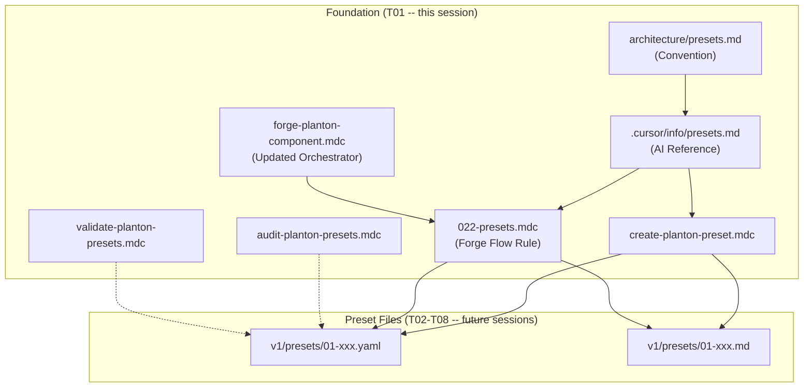

# Presets System Foundation: Convention, Rules, and Forge Integration

**Date**: February 14, 2026
**Type**: Feature
**Components**: Architecture, Cursor Rules, Forge Orchestrator, Documentation

## Summary

Established the complete foundation for the Planton presets system -- production-quality, directly deployable YAML configuration templates for all 213 deployment components. Created the authoritative convention document, AI reference, three Cursor rules for preset lifecycle management (create, audit, validate), a forge flow rule for automatic preset generation during component creation, and a pilot preset for AwsAlb to validate the convention.

## Problem Statement / Motivation

Planton provides a consistent KRM-style structure for deploying infrastructure across any cloud provider, but early adopters report a recurring gap: knowing *what configuration to actually deploy* for a given component. Each component's `spec.proto` defines many fields, and users must synthesize provider documentation, `examples.md`, and `docs/README.md` to determine the right combination for their use case.

### Pain Points

- Users face analysis paralysis when configuring components with 10+ fields
- No ready-made starting points ranked by real-world deployment frequency
- Existing `examples.md` files are documentation (embedded YAML with prose), not deployable artifacts
- Existing `iac/hack/manifest.yaml` files are minimal test fixtures, not production-quality
- No standardized format for sharable, opinionated configuration templates

## Solution / What's New

A presets system that provides ranked, deployable YAML manifests paired with companion markdown documentation for every Planton deployment component. The foundation includes convention documents, Cursor rules, and integration into the existing forge workflow.

### Architecture

## Implementation Details

### Files Created (8 new)

- **`architecture/presets.md`** (~595 lines) -- Authoritative convention document defining what presets are, file naming and ranking conventions, YAML and markdown format specifications, placeholder conventions, and the relationship to existing artifacts (examples.md, hack manifests). Matches the depth and tone of `architecture/deployment-component.md`.

- **`.cursor/info/presets.md`** (~116 lines) -- Concise AI reference for Cursor agents. Follows the directive, no-philosophy style of existing `.cursor/info/` docs. Includes YAML/MD skeletons, CORRECT vs WRONG patterns for StringValueOrRef fields, and ranking guidelines.

- **`_rules/deployment-component/presets/create-planton-preset.mdc`** -- Action rule for creating new presets. Reads spec.proto, api.proto, examples.md, and docs/README.md to craft production-quality presets with proper StringValueOrRef handling.

- **`_rules/deployment-component/presets/audit-planton-presets.mdc`** -- Action rule for scanning components and generating a coverage report identifying missing presets with prioritized recommendations.

- **`_rules/deployment-component/presets/validate-planton-presets.mdc`** -- Action rule for validating preset files against conventions (naming, KRM envelope, StringValueOrRef usage, companion files, required sections).

- **`_rules/deployment-component/forge/flow/022-presets.mdc`** -- Forge flow rule that generates 2-3 initial presets during component creation. Follows the uppercase section header format of existing flow rules (001-021).

- **`apis/.../aws/awsalb/v1/presets/01-internet-facing-https.yaml`** -- Pilot preset validating the convention. Internet-facing ALB with HTTPS, DNS management, deletion protection, and the recommended 60-second idle timeout.

- **`apis/.../aws/awsalb/v1/presets/01-internet-facing-https.md`** -- Pilot preset companion markdown with all required sections (Description, When to Use, Key Configuration Choices, Placeholders to Replace, Related Presets).

### Files Modified (1 existing)

- **`_rules/deployment-component/forge/forge-planton-component.mdc`** -- Added Phase 7 (Presets/Rule 022) between Terraform implementation and final validation. Renumbered validation to Phase 8 (steps 19-20). Updated total from 19 to 20 rules. Added presets to "What Forge Creates" and "Success Criteria" sections.

### Key Design Decisions

- **`value:` wrapper mandatory** for all `StringValueOrRef` fields in presets, ensuring proto-correct serialization and direct deployability
- **Bare (unquoted) YAML values** wherever syntax allows -- unnecessary quotes are clutter
- **`metadata.name` prefixed with `my-`** to signal the name is a template to be renamed
- **No `org`/`env`/`version` in metadata** -- these are deployment-time decisions, not configuration patterns
- **Ranking by real-world frequency**, not complexity -- the "30-second heuristic" for rank 01
- **Existing `examples.md` inconsistency documented** -- they use simplified YAML for StringValueOrRef (plain strings instead of `value:` wrapper), to be fixed incrementally per provider in T02-T08

## Benefits

- **Standardized convention** -- Every preset across all 213 components will follow the same structure
- **AI-assisted creation** -- Cursor rules enable rapid, convention-compliant preset creation
- **Forge integration** -- New components automatically get initial presets during creation
- **Quality enforcement** -- Validate rule catches convention violations before they accumulate
- **Coverage visibility** -- Audit rule identifies gaps and prioritizes recommendations

## Impact

- **End users**: Will get ready-to-deploy configuration templates for every Planton component (starting T02)
- **AI agents**: Have clear authoring guides and rules for creating consistent presets
- **Component authors**: Forge now generates presets as step 18 of the 20-step sequence
- **Platform maintainers**: Convention document serves as the single source of truth for the presets system

## Related Work

- **T02-T08**: Future sessions will create presets for all 213 components by provider (AWS, GCP, Azure, Kubernetes, OpenStack, Scaleway, remaining)
- **`architecture/deployment-component.md`**: The presets convention extends the existing ideal state definition
- **Forge orchestrator**: Presets are now part of the component creation workflow (step 18/20)

---

**Status**: Production Ready
**Timeline**: 1 session (foundation only -- preset creation begins in T02)
