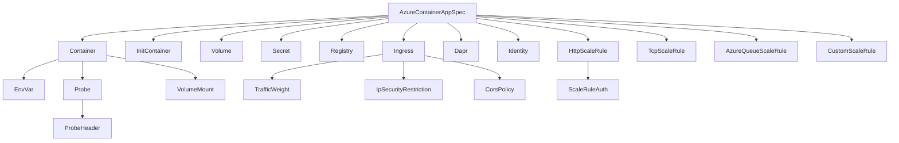

# AzureContainerApp: Full-Feature Container Workload Component

**Date**: February 14, 2026
**Type**: Feature
**Components**: API Definitions, Azure Provider, IaC Modules, Documentation

## Summary

Forged `AzureContainerApp` (R18) -- the most complex Azure component in OpenMCF with 21 message types across 36 files. This is a full-feature implementation of `azurerm_container_app` with zero omissions: containers, init containers, health probes, 4 scale rule types (HTTP/TCP/Azure Queue/Custom KEDA), secrets (plain + Key Vault), registries (username/password + identity), ingress (IP restrictions, CORS, mTLS), volumes, Dapr sidecar, managed identity, and all operational tunables. Build passes, 53/53 validation tests green.

## Problem Statement / Motivation

The Azure resource expansion project (20260212.05.sp.azure-resource-expansion) requires 24 new Azure resource kinds for enterprise workloads. R18 AzureContainerApp is the container workload resource that deploys into the AzureContainerAppEnvironment (R17, already forged). It is the primary workload type for the container-apps-environment infra chart.

### Pain Points

- The T02 spec design had significant gaps: missing secrets block (despite referencing secretRef in env vars), missing registries, missing health probes, missing identity, and generic scale rule typing
- Container App is Azure's container orchestration primitive -- incomplete coverage would force users to manage raw Terraform/Pulumi for production workloads
- No 80/20 omissions requested: the user explicitly asked for "the whole enchilada" to ensure this foundational component has complete coverage

## Solution / What's New

Full-feature AzureContainerApp component with 21 proto message types:

### 14 Corrections from T02 Spec

1. Added `resource_group` (StringValueOrRef) -- missing per DD05
2. Deliberately omitted `region` -- computed from environment
3. Added `secrets` -- critical gap (env var secretRef references require it)
4. Added `registries` -- critical for private images
5. Restructured container fields (cpu as double, memory as string)
6. Added container health probes (liveness, readiness, startup)
7. Added init containers
8. Restructured scale rules to 4 typed variants (HTTP, TCP, Azure Queue, Custom)
9. Added full ingress features (IP restrictions, CORS, mTLS, exposed_port)
10. Added identity block (SystemAssigned, UserAssigned, both)
11. Added volumes and volume mounts (EmptyDir, AzureFile)
12. Added workload_profile_name for dedicated compute
13. Added operational tunables (max_inactive_revisions, cooldown, polling interval, termination grace period, revision_suffix)
14. Fixed name validation to RE2-compatible regex

## Implementation Details

### Proto API (4 files)

- `spec.proto`: 21 message types, comprehensive buf.validate + CEL validation
- `stack_outputs.proto`: 5 outputs (container_app_id, latest_revision_name/fqdn, outbound_ip_addresses, ingress_fqdn)
- `api.proto`: KRM wiring (AzureContainerApp, AzureContainerAppStatus)
- `stack_input.proto`: IaC module input (target + provider config)

### Validation Tests (spec_test.go)

53 tests covering valid and invalid scenarios:
- 20 valid cases: minimal, with ingress, secrets, registries, probes, init containers, scale rules, dapr, volumes, identity, valueFrom references, blue-green, CORS, IP restrictions
- 33 invalid cases: missing required fields, out-of-range values, invalid enum values, name format violations, wrong api_version/kind

### Pulumi Module

- `module/main.go` (~580 lines): Complete `Resources` function with helper builders for every feature
- Uses `containerapp.NewApp` from `pulumi-azure/sdk/v6/go/azure/containerapp`
- Handles conditional ingress FQDN output via `ApplyT`
- Builder functions for containers, init containers, probes, env vars, volumes, scale rules, secrets, registries, ingress, dapr, identity

### Terraform Module

- `main.tf` (~300 lines): `azurerm_container_app` with nested dynamic blocks
- `variables.tf` (~250 lines): Deeply nested type definitions matching proto
- Feature parity with Pulumi module

### Documentation

- `README.md`: User-facing overview with spec fields table and quick examples
- `examples.md`: 10 YAML examples from minimal to enterprise
- `docs/README.md`: Comprehensive research doc (landscape, scaling, networking, secrets, identity)
- `iac/pulumi/README.md`, `iac/pulumi/overview.md`: Module architecture docs
- `iac/tf/README.md`: Terraform module docs

### Presets (3)

1. `01-web-service`: HTTP service with ingress, health probes, HTTP scaling
2. `02-background-worker`: Scale-to-zero worker with Service Bus KEDA rule
3. `03-enterprise-api`: Identity, Key Vault secrets, ACR identity auth, IP restrictions

## Benefits

- **Complete coverage**: Zero omissions from the Terraform provider's capabilities
- **21 message types**: Most complex Azure component, matching the resource's true complexity
- **53 validation tests**: Comprehensive test coverage for all fields and constraints
- **Dual IaC**: Full feature parity between Pulumi and Terraform implementations
- **Infra chart ready**: All cross-resource references use StringValueOrRef for composability
- **3 presets**: Ready-to-deploy templates for common patterns

## Impact

- **Users**: Can deploy Azure Container Apps with full feature coverage through OpenMCF
- **Infra charts**: container-apps-environment chart can now include workload definitions
- **Project**: R18 of 24 Azure resources complete (75% of queue done)

## Code Metrics

- **36 files** total (proto + generated stubs + IaC + docs + presets + test + build)
- **21 message types** in spec.proto
- **53 validation tests** (all passing)
- **~580 lines** Pulumi module (main.go)
- **~300 lines** Terraform module (main.tf)
- **14 corrections** from original T02 spec design

## Related Work

- **Depends on**: AzureContainerAppEnvironment (R17, enum 440)
- **Enables**: container-apps-environment infra chart (T03)
- **Part of**: 20260212.05.sp.azure-resource-expansion (R18 of 24)
- **Next**: R19 AzureFunctionApp (enum 443, id_prefix azfn)

---

**Status**: Production Ready
**Timeline**: Single session (2026-02-14)
