# Azure Presets: All 29 Components

**Date**: February 14, 2026
**Type**: Feature
**Components**: Azure Provider, Presets System, API Definitions

## Summary

Created production-quality presets for all 29 Azure deployment components, adding 55 presets (110 YAML + MD files, ~2,800 lines) across 5 logical batches. This completes the Azure provider's preset coverage as part of the OpenMCF presets initiative (T04). Existing AzureContainerApp presets were rewritten from snake_case to camelCase for consistency with the AWS and GCP providers.

## Problem Statement / Motivation

Azure users face the same challenge as AWS and GCP users: OpenMCF's consistent KRM structure is valuable, but configuring a resource still requires understanding all available fields and making judgment calls about common configurations. Azure's 29 components span foundation infrastructure, Kubernetes, databases, networking, and identity -- a broad surface area where opinionated starting points significantly reduce time-to-deploy.

### Pain Points

- Azure has 29 components with varying complexity (from 2-field Resource Groups to 24-field Container Apps)
- No presets existed for 28 of 29 Azure components (only AzureContainerApp had 3 snake_case presets)
- The 3 existing AzureContainerApp presets used snake_case, inconsistent with the camelCase convention established for AWS (T02) and GCP (T03)
- Complex components like AKS, Application Gateway, and CosmosDB have many configuration axes that benefit from curated starting points

## Solution / What's New

55 presets across all 29 Azure components, organized in 5 batches by architectural tier:

```mermaid
flowchart TB
    subgraph batch1 [Batch 1: Foundation]
        RG[ResourceGroup 1]
        VPC[VPC 2]
        Subnet[Subnet 2]
        PIP[PublicIP 1]
        NAT[NatGateway 1]
        DNS[DnsZone 1]
        DNSRec[DnsRecord 2]
        PDNS[PrivateDnsZone 1]
        LAW[LogAnalytics 1]
    end
    subgraph batch2 [Batch 2: Security]
        NSG[NSG 3]
        KV[KeyVault 2]
        UAI[Identity 2]
        AI[AppInsights 2]
        SA[Storage 2]
    end
    subgraph batch3 [Batch 3: Compute]
        AKS[AKS Cluster 2]
        NP[AKS NodePool 2]
        VM[VirtualMachine 2]
        CAE[ContainerAppEnv 2]
        CA[ContainerApp 3]
        SP[ServicePlan 2]
    end
    subgraph batch4 [Batch 4: Load Balancing]
        LB[LoadBalancer 2]
        AG[AppGateway 2]
        PE[PrivateEndpoint 2]
    end
    subgraph batch5 [Batch 5: Data]
        PG[PostgreSQL 2]
        MySQL[MySQL 2]
        MSSQL[MSSQL 2]
        Cosmos[CosmosDB 3]
        Redis[Redis 2]
        ACR[ContainerRegistry 2]
    end
    batch1 --> batch2 --> batch3 --> batch4 --> batch5
```

### Key Design Decisions

- **camelCase field names** across all Azure presets, matching proto3 JSON canonical form and the convention established by AWS/GCP presets
- **Existing AzureContainerApp presets rewritten** from snake_case to camelCase, including proper `value:` wrapper for StringValueOrRef fields that were previously using simplified form
- **`value:` wrapper mandatory** for all StringValueOrRef fields with descriptive `<angle-bracket>` placeholders
- **Subnet preset renamed** from planned `02-aks-cni` to `02-delegated-postgresql` because AKS doesn't use subnet delegation -- the delegation pattern is the genuinely differentiating use case
- **Storage preset renamed** from planned `02-blob-with-lifecycle` to `02-production-geo-redundant` because the spec doesn't expose lifecycle management fields

## Implementation Details

### Preset Distribution by Component

| Component | Presets | Key Configuration Axes |
|-----------|---------|----------------------|
| azureresourcegroup | 1 | Name + region only |
| azurevpc | 2 | NAT gateway on/off |
| azuresubnet | 2 | General vs delegated (PostgreSQL) |
| azurepublicip | 1 | Zone-redundant static |
| azurenatgateway | 1 | Standard with timeout |
| azurednszone | 1 | Zone only, no inline records |
| azurednsrecord | 2 | A record vs CNAME |
| azureprivatednszone | 1 | PostgreSQL privatelink zone |
| azureloganalyticsworkspace | 1 | PerGB2018 pay-as-you-go |
| azurenetworksecuritygroup | 3 | Web tier / database tier / bastion |
| azurekeyvault | 2 | Standard RBAC vs Premium network-restricted |
| azureuserassignedidentity | 2 | Single role vs multi-role |
| azureapplicationinsights | 2 | Full sampling vs 25% cost-optimized |
| azurestorageaccount | 2 | LRS general vs GRS production |
| azureakscluster | 2 | Public endpoint vs private cluster |
| azureaksnodepool | 2 | On-demand vs spot |
| azurevirtualmachine | 2 | Ubuntu SSH vs Windows RDP |
| azurecontainerappenvironment | 2 | Consumption vs VNet-injected workload profiles |
| azurecontainerapp | 3 | Web service / background worker / enterprise API |
| azureserviceplan | 2 | Standard S1 vs Premium P1v3 zone-balanced |
| azureloadbalancer | 2 | Public vs internal |
| azureapplicationgateway | 2 | HTTP basic vs HTTPS WAF |
| azureprivateendpoint | 2 | SQL Server vs Blob Storage |
| azurepostgresqlflexibleserver | 2 | Public access vs VNet-injected |
| azuremysqlflexibleserver | 2 | Public access vs VNet-injected |
| azuremssqlserver | 2 | Standard DTU vs Business Critical vCore |
| azurecosmosdbaccount | 3 | SQL API / MongoDB API / Serverless |
| azurerediscache | 2 | Standard vs Premium VNet-injected |
| azurecontainerregistry | 2 | Standard vs Premium geo-replicated |

### Code Metrics

- **29 components** covered (100% of Azure provider)
- **55 presets** (110 files total)
- **~2,800 lines** of YAML + Markdown added
- **5 commits** on `feat/azure/expand-components` branch
- **3 existing presets** rewritten (AzureContainerApp snake_case to camelCase)

## Benefits

- **Immediate productivity** -- Azure users can now deploy any of 29 resource types by picking a preset, replacing placeholders, and running `openmcf pulumi up`
- **Consistency** -- All Azure presets follow the same camelCase convention as AWS and GCP, creating a uniform experience across providers
- **Quality reference** -- Each preset's companion markdown documents the configuration rationale, teaching users *why* these values were chosen
- **Cross-reference** -- Placeholder tables include "Where to Find" columns pointing to related OpenMCF components, helping users wire resources together

## Impact

- **Azure provider**: 100% preset coverage (29/29 components)
- **Overall project**: 73/213 components now have presets (44 AWS/GCP + 29 Azure)
- **Remaining**: 140 components across Kubernetes (51), OpenStack (28), Scaleway (18), and 5 smaller providers

## Related Work

- **T01**: Foundation -- convention document, Cursor rules, Forge integration (session 2)
- **T02**: AWS presets -- 25 components, 50 presets (session 3)
- **T03**: GCP presets -- 19 components, 36 presets (session 4)
- **Convention doc**: `architecture/presets.md`
- **AI reference**: `.cursor/info/presets.md`

---

**Status**: Production Ready
**Timeline**: Single session (T04, session 5)
