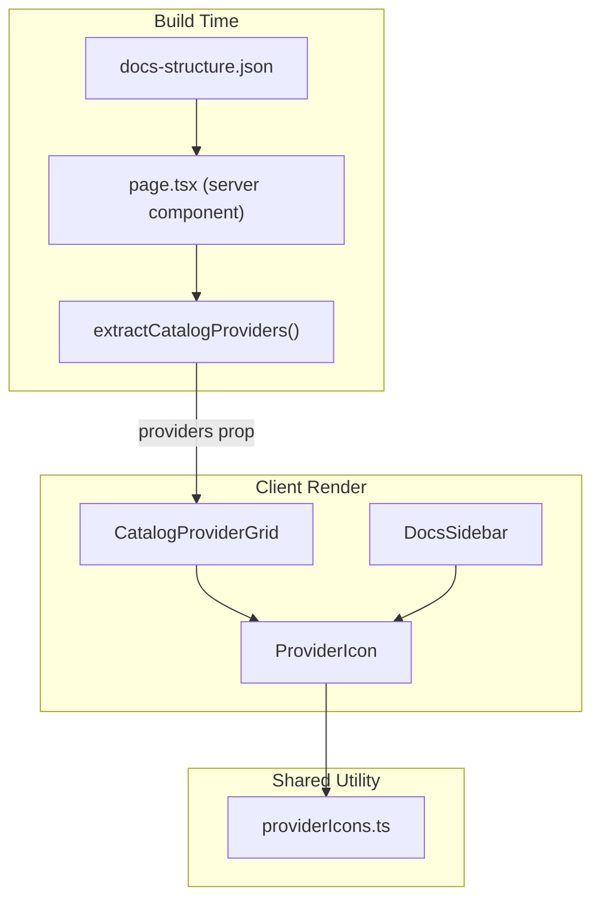

# Data-Driven Catalog Grid with Provider Icon Fallback

**Date**: February 14, 2026
**Type**: Enhancement
**Components**: Documentation Site, Catalog UI, Sidebar Navigation

## Summary

Replaced the hardcoded HTML provider grid on the catalog index page with a data-driven React component that derives provider names, component counts, and icons from the docs structure at build time. Introduced a shared `ProviderIcon` component with letter-badge fallback used by both the catalog grid and the sidebar, eliminating broken icons and stale data.

## Problem Statement / Motivation

The catalog index page (`/docs/catalog`) contained a hardcoded HTML grid with manually maintained provider names, icon paths, and component counts embedded directly in the markdown file.

### Pain Points

- **Broken icons**: Auth0, OpenFGA, and Scaleway referenced `/images/providers/default.svg` which does not exist, causing broken image placeholders visible to users
- **Wrong icon paths**: Auth0 and Scaleway have valid SVG files on disk (`auth0.svg`, `scaleway.svg`), but the markdown pointed to a non-existent `default.svg`
- **Stale component counts**: Any time a new component was added to a provider, the markdown count had to be manually updated — a silent drift risk
- **Duplicated icon logic**: The sidebar maintained a separate hardcoded `providerIconMap` (11 entries) that was missing 3 providers (OpenStack, OpenFGA, Scaleway), and had no `onError` fallback for provider-level icons
- **No fallback mechanism**: The `MDXRenderer`'s `img` handler was an inline arrow function with zero error handling — broken images rendered as browser-default broken image placeholders

## Solution / What's New

### Convention-Based Icon Resolution

Created a centralized icon resolution utility (`providerIcons.ts`) that uses a convention-based path (`/images/providers/{provider}.svg`) with a minimal override map for providers whose filename doesn't match their directory name:

```
atlas        -> mongodb-atlas.svg  (override)
digitalocean -> digital-ocean.svg  (override)
aws          -> aws.svg            (convention)
gcp          -> gcp.svg            (convention)
openfga      -> openfga.svg        (convention, fallback to letter badge)
```

New providers with conventionally-named SVGs need zero code changes.

### Shared ProviderIcon Component

A single React component used by both the sidebar and catalog grid. Attempts to load the SVG; on error, renders a styled letter badge (first letter of the provider name) matching the existing component-icon fallback style.

### Data-Driven Catalog Grid

The catalog grid is now a React component that receives provider metadata as props from the server component at build time. Provider names, component counts, and links are derived from the docs structure tree — never stale.



## Implementation Details

### Files Created

- **`site/src/app/docs/utils/providerIcons.ts`** — Centralized provider icon path resolution. Override map with 2 entries (atlas, digitalocean); all other providers use the naming convention. Single exported function `getProviderIconPath()`.

- **`site/src/app/docs/components/ProviderIcon.tsx`** — Client component with `useState` for error tracking. Uses `next/image` with `onError` handler. On failure, renders a `<span>` letter badge sized to match the requested icon size.

- **`site/src/app/docs/components/CatalogProviderGrid.tsx`** — Client component receiving `CatalogProvider[]` as props. Renders a 2-column responsive grid of provider cards with `ProviderIcon`, display name, and component count. Preserves the existing visual design.

### Files Modified

- **`site/src/app/docs/[[...slug]]/page.tsx`** — Added `extractCatalogProviders()` function that walks the docs structure tree to find catalog directory children and count their file entries. Detects the catalog index route (`path === 'catalog'`) and passes provider data to `MDXRenderer`.

- **`site/src/app/docs/components/MDXRenderer.tsx`** — Added `catalogProviders` optional prop. Renders `CatalogProviderGrid` between the markdown content and the NextArticle navigation. Extracted the inline `img` arrow function into a proper `MarkdownImage` named component with `onError` handling — detects provider icon images and shows letter-badge fallback on failure.

- **`site/public/docs/catalog/index.md`** — Stripped the entire 100-line hardcoded HTML grid. File now contains only frontmatter and the markdown header text. The grid is rendered by React.

- **`site/src/app/docs/components/DocsSidebar.tsx`** — Replaced the 30-line hardcoded `providerIconMap` block with a single `<ProviderIcon>` call. All providers (including previously missing OpenStack, OpenFGA, Scaleway) are now handled uniformly with automatic fallback.

## Benefits

- **Zero broken icons** — every provider gets either its SVG or a professional letter badge
- **Zero stale data** — component counts are derived from the docs structure at build time
- **Single source of truth** — `providerIcons.ts` is the one place that maps provider names to icon paths
- **Zero-code-change new providers** — add an SVG named `{provider}.svg`, add catalog pages, rebuild; grid and sidebar pick it up automatically
- **Reduced code** — removed ~130 lines of hardcoded HTML and duplicated icon maps, added ~120 lines of clean, reusable components
- **Better error resilience** — markdown images throughout the site now have `onError` handling

## Impact

- **End users**: No more broken image icons on the catalog page or sidebar for any provider
- **Documentation maintainers**: Adding a new provider to the catalog no longer requires editing `catalog/index.md` — the grid updates automatically
- **Developers**: Provider icon resolution is centralized; adding a new provider icon requires only the SVG file (convention) or one line in the override map (non-standard name)

## Related Work

- Catalog page rewrite system (2026-02-13): established the catalog page standard and build pipeline
- Docs site UX fixes (2026-02-14): fixed sidebar labels, URL slugs, code copy, inline code styling — this change continues that UX quality push

---

**Status**: Production Ready
**Build**: 271 pages indexed, zero errors
