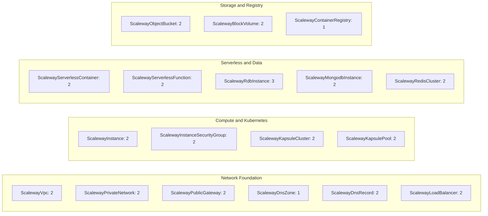

# Scaleway Presets: All 18 Components

**Date**: February 14, 2026
**Type**: Feature
**Components**: Presets System, Scaleway Provider

## Summary

Created 35 production-quality presets (70 files: 35 YAML + 35 MD) covering all 18 Scaleway deployment components. This is T07 in the presets project, bringing the cumulative total to 302 presets across 169 of 213 components (AWS + GCP + Azure + Kubernetes + OpenStack + Scaleway).

## Problem Statement / Motivation

Scaleway users configuring OpenMCF components need to understand all available fields and sensible defaults before deploying. The 18 Scaleway components had `spec.proto` definitions and `examples.md` docs, but no ready-to-deploy preset files representing common real-world configurations.

### Pain Points

- No quick-start manifests for any Scaleway component
- Users must read spec.proto to understand field types and defaults
- StringValueOrRef wrapper requirement (`value:`) is easy to miss
- No recommended_default annotations surfaced in deployable form

## Solution / What's New

### Preset Coverage by Category

### Preset Distribution

- **1 preset**: ScalewayDnsZone, ScalewayContainerRegistry (2 components)
- **2 presets**: 15 components
- **3 presets**: ScalewayRdbInstance (1 component -- PostgreSQL dev, PostgreSQL HA, MySQL)

## Implementation Details

- **70 files** created (35 YAML + 35 MD), ~1,462 lines total
- All presets use **camelCase** field names (proto3 JSON canonical form, consistent with all other providers)
- All `StringValueOrRef` fields use the `value:` wrapper with descriptive `<placeholder>` names
- All `recommended_default` annotations honored with inline comments
- Every YAML has a companion MD with: Description, When to Use, Key Configuration Choices, Placeholders to Replace, Related Presets
- No hack manifests exist for any Scaleway component -- all presets crafted from `spec.proto` + `examples.md`

### Key Patterns

- **Dev/Production pairs**: Most components have a development preset (minimal, public) and a production preset (Private Network, HA, security hardened)
- **Engine-specific database presets**: ScalewayRdbInstance gets 3 presets (PostgreSQL dev, PostgreSQL HA, MySQL) -- consistent with AWS RDS and GCP CloudSQL approach
- **Mutually exclusive fields**: ScalewayRedisCluster `aclRules` vs `privateNetworkId` -- dev preset uses ACL rules (public), production uses Private Network
- **Zone-only DNS**: ScalewayDnsZone gets 1 preset (no inline records) -- consistent with AWS Route53Zone and GCP DnsZone decisions

## Benefits

- **18 components** now have deployable starting points -- 100% Scaleway coverage
- **Time savings**: Users can deploy a production-grade Kapsule cluster or RDB instance in minutes instead of reading docs
- **Consistency**: All Scaleway presets follow the same conventions as AWS, GCP, Azure, Kubernetes, and OpenStack

## Impact

- **End users**: Every Scaleway component now has at least 1 preset, most have 2
- **Project progress**: 169/213 components now have presets (79.3%); remaining: DigitalOcean (15), Cloudflare (8), Civo (12), Snowflake (1), OpenFGA (3) = 44 components

## Related Work

- **T01**: Presets system foundation (`2026-02-14-075740-presets-system-foundation.md`)
- **T02**: AWS presets (`2026-02-14-083641-aws-presets-all-25-components.md`)
- **T03**: GCP presets (`2026-02-14-085825-gcp-presets-all-19-components.md`)
- **T04**: Azure presets (`2026-02-14-093405-azure-presets-all-29-components.md`)
- **T05**: Kubernetes presets (`2026-02-14-100325-kubernetes-presets-all-51-components.md`)
- **T06**: OpenStack presets (`2026-02-14-102629-openstack-presets-all-27-components.md`)

---

**Status**: ✅ Production Ready
**Timeline**: Single session
