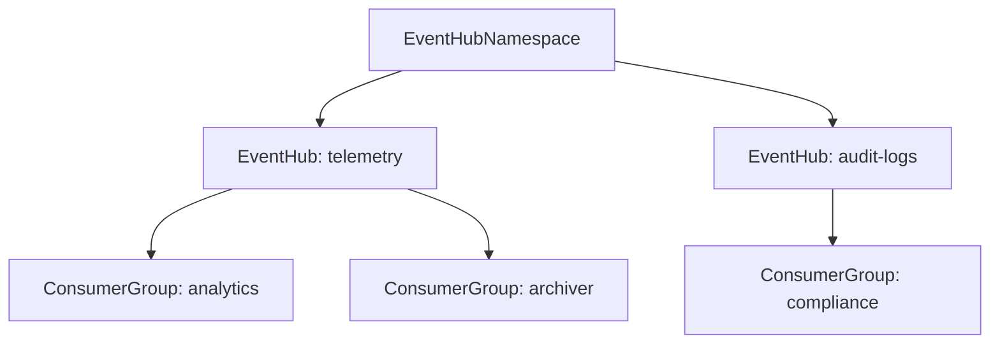

# Azure Event Hub Namespace Component

**Date**: February 14, 2026
**Type**: Feature
**Components**: API Definitions, Azure Provider, Pulumi CLI Integration, Terraform Module

## Summary

Added the AzureEventHubNamespace deployment component (R22) to the Azure provider, bringing real-time event streaming capabilities to OpenMCF. The component bundles an Event Hubs namespace with event hubs and consumer groups, supporting Basic, Standard, and Premium SKU tiers with full Pulumi and Terraform IaC implementations.

## Problem Statement / Motivation

The Azure provider expansion project requires 24 cloud resource kinds to cover enterprise Azure workloads. Event Hubs is Azure's managed event streaming platform -- critical for telemetry ingestion, log aggregation, IoT data pipelines, and real-time analytics. Without this component, teams needing event streaming on Azure would have to provision resources outside OpenMCF, breaking the declarative infrastructure model.

### Pain Points

- No OpenMCF support for Azure event streaming workloads
- Teams forced to manually provision Event Hubs namespaces, event hubs, and consumer groups
- Cannot compose event streaming with other Azure resources in infra charts

## Solution / What's New

AzureEventHubNamespace is a composite deployment component that bundles:
- **Namespace**: The Event Hubs namespace with SKU, capacity, auto-inflate, zone redundancy, TLS, and network access controls
- **Event Hubs**: Streaming entities with configurable partition counts and message retention
- **Consumer Groups**: Nested within each event hub for independent stream consumption

### Architecture



### Key Design Decisions

- **Consumer groups nested inside EventHub message**: Unlike Service Bus where queues/topics are flat at namespace level, consumer groups belong to a specific event hub. Nesting provides a natural API where users don't repeat event hub names.
- **12 corrections from T02 spec**: Added `resource_group` (StringValueOrRef), `region`, `minimum_tls_version`, `public_network_access_enabled`, string+CEL SKU validation, partition count range (1-32), message retention range (1-7), namespace/event hub/consumer group name validations, and `event_hub_ids` map output.
- **Event Hub Capture deliberately omitted**: Archiving to Blob Storage involves storage account dependencies, encoding config, and archive naming. Deferred to v2.
- **Pulumi consumer group legacy pattern**: The Pulumi Azure classic SDK v6 uses `NamespaceName` + `EventhubName` + `ResourceGroupName` for consumer groups (not `NamespaceId`). The module handles this correctly.

## Implementation Details

### Files Created

- **Proto API** (4 files): `spec.proto`, `stack_outputs.proto`, `api.proto`, `stack_input.proto`
- **Spec Tests**: `spec_test.go` with 44 validation tests (22 valid + 22 invalid)
- **Pulumi Module**: `main.go`, `locals.go`, `outputs.go`, entrypoint `main.go`, `Pulumi.yaml`, `Makefile`
- **Terraform Module**: `main.tf`, `variables.tf`, `outputs.tf`, `locals.tf`, `provider.tf`
- **Documentation**: `README.md`, `examples.md`
- **Presets**: `01-standard-streaming.yaml`, `02-premium-enterprise.yaml`, `03-iot-event-ingestion.yaml`
- **Supporting Files**: `iac/hack/manifest.yaml`
- **Enum Registration**: `AzureEventHubNamespace = 471` in `cloud_resource_kind.proto`

### Terraform Consumer Group Flattening

The Terraform module uses a flattened `for_each` to iterate over nested consumer groups:

```hcl
consumer_groups = flatten([
  for eh in var.spec.event_hubs : [
    for cg in eh.consumer_groups : {
      key           = "${eh.name}/${cg.name}"
      eventhub_name = eh.name
      name          = cg.name
      user_metadata = cg.user_metadata
    }
  ]
])
```

### SDK Limitation

`ZoneRedundant` is not exposed in the Pulumi Azure classic SDK v6 (same limitation as AzureServiceBusNamespace R21). The field is available in the Terraform module and commented out in the Pulumi module with a note for future SDK updates.

## Benefits

- **Event streaming on Azure** now fully supported in OpenMCF
- **Infra chart composable**: `primary_connection_string` output enables `valueFrom` wiring into container apps, function apps, and web apps
- **Sibling parity** with AzureServiceBusNamespace (same namespace-level fields, similar structure)
- **44 validation tests** ensure all proto constraints are enforced correctly
- **Dual IaC**: Both Pulumi and Terraform with feature parity (except ZoneRedundant Pulumi SDK gap)

## Impact

- Azure provider now has 23 of 24 planned resource kinds (R23 AzureFrontDoorProfile remaining)
- Messaging category complete: Service Bus (R21) + Event Hubs (R22) cover both message queuing and event streaming patterns
- Enterprise architectures can now include event-driven patterns in infra chart compositions

## Related Work

- **R21 AzureServiceBusNamespace**: Sibling messaging component (message queues + topics)
- **Parent project**: 20260212.05.sp.azure-resource-expansion (22 of 24 resources complete)
- **Next**: R23 AzureFrontDoorProfile (CDN), then T03 infra charts

---

**Status**: Production Ready
**Timeline**: Single session
