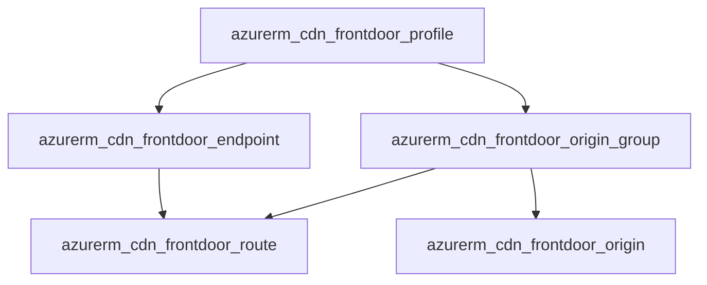

# AzureFrontDoorProfile Deployment Component (R23)

**Date**: February 14, 2026
**Type**: Feature
**Components**: Azure Provider, API Definitions, Pulumi Module, Terraform Module

## Summary

Added AzureFrontDoorProfile as the 24th and final Azure resource kind in the cloud provider expansion project. This composite component bundles Azure Front Door's profile, endpoints, origin groups, origins, and routes into a single coherent deployment unit -- following the same DD03 composite bundling pattern used across all Azure resources.

## Problem Statement / Motivation

Azure Front Door is a global CDN and application delivery network that enterprises need for production web workloads. The Azure provider expansion project (20260212.05) targeted 24 resource kinds to reach comprehensive Azure coverage. AzureFrontDoorProfile was the final resource in the queue, completing the CDN category.

### Pain Points

- No CDN/application acceleration resource in the Azure provider
- Front Door involves 5 Terraform resource types that must be configured together
- Complex nested relationships (endpoints -> routes -> origin groups -> origins) require careful orchestration

## Solution / What's New

### Composite Bundle (5 Azure Resources)

A single AzureFrontDoorProfile manifest provisions all five resource types in dependency order, with name-based cross-references resolved internally by the IaC modules.

### 16 Corrections from T02 Spec

Deep Terraform provider research (`cdn_frontdoor_*.go`) identified 16 corrections from the original T02 plan:

1. Added `resource_group` (StringValueOrRef) per DD05
2. No `region` field -- Front Door is global (like AzurePrivateDnsZone)
3. SKU as string+CEL, not proto enum
4. Added `response_timeout_seconds` (16-240, default 120)
5. Added `certificate_name_check_enabled` on origins (required in TF provider)
6. Added `origin_host_header` (critical for multi-tenant backends)
7. Added `enabled` toggles on endpoints and origins
8. Enriched `load_balancing` with `additional_latency_in_milliseconds`
9. Added `request_type` (GET/HEAD) on health probes
10. Added `session_affinity_enabled` on origin groups
11. Enriched routes with `supported_protocols`, `https_redirect_enabled`, `link_to_default_domain`
12. Added cache block (query string behavior, compression, content types)
13. Added `private_link` on origins (Premium SKU only)
14. Enriched outputs with `endpoint_ids` and `endpoint_hostnames` maps
15. Profile name validation (2-46 chars, alphanumeric + hyphens)
16. Endpoint name validation (same pattern)

### Spec Design

- **9 message types**: Spec, Endpoint, OriginGroup, Origin, LoadBalancing, HealthProbe, PrivateLink, Route, RouteCache
- **16 fields with defaults** via `optional` + `(org.openmcf.shared.options.default)`
- **CEL validations** for SKU, protocols, forwarding protocol, query string caching behavior
- **StringValueOrRef** for `resource_group` (references AzureResourceGroup)

### 80/20 Omissions

Custom domains, WAF policies, rule sets, security policies, secrets, and identity on profile were deliberately omitted. These are separate Terraform resources with independent lifecycles and can be added as standalone OpenMCF resources in the future.

## Implementation Details

### Proto Files (4)
- `spec.proto` -- 9 messages, 576 lines, comprehensive field docs and validations
- `stack_outputs.proto` -- profile_id, profile_name, resource_guid, endpoint_ids map, endpoint_hostnames map
- `api.proto` -- KRM wiring
- `stack_input.proto` -- IaC module input

### IaC Modules
- **Pulumi** (Go): 8 files in `module/` -- profile, endpoint, origin group, origin, route resources with Azure CDN SDK v6
- **Terraform** (HCL): 5 files -- `for_each` over endpoints, origin groups, flattened origins, routes with dynamic blocks for health probe, private link, and cache

### Testing
- 69 spec validation tests (32 valid + 37 invalid)
- Go build passes for all packages
- Enum registered: `AzureFrontDoorProfile = 480` with `id_prefix: "azfd"`

### Presets
- `01-standard-web-acceleration` -- Standard CDN with caching for web apps
- `02-multi-region-api-gateway` -- Multi-origin with health probes and path routing
- `03-premium-enterprise-cdn` -- Premium SKU with Private Link to App Service

## Benefits

- Completes the Azure CDN category in OpenMCF
- Enables global application acceleration and SSL offloading
- Private Link support (Premium) for secure backend connectivity
- Cache configuration for reducing origin load and improving latency
- Health-based failover across geographically distributed origins

## Impact

- **Azure provider**: 34 total resource kinds (10 original + 24 new)
- **Project milestone**: All 24 Azure expansion resources complete
- **Next phase**: T03 infra charts (6 charts)

## Related Work

- Part of 20260212.05.sp.azure-resource-expansion (T02 resource queue)
- Completes the CDN category alongside existing AzureDnsZone/AzureDnsRecord
- Referenced by AzureDnsRecord (CNAME to endpoint hostnames)

---

**Status**: Production Ready
**Timeline**: Single session (R23)
