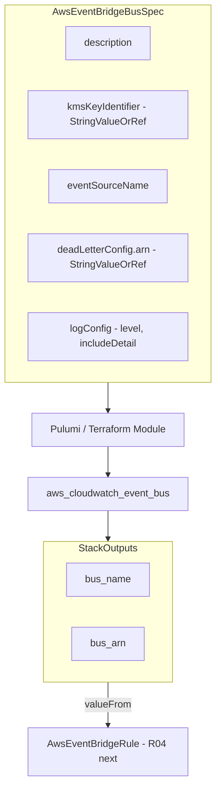

# AWS EventBridge Bus Resource Kind

**Date**: February 15, 2026
**Type**: Feature
**Components**: API Definitions, Pulumi CLI Integration, Terraform Module, Resource Management

## Summary

Added `AwsEventBridgeBus` (enum 227, R03) as the third new AWS resource kind in the cloud provider expansion project. This component provisions custom EventBridge event buses with KMS encryption, dead letter queue routing, and configurable logging — the foundational building block for event-driven architectures on AWS.

## Problem Statement / Motivation

EventBridge is the backbone of event-driven architectures on AWS. Without a custom bus component in Planton, users building event-driven infra charts had to fall back to the default bus or manage custom buses outside the framework, breaking the declarative model.

### Pain Points

- No way to provision isolated event buses through Planton
- No infra-chart composability for event-driven patterns (EventBridge -> Lambda, SQS, SNS)
- The default bus is shared across all AWS services, making access control and encryption difficult for application-specific events

## Solution / What's New

Added a complete `AwsEventBridgeBus` deployment component following the Planton forge workflow.

### Component Overview

## Implementation Details

### Proto API

- **spec.proto**: 5 fields, 2 nested messages (`AwsEventBridgeBusDeadLetterConfig`, `AwsEventBridgeBusLogConfig`), 3 CEL validations
- **StringValueOrRef fields**: `kms_key_identifier` (-> AwsKmsKey), `dead_letter_config.arn` (-> AwsSqsQueue)
- **String + CEL validation**: Log level values (`OFF`/`ERROR`/`INFO`/`TRACE`), include_detail (`NONE`/`FULL`), partner event source name pattern

### Validation Tests

- 18 spec tests covering: happy paths, field constraints, CEL validations (event source name pattern, log level/include_detail values), dead letter config required field, description length

### Pulumi Module (Full Feature Support)

- `module/main.go` — provider setup and orchestration
- `module/locals.go` — tag construction, spec references
- `module/event_bus.go` — creates `cloudwatch.EventBus` with all 5 spec fields + nested blocks
- `module/outputs.go` — `bus_name`, `bus_arn` output constants

### Terraform Module (Core Features)

- Supports: name, event_source_name, tags
- **Note**: `dead_letter_config`, `log_config`, `description`, and `kms_key_identifier` require AWS provider >= 6.x. The TF module pins to 5.82.0 for consistency with other Planton components. Pulumi module provides full feature support.

### Documentation

- README.md with 80/20 field breakdown, use cases, important notes
- examples.md with 5 examples (minimal, production, trace logging, partner, literal ARN)
- docs/README.md with research documentation and design decisions
- catalog-page.md for the resource catalog

### Presets

1. **01-simple-custom-bus** — minimal bus with description
2. **02-production-encrypted-bus** — KMS + DLQ + error logging
3. **03-partner-event-bus** — SaaS partner integration

## Surprise Findings

Two capabilities discovered during deep Terraform provider research that were **not in the T02 planning guidance**:

1. **`dead_letter_config`** — bus-level DLQ for events that fail delivery to any rule target
2. **`log_config`** — logging with level (OFF/ERROR/INFO/TRACE) and include_detail (NONE/FULL)

Both were included in the Pulumi module. The TF module (v5.82.0) does not support these newer attributes.

## Benefits

- Enables event-driven infra chart patterns (EventBridge bus -> rules -> Lambda/SQS/SNS targets)
- `StringValueOrRef` fields ensure composability: KMS key and DLQ wire via `valueFrom` in infra charts
- `bus_arn` output enables downstream `AwsEventBridgeRule` (R04) to reference this bus

## Impact

- **AWS resource coverage**: 27 of ~57 target kinds (25 existing + R01 SQS + R02 SNS + R03 EventBridge Bus)
- **Infra chart readiness**: Foundation for event-driven architecture charts
- **Next resource**: R04 `AwsEventBridgeRule` — attaches rules to this bus for event routing

## Related Work

- `AwsSqsQueue` (R01) — 2026-02-15 — messaging queue, can serve as DLQ for this bus
- `AwsSnsTopic` (R02) — 2026-02-15 — pub/sub messaging, common EventBridge rule target
- `AwsEventBridgeRule` (R04) — next in queue — rules that route events from this bus to targets

---

**Status**: Production Ready
**Timeline**: Single session (~30 min)
