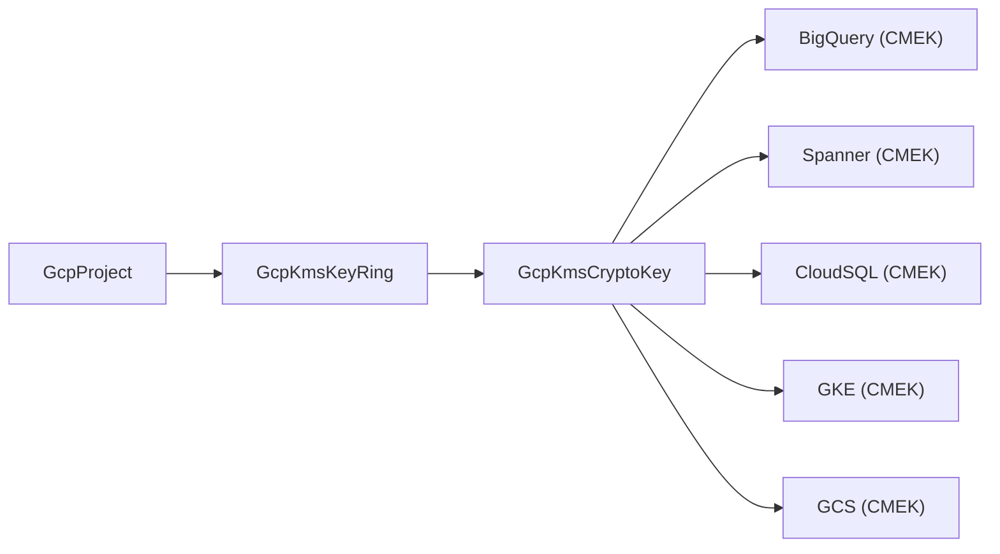

# GCP KMS Key Ring Deployment Component

**Date**: February 15, 2026
**Type**: Feature
**Components**: GCP Provider, API Definitions, Pulumi Module, Terraform Module, Documentation

## Summary

Forged the GcpKmsKeyRing deployment component — a complete production-ready resource for managing GCP Cloud KMS key rings through OpenMCF. This is the foundation security resource that enables customer-managed encryption keys (CMEK) across the entire GCP resource catalog. The component includes protobuf API definitions, Pulumi Go module, Terraform HCL module, 18 validation tests, 3 presets, and comprehensive documentation.

## Problem Statement / Motivation

Cloud KMS key rings are the organizational prerequisite for all CMEK encryption in GCP. Without a GcpKmsKeyRing resource in OpenMCF, users cannot declaratively manage the container that holds their encryption keys. This blocks the entire CMEK dependency chain: KeyRing → CryptoKey → CMEK consumers (BigQuery, Spanner, GKE, CloudSQL, etc.).

### Pain Points

- No way to declaratively create KMS key rings through OpenMCF
- Infra charts requiring CMEK cannot compose encryption resources
- Manual key ring creation breaks IaC reproducibility and auditability

## Solution / What's New

A complete deployment component following the OpenMCF forge workflow (20 steps), covering:

### Proto API (4 files)

- `spec.proto` — 3 fields (`project_id` as StringValueOrRef, `key_ring_name` with regex validation, `location` required)
- `stack_outputs.proto` — 2 outputs (`key_ring_id` as fully qualified path, `key_ring_name`)
- `api.proto` — KRM envelope with GcpKmsKeyRing and GcpKmsKeyRingStatus
- `stack_input.proto` — GcpKmsKeyRingStackInput with target and provider config

### Pulumi Module (4 Go files)

- `main.go` → `locals.go` → `key_ring.go` → `outputs.go`
- Creates `kms.NewKeyRing` with `Name`, `Location`, `Project`
- Exports `key_ring_id` via `.ID()` (fully qualified path for downstream CryptoKey references)

### Terraform Module (5 files + README)

- `provider.tf`, `variables.tf`, `locals.tf`, `main.tf`, `outputs.tf`
- Full feature parity with Pulumi implementation

### 18 Validation Tests

- 9 positive cases: minimal spec, uppercase names, underscores, digits, boundary lengths, global/multi-region locations
- 9 negative cases: missing project, empty name, invalid characters, over-length names, missing location/metadata/spec

### 3 Presets

- `01-regional-key-ring` — standard regional workload pattern
- `02-global-key-ring` — cross-region access without data residency
- `03-multi-region-key-ring` — continental availability with data residency

## Implementation Details

### Key Design Discoveries (Corrections to Plan)

Five corrections were identified during deep-dive research of the Terraform provider and Pulumi SDK:

1. **Missing `key_ring_name` field** — the plan omitted the GCP resource name field. Added to match the `rule_name`/`address_name` pattern.
2. **Unique name validation** — KMS key rings allow uppercase and underscores (`^[a-zA-Z0-9_-]{1,63}$`), unlike most GCP resources that require lowercase-only.
3. **Permanent resources** — key rings cannot be deleted from GCP. Prominently documented in all README files and the catalog page.
4. **No labels support** — GCP KMS key rings do not support resource labels. Labels are computed in `locals.go` for pattern consistency but not applied to the resource.
5. **Fully qualified ID output** — `key_ring_id` exports `projects/{project}/locations/{location}/keyRings/{name}` because that's exactly what `kms.CryptoKey` expects for its `KeyRing` argument.

### Dependency Chain

## Benefits

- **CMEK foundation unlocked** — GcpKmsCryptoKey (R04) can now reference this key ring
- **Infra-chart composability** — `key_ring_id` output via StringValueOrRef enables dependency-aware deployment
- **Validation before deployment** — name pattern, required fields, and location validated via buf.validate before any GCP API call
- **Dual IaC support** — both Pulumi and Terraform with full feature parity
- **Production documentation** — comprehensive README, examples, research docs, and catalog page

## Impact

- **Resource count**: GCP resources in OpenMCF: 19 existing + 3 new (R01 FirewallRule + R02 GlobalAddress + R03 KmsKeyRing) = 22
- **Files created**: 37 files across proto, Go, Terraform, YAML, and Markdown
- **Tests**: 18 (9 positive, 9 negative) — all passing

## Related Work

- **R01 GcpFirewallRule** — first resource forged in this sub-project (networking)
- **R02 GcpGlobalAddress** — second resource forged (networking)
- **R04 GcpKmsCryptoKey** — next resource in queue, direct dependent on this key ring

---

**Status**: Production Ready
