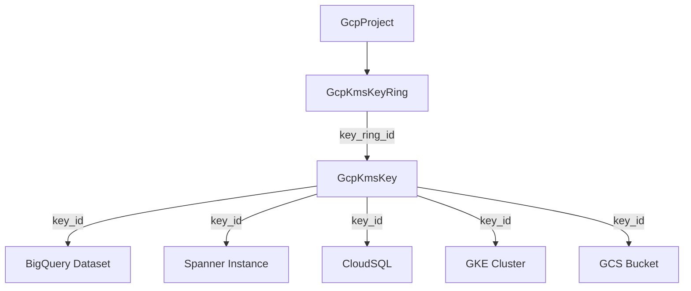

# GcpKmsKey — Cloud KMS Cryptographic Key Resource

**Date**: February 15, 2026
**Type**: Feature
**Components**: API Definitions, GCP Provider, Pulumi Module, Terraform Module

## Summary

Added GcpKmsKey (R04 in the GCP resource expansion project) -- a Cloud KMS cryptographic key resource that depends on GcpKmsKeyRing (R03). This is a critical CMEK foundation resource referenced by BigQuery, Spanner, GKE, CloudSQL, GCS, PubSub, AlloyDB, and other downstream resources for customer-managed encryption. Includes 29 validation tests, full Pulumi/Terraform feature parity, 3 presets, and production-quality documentation.

## Problem Statement / Motivation

Planton's GCP provider lacked the ability to provision KMS cryptographic keys -- the actual encryption resources that downstream services reference for CMEK. While GcpKmsKeyRing (R03) was already available as the container, users could not create the keys themselves through Planton.

### Pain Points

- No way to provision CMEK encryption keys through Planton
- Downstream resources (BigQuery, Spanner, CloudSQL) couldn't reference KMS keys via `StringValueOrRef`
- HSM-protected keys for compliance environments required manual GCP console/gcloud work
- Asymmetric signing keys for CI/CD pipelines couldn't be managed as code

## Solution / What's New

### GcpKmsKey Resource

A complete deployment component with:

- **Proto API** -- 4 proto files with 7 spec fields, GcpKmsKeyVersionTemplate sub-message, CEL validations for purpose, protection_level, and duration format strings
- **Pulumi module** -- 4 Go files creating `kms.CryptoKey` with framework label management and conditional field setting
- **Terraform module** -- 5 files + README with `google_kms_crypto_key`, dynamic `version_template` block
- **29 validation tests** -- 16 positive cases, 13 negative cases covering all purpose values, version template combinations, name validation, and duration format validation
- **3 presets** -- symmetric-encryption (CMEK), hsm-symmetric-encryption (compliance), asymmetric-signing (CI/CD)
- **Production documentation** -- README, examples, research docs, catalog page, Pulumi/TF READMEs

### Naming Decision

Renamed from `GcpKmsCryptoKey` (GCP API name) to `GcpKmsKey` for user-friendliness. "Crypto" is redundant in the KMS context, and Planton already abbreviates (GcpGcsBucket, GcpGkeCluster).

## Implementation Details

### Spec Design (7 fields, 0 cross-field validations)

```
key_ring_id              StringValueOrRef  → GcpKmsKeyRing.status.outputs.key_ring_id
key_name                 string            [a-zA-Z0-9_-]{1,63}
purpose                  string            CEL in [ENCRYPT_DECRYPT, ASYMMETRIC_SIGN, ...]
rotation_period          string            CEL matches ^[0-9]+(\.[0-9]{1,9})?s$
destroy_scheduled_duration string          CEL matches duration format
version_template         GcpKmsKeyVersionTemplate { algorithm, protection_level }
skip_initial_version_creation bool
```

### Dependency Graph



### Deliberate Exclusions

| Field | Reason |
|-------|--------|
| `import_only` | BYOK via import jobs -- requires infrastructure we don't model |
| `crypto_key_backend` | EXTERNAL_VPC -- requires EKM connections we don't model |
| `key_access_justifications_policy` | Beta feature |
| EXTERNAL/EXTERNAL_VPC protection levels | Requires EKM infrastructure |

### Key Design Decisions

- **Labels support**: Unlike GcpKmsKeyRing, CryptoKeys DO support GCP labels. Framework labels are applied automatically.
- **Protection level restricted to SOFTWARE/HSM**: EXTERNAL and EXTERNAL_VPC require EKM connections we don't model.
- **No cross-field CEL validations**: The purpose-to-algorithm compatibility matrix is complex (20+ combinations). GCP API validates this with clear error messages.
- **`key_id` output as fully qualified path**: `projects/{p}/locations/{l}/keyRings/{kr}/cryptoKeys/{name}` -- exactly what all downstream CMEK consumers expect.

## Benefits

- **CMEK capability**: Users can now provision encryption keys and wire them to downstream resources via `StringValueOrRef`
- **Compliance support**: HSM-protected keys for FIPS 140-2 Level 3 environments
- **CI/CD signing**: Asymmetric signing keys for artifact verification
- **Infra chart composability**: `key_id` output enables dependency-aware provisioning across BigQuery, Spanner, GKE, CloudSQL, and more

## Impact

- **New resource kind**: GcpKmsKey (enum 691, id_prefix `gcpkms`)
- **Files created**: ~40 files across proto, Go, Terraform, documentation, and presets
- **Tests**: 29 passing (16 positive, 13 negative)
- **Downstream enablement**: Unlocks CMEK for R05-R12 (BigQuery, Spanner, AlloyDB, Bigtable, PubSub)

## Related Work

- **R03 GcpKmsKeyRing** -- Parent resource, completed in prior session
- **R05+ downstream consumers** -- BigQuery, Spanner, Redis, AlloyDB will reference `key_id` for CMEK
- **GCP Resource Expansion project** -- 4 of 21 resources now complete

---

**Status**: Production Ready
**Timeline**: Single session
