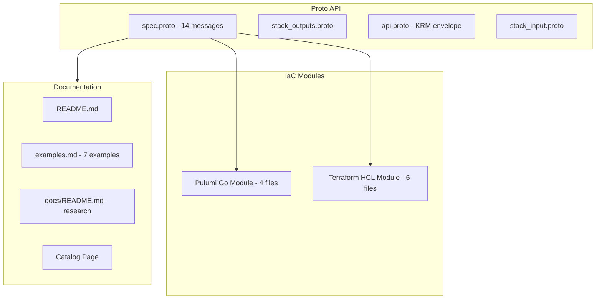

# GcpPubSubTopic Deployment Component

**Date**: February 15, 2026
**Type**: Feature
**Components**: API Definitions, GCP Provider, Pulumi CLI Integration, Terraform Module

## Summary

Added GcpPubSubTopic as a new deployment component in OpenMCF, providing full Pub/Sub topic management with CMEK encryption, message retention, regional storage policies, schema validation, and ingestion from 5 external data sources (AWS Kinesis, AWS MSK, Azure Event Hubs, Cloud Storage, Confluent Cloud). This is the first messaging resource in the GCP provider expansion and a foundation dependency for subscriptions, schedulers, and event pipeline compositions.

## Problem Statement / Motivation

OpenMCF's GCP provider covered compute, storage, networking, databases, and security -- but had zero messaging resources. Pub/Sub is the backbone of event-driven architectures in GCP, and its absence meant users couldn't declaratively provision the most fundamental messaging primitive.

### Pain Points

- No way to provision Pub/Sub topics through OpenMCF
- No cross-resource composability for event pipelines (topic -> subscription -> function)
- No CMEK or regional compliance controls for messaging infrastructure
- No support for Pub/Sub's data ingestion capabilities (cross-cloud data pipelines)

## Solution / What's New

A complete deployment component with 14 proto messages, Pulumi and Terraform implementations, 38 validation tests, 4 presets, and comprehensive documentation.

### Component Architecture

### Spec Design Highlights

The spec covers 7 top-level fields with 14 total proto messages:

- **Core fields**: `project_id` (StringValueOrRef), `topic_name`, `kms_key_name` (StringValueOrRef), `message_retention_duration`
- **Message storage policy**: `allowed_persistence_regions` + `enforce_in_transit` for data sovereignty
- **Schema settings**: `schema` + `encoding` (JSON/BINARY) for message validation
- **Ingestion data source settings**: 5 external sources with 10 sub-messages

### Ingestion Sources

| Source | Fields | Use Case |
|--------|--------|----------|
| AWS Kinesis | stream_arn, consumer_arn, aws_role_arn, gcp_service_account | Cross-cloud stream migration |
| AWS MSK | cluster_arn, topic, aws_role_arn, gcp_service_account | Kafka to Pub/Sub bridge |
| Azure Event Hubs | resource_group, namespace, event_hub, + auth fields | Azure to GCP migration |
| Cloud Storage | bucket (StringValueOrRef), match_glob, format selection | Batch ingestion from GCS |
| Confluent Cloud | bootstrap_server, topic, identity_pool_id, gcp_service_account | Managed Kafka integration |

Cloud Storage's `bucket` field uses `StringValueOrRef` with `default_kind = GcpGcsBucket` for cross-resource composability.

## Implementation Details

### Proto API (14 messages)

- `GcpPubSubTopicSpec` -- 7 fields covering all core topic configuration
- `GcpPubSubTopicMessageStoragePolicy` -- regional constraints + in-transit enforcement
- `GcpPubSubTopicSchemaSettings` -- schema validation with encoding
- 10 ingestion sub-messages covering all 5 data sources + Cloud Storage format types + platform logs
- Topic name validation: `^[a-zA-Z][a-zA-Z0-9\-_\.~+%]*$`, 3-255 chars
- CEL validations on encoding (JSON/BINARY) and severity (DISABLED/DEBUG/INFO/WARNING/ERROR)

### Pulumi Module

4 Go files following established patterns:
- `main.go` -- entry point with provider setup
- `locals.go` -- GCP label computation using topic_name as resource identifier
- `topic.go` -- `pubsub.NewTopic` with dedicated `ingestionDataSourceSettings()` helper
- `outputs.go` -- topic_id (fully qualified) and topic_name constants

The ingestion helper maps each non-nil source from proto to Pulumi args, with Cloud Storage format selection via nil-checks on marker messages (AvroFormat, PubsubAvroFormat, TextFormat).

### Terraform Module

6 HCL files with nested dynamic blocks:
- `main.tf` -- `google_pubsub_topic` with dynamic blocks for message_storage_policy, schema_settings, and ingestion_data_source_settings (5 nested dynamic source blocks + 3 format blocks for Cloud Storage)
- Requires Google provider `~> 6.0` (v6.50.0) -- a version bump from the `~> 5.0` used by other components, needed for the newer ingestion sources and `enforce_in_transit`

### Validation Tests

38 tests (20 positive, 18 negative):
- Positive: minimal topic, CMEK, retention, storage policy, enforce_in_transit, schema settings (JSON/BINARY), Cloud Storage ingestion (text/avro), AWS Kinesis, Confluent Cloud, platform logs, all core fields, topic name edge cases
- Negative: missing required fields, name boundary violations, invalid characters, invalid encoding/severity, empty regions, missing ingestion required fields

## Benefits

- **First messaging primitive** in OpenMCF's GCP provider -- unlocks event-driven architecture patterns
- **Cross-cloud ingestion** -- users can set up data pipelines from AWS/Azure/Confluent to GCP declaratively
- **Full compliance support** -- CMEK encryption + regional storage with in-transit enforcement
- **Foundation for composition** -- `topic_id` output enables GcpPubSubSubscription, GcpCloudSchedulerJob, and event pipeline charts

## Impact

- **Users**: Can now provision Pub/Sub topics with all configuration options through OpenMCF
- **Downstream resources**: R07 (GcpPubSubSubscription) and R18 (GcpCloudSchedulerJob) can reference this component's outputs
- **GCP catalog**: Expanded from 22 to 23 resource kinds
- **Terraform users**: Note the `~> 6.0` provider requirement for ingestion features

## Related Work

- Part of the GCP Resource Expansion project (20260215.01.sp.gcp-resource-expansion)
- R06 in a queue of 21 new GCP resources
- Previous: R05 GcpBigQueryDataset (2026-02-15)
- Next: R07 GcpPubSubSubscription

---

**Status**: Production Ready
**Timeline**: Single session
