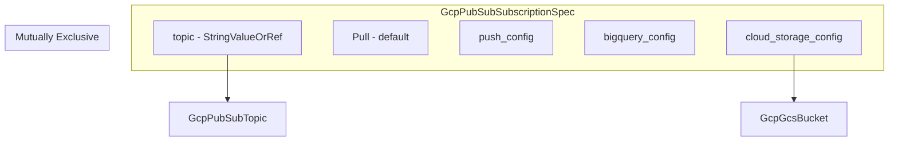

# GcpPubSubSubscription Deployment Component

**Date**: February 15, 2026
**Type**: Feature
**Components**: API Definitions, Pulumi CLI Integration, Terraform Module, Provider Framework

## Summary

Added GcpPubSubSubscription as a new GCP deployment component in Planton, completing the
Pub/Sub resource pair alongside GcpPubSubTopic. The component supports all four GCP delivery
methods (pull, push, BigQuery, Cloud Storage) with dead-letter handling, retry policies,
message ordering, exactly-once delivery, and attribute-based filtering. This is the 7th
new GCP resource kind forged as part of the GCP resource expansion initiative.

## Problem Statement / Motivation

Planton had GcpPubSubTopic for creating Pub/Sub topics but no corresponding subscription
resource. Users could create topics but had to fall back to raw Terraform/Pulumi to create
subscriptions -- breaking the declarative workflow and making infra-chart composition
impossible for event-driven architectures.

### Pain Points

- No way to declare subscriptions in Planton manifests
- Event pipeline infra charts (topic -> subscription -> consumer) were incomplete
- BigQuery and Cloud Storage delivery patterns required manual provisioning
- Dead-letter and retry policies couldn't be expressed declaratively

## Solution / What's New

A complete GcpPubSubSubscription deployment component with:

### Proto API (4 proto files, 12 message types)

- `spec.proto` with 15 top-level fields and 10 sub-messages covering all delivery
  methods, dead-letter, retry, expiration, and filtering
- 2 message-level CEL validations (delivery method mutual exclusion, BigQuery schema exclusion)
- 4 StringValueOrRef fields for infra-chart composability (project_id, topic,
  dead_letter_topic, cloud_storage bucket)

### Pulumi Module (4 Go files)

- `subscription.go` with conditional configuration for all 4 delivery methods
- Pull (default), push (with OIDC and no_wrapper), BigQuery, Cloud Storage
- Dead-letter policy with StringValueOrRef for composable DLQ wiring
- Framework labels applied automatically

### Terraform Module (6 files)

- Feature parity with Pulumi implementation
- Dynamic blocks for all delivery configs
- Google provider `~> 6.0` required for Cloud Storage `max_messages` and
  `avro_config.use_topic_schema`

### Documentation and Presets

- User-facing README, 8 YAML examples, comprehensive research docs
- 4 presets: basic-pull, push-with-oidc, bigquery-delivery, dead-letter
- Catalog page for the Planton documentation site

## Implementation Details

### Delivery Method Architecture

### Key Design Decisions

1. **BigQuery and Cloud Storage delivery included** -- These are core GCP delivery
   methods, not niche features. Excluding them would leave analytics and archival
   pipelines incomplete.

2. **message_transforms excluded** -- JavaScript UDF transforms are a newer, niche
   feature. Users needing this can use raw Terraform/Pulumi.

3. **Terraform provider bumped to `~> 6.0`** -- Cloud Storage subscription features
   (`max_messages`, `avro_config.use_topic_schema`) are not available in v5.x.
   Discovered during implementation when `terraform validate` failed with `~> 5.0`.

4. **subscription_name field added** -- Consistent with the naming pattern established
   in R01-R06 (rule_name, address_name, key_ring_name, key_name, topic_name).

5. **cloud_storage_config.bucket as StringValueOrRef** -- Enables infra-chart
   composability for archival pipelines (topic -> subscription -> bucket).

### Corrections to Planning Phase

| Plan Said | Actual | Reason |
|-----------|--------|--------|
| No bigquery_config | Added | Core delivery method, widely used for analytics |
| No cloud_storage_config | Added | Core delivery method for archival/data lake |
| Flat expiration_policy_ttl | Structured sub-message | Matches GCP API structure |
| TF provider ~> 5.0 | ~> 6.0 required | Cloud Storage fields unavailable in v5.x |
| ~25 tests | 49 tests | More delivery methods = more test combinations |

## Benefits

- **Complete Pub/Sub pair**: Topics and subscriptions can now be fully managed in Planton
- **Four delivery methods**: Pull, push, BigQuery, and Cloud Storage all supported
- **Infra-chart ready**: 4 StringValueOrRef fields enable dependency-aware composition
- **Production reliability**: Dead-letter, retry, exactly-once, and expiration policies
- **49 validation tests**: Comprehensive coverage of all delivery modes and constraints

## Impact

- **Users**: Can now provision complete event-driven pipelines declaratively
- **Infra Charts**: Enables event-pipeline, analytics-pipeline, and archival-pipeline charts
- **Platform**: 7th of 21 GCP resources completed in the expansion initiative

## Related Work

- GcpPubSubTopic (R06) -- Source topic, completed in the same expansion initiative
- GcpBigQueryDataset (R05) -- Target for BigQuery delivery subscriptions
- GcpGcsBucket -- Target for Cloud Storage delivery subscriptions
- Parent project: 20260212.01.planton-cloud-provider-expansion

---

**Status**: Production Ready
**Timeline**: Single session
