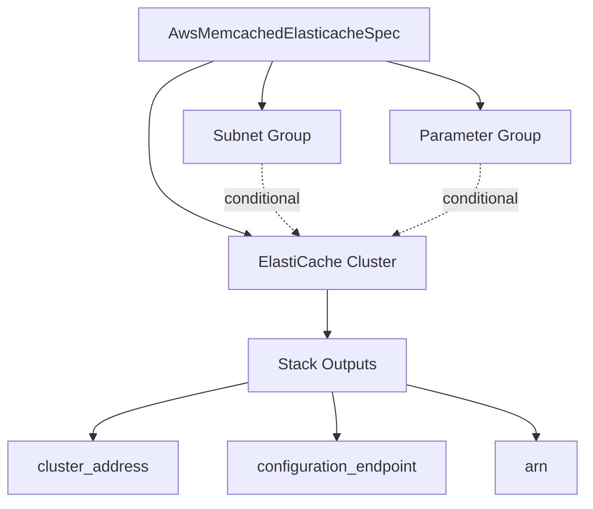

# AWS Memcached ElastiCache Resource Kind (R07a)

**Date**: February 15, 2026
**Type**: Feature
**Components**: API Definitions, Pulumi CLI Integration, Provider Framework

## Summary

Added AwsMemcachedElasticache as a new AWS resource kind in OpenMCF, providing declarative management of ElastiCache Memcached clusters. This is the eighth new AWS resource kind in the expansion project and the sibling component to AwsRedisElasticache (R07), created after deep research revealed that Memcached and Redis use fundamentally different AWS resources with ~15+ unique fields each.

## Problem Statement / Motivation

The original planning phase designed a single `AwsElasticacheCluster` component for both Redis and Memcached. During R07 implementation, deep research into the Terraform provider revealed that:

- Memcached uses `aws_elasticache_cluster` while Redis uses `aws_elasticache_replication_group`
- Memcached has no replication, no persistence, no authentication, no encryption at rest
- The field delta between engines is massive (~15+ unique fields each)
- Combining them would require complex conditional logic and degrade user experience

### Pain Points

- No Memcached caching support in OpenMCF prior to this component
- Users needing simple, high-throughput distributed caches had no declarative option
- Session caching, query result caching, and API response caching patterns were not covered

## Solution / What's New

A focused, clean AwsMemcachedElasticache component that embraces Memcached's simplicity rather than trying to shoehorn it into Redis's model.

### Component Architecture

## Implementation Details

### Proto API (4 files)

- **spec.proto**: 15 fields, 1 nested message (AwsMemcachedElasticacheParameter), 4 CEL validations
- **stack_outputs.proto**: 7 outputs (cluster_id, cluster_address, configuration_endpoint, arn, port, subnet_group_name, parameter_group_name)
- **api.proto**: KRM wrapper with api_version, kind, metadata, spec, status
- **stack_input.proto**: target + provider_config

### Key Spec Fields

| Field | Purpose |
|-------|---------|
| `engine_version` | 3-part version (1.6.22, 1.5.16, etc.) |
| `node_type` | Instance class (cache.t3.micro, cache.r7g.large) |
| `num_cache_nodes` | Horizontal scaling: 1–40 nodes |
| `az_mode` | single-az or cross-az distribution |
| `transit_encryption_enabled` | TLS (engine >= 1.6.12) |
| `subnet_ids` | StringValueOrRef → AwsVpc |
| `security_group_ids` | StringValueOrRef → AwsSecurityGroup |
| `notification_topic_arn` | StringValueOrRef → AwsSnsTopic |

### CEL Validations

1. `az_mode` valid values (single-az, cross-az)
2. cross-az requires num_cache_nodes > 1
3. preferred_availability_zones length matches num_cache_nodes
4. parameters require parameter_group_family

### Pulumi Module (6 files)

- `main.go` — orchestrator with AWS provider setup
- `locals.go` — tag computation from metadata
- `outputs.go` — output key constants
- `subnet_group.go` — conditional subnet group creation
- `parameter_group.go` — conditional parameter group creation
- `cluster.go` — `elasticache.Cluster` with engine="memcached"

### Terraform Module (5 files)

- Feature parity with Pulumi module
- Uses `aws_elasticache_cluster` (not `aws_elasticache_replication_group`)
- Conditional resources via count

### Validation Tests

29 specs, all passing:
- 15 happy path (minimal, multi-node, cross-az, encryption, VPC, parameters, production-ready, etc.)
- 14 failure scenarios (missing required fields, invalid az_mode, cross-az with single node, AZ count mismatch, port range, parameter group dependency, etc.)

### Documentation

- README.md with Memcached vs Redis comparison table, configuration reference, operational notes
- examples.md with 7 examples including infra chart reference pattern
- docs/README.md with architecture deep-dive (topology, auto-discovery, scaling behavior, security model)
- Catalog page at site/public/docs/catalog/aws/memcached-elasticache.md

### Presets

1. `01-single-node-dev` — minimal development cache
2. `02-multi-node-cross-az` — 3-node HA cluster
3. `03-production-encrypted` — TLS, custom parameters, maintenance window

## Benefits

- **Clean separation** — Memcached and Redis are distinct components with focused specs, not a bloated combination
- **Simpler UX** — 15 fields vs Redis's 29; users see only what Memcached actually supports
- **No false promises** — No encryption-at-rest, no auth, no persistence fields that would confuse users
- **Infra chart ready** — StringValueOrRef on all cross-resource fields, rich outputs for downstream wiring

## Impact

- **New resource kind**: AwsMemcachedElasticache (enum 252, id_prefix: awsmemcached)
- **AWS resource coverage**: Now 33 kinds (25 existing + 8 new in expansion project)
- **Files**: ~40 files, ~2500 lines across proto, Go, Terraform, documentation

## Related Work

- **AwsRedisElasticache (R07)** — sibling component for Redis/Valkey caching
- **AwsServerlessElasticache (R07b)** — planned component for ElastiCache Serverless (next in queue)

---

**Status**: Production Ready
**Timeline**: Single session (~2 hours)
