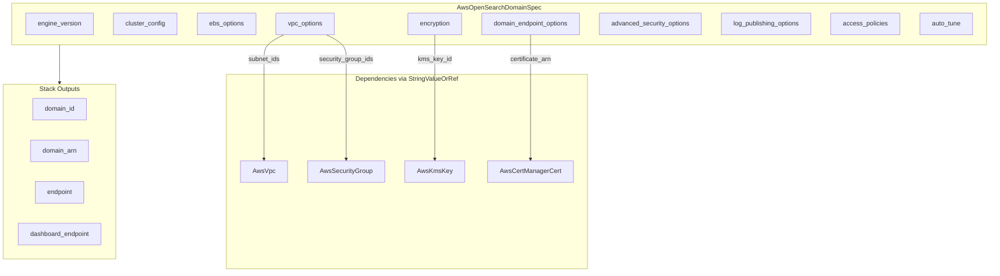

# AWS OpenSearch Domain Resource Kind

**Date**: February 15, 2026
**Type**: Feature
**Components**: API Definitions, Pulumi CLI Integration, Provider Framework, Resource Management

## Summary

Added `AwsOpenSearchDomain` (enum 251) as a new cloud resource kind in OpenMCF, providing managed search, analytics, and observability capabilities via Amazon OpenSearch Service. The component supports cluster configuration with dedicated masters, zone awareness, UltraWarm/cold storage tiers, fine-grained access control (FGAC), VPC deployment, log publishing, and Auto-Tune optimization.

## Problem Statement / Motivation

OpenMCF's AWS provider catalog lacked a managed search and analytics resource. Teams deploying OpenSearch domains had no declarative, validated way to manage them through the framework. OpenSearch is a critical infrastructure component for log analytics, application search, SIEM, and observability workloads.

### Pain Points

- No declarative management of OpenSearch domains in OpenMCF
- OpenSearch has a large configuration surface (cluster topology, storage tiers, encryption, access control, networking) that benefits from validation and sensible defaults
- Cross-resource dependencies (VPC, security groups, KMS keys, CloudWatch log groups, ACM certificates) needed wiring via StringValueOrRef

## Solution / What's New

A complete `AwsOpenSearchDomain` deployment component covering the 80%+ of production OpenSearch use cases with a clean, validated protobuf API.

### Component Overview

## Implementation Details

### Proto API (spec.proto)

- **15 top-level fields** covering engine, cluster config, EBS, encryption, VPC, endpoint options, FGAC, log publishing, access policies, auto-tune, IP type, and advanced options
- **6 nested messages**: ClusterConfig (12 fields), EbsOptions (5 fields), VpcOptions (2 fields), EndpointOptions (5 fields), AdvancedSecurityOptions (5 fields), LogPublishingOption (3 fields)
- **~47 total fields** across all messages
- **7 StringValueOrRef fields** for cross-resource dependencies
- **~25 CEL validations** across all messages enforcing cross-field constraints
- Flattened single-field blocks (encrypt_at_rest, node_to_node_encryption) for YAML ergonomics
- Flattened master_user_options into AdvancedSecurityOptions (3 mutually exclusive fields)

### Validation Tests (spec_test.go)

- **38 spec tests**: 15 happy path + 23 failure scenarios
- Covers all CEL validations, conditional field requirements, mutual exclusions, range constraints
- All tests passing

### Pulumi Module (4 files)

- `main.go` -- Entry point with AWS provider setup
- `locals.go` -- Locals struct with target, spec, and AWS tags
- `outputs.go` -- 5 output constants
- `domain.go` -- Comprehensive `opensearch.Domain` resource creation with conditional blocks for VPC, FGAC, log publishing, auto-tune, custom endpoint

### Terraform Module (6 files)

- `main.tf` -- Single `aws_opensearch_domain` resource with dynamic blocks
- `locals.tf` -- Comprehensive value extraction with safe defaults
- `outputs.tf` -- 5 outputs matching stack_outputs.proto
- `variables.tf` / `provider.tf` / `README.md`
- Feature parity with Pulumi module

### Presets (3)

1. **01-single-node-dev** -- Minimal t3.small.search, gp3 10GB, encryption enabled
2. **02-production-vpc** -- 3 data nodes + 3 masters, 3 AZs, VPC, FGAC, gp3 100GB
3. **03-analytics-warm-cold** -- 3 data + 3 UltraWarm + cold, log publishing, auto-tune

### Documentation

- `README.md` -- User-facing with configuration reference tables
- `examples.md` -- 7 complete YAML examples
- `docs/README.md` -- Architecture deep-dive
- Catalog page at `site/public/docs/catalog/aws/opensearch-domain.md`

## Key Design Decisions

- **Flattened encryption blocks**: `encrypt_at_rest_enabled` + `kms_key_id` + `node_to_node_encryption_enabled` as top-level fields (not nested) -- follows AwsRedisElasticache precedent
- **Flattened master_user_options**: 3 fields directly on AdvancedSecurityOptions message -- TF nests them in a block but the mutual exclusion makes them sparse
- **Advanced security (FGAC) included**: Not in T02 planning guidance but critical for ~60-70% of production domains
- **Log publishing included**: Not in T02 but essential for observability
- **Auto-tune simplified**: TF has complex block with maintenance schedules -- simplified to single bool
- **Off-peak window excluded**: Auto-enabled for new domains with sane defaults
- **Snapshot options excluded**: Deprecated for OpenSearch 5.3+ (automatic hourly snapshots)
- **Cognito/Identity Center/AI-ML excluded**: <5% adoption each, v2 candidates

## Benefits

- **Declarative management** of OpenSearch domains with validated configuration
- **Cross-resource wiring** via StringValueOrRef for VPC, security groups, KMS keys, certificates
- **25 CEL validations** catch misconfigurations before deployment
- **Production-ready defaults** (encryption recommended, HTTPS enforced)
- **Three presets** cover dev, production, and analytics use cases

## Impact

- Adds the 10th new AWS resource kind in the expansion project (R08)
- Enables future infra charts: data-pipeline, log-analytics, search-platform
- Domain outputs (endpoint, ARN) can be referenced by downstream resources

## Related Work

- Part of: 20260215.02.sp.aws-resource-expansion (R08 of ~32)
- Prior: R01 AwsSqsQueue, R02 AwsSnsTopic, R03 AwsEventBridgeBus, R04 AwsEventBridgeRule, R05 AwsHttpApiGateway, R06 AwsStepFunction, R07 AwsRedisElasticache, R07a AwsMemcachedElasticache, R07b AwsServerlessElasticache
- Next: R09 AwsNlb

---

**Status**: Production Ready
**Timeline**: Single session
