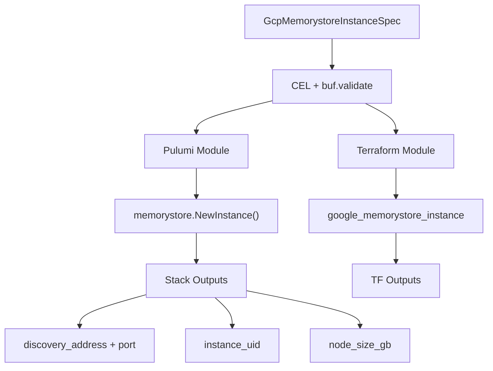

# GcpMemorystoreInstance Deployment Component

**Date**: February 15, 2026
**Type**: Feature
**Components**: GCP Provider, API Definitions, Pulumi Module, Terraform Module

## Summary

Added GcpMemorystoreInstance as a new deployment component for Google Cloud's new-generation Memorystore API. This covers Valkey-engine instances with native sharding, PSC networking, RDB/AOF persistence, automated backups, and CMEK encryption — complementing the existing GcpRedisInstance component that targets the legacy Redis API.

## Problem Statement / Motivation

The existing GcpRedisInstance component covers Google Cloud's legacy Memorystore for Redis API (`google_redis_instance`), which offers simple/HA instances with VPC peering. However, Google has released a new-generation Memorystore API (`google_memorystore_instance`) that provides fundamentally different capabilities:

### Pain Points

- No Planton component for the new Memorystore API with native sharding
- No support for Valkey engine (Redis-compatible, open-source fork)
- No PSC-based networking option (the new standard replacing VPC peering for managed services)
- No AOF persistence option (only RDB was available via GcpRedisInstance)
- No automated backup support for in-memory data stores

## Solution / What's New

### Component Architecture



### Key Features

- **Valkey Engine**: Supports Valkey 7.2 and 8.0 (Redis-compatible)
- **Native Sharding**: Configurable shard_count with CLUSTER or CLUSTER_DISABLED modes
- **PSC Networking**: Private Service Connect endpoints (replacing VPC peering)
- **Dual Persistence**: RDB snapshots and AOF append-only file modes
- **Automated Backups**: Scheduled daily backups with configurable retention
- **CMEK Encryption**: Customer-managed KMS keys for at-rest encryption
- **Zone Distribution**: MULTI_ZONE or SINGLE_ZONE deployment options
- **Node Types**: Four predefined SKUs from dev (SHARED_CORE_NANO) to enterprise (HIGHMEM_XLARGE)

## Implementation Details

### Proto API (4 files, 8 message types)

- `spec.proto`: 18 fields with 8 sub-messages covering PSC connections, persistence (RDB + AOF), zone distribution, maintenance windows, and automated backups
- `stack_outputs.proto`: 4 outputs (discovery_address, discovery_port, instance_uid, node_size_gb)
- `api.proto`: KRM envelope with `gcp.planton.dev/v1` API version
- `stack_input.proto`: Stack input with GcpProviderConfig

Notable CEL validations:
- Mode in-list (CLUSTER, CLUSTER_DISABLED)
- Node type in-list (4 SKUs)
- Persistence cross-field: rdb_config required when mode=RDB, aof_config when mode=AOF
- Zone distribution cross-field: zone required when mode=SINGLE_ZONE
- Instance name regex: `^[a-z][a-z0-9-]{2,61}[a-z0-9]$` (4-63 chars)

### Pulumi Module (4 Go files)

The most interesting implementation detail is the output extraction. The new Memorystore API uses deeply nested PSC endpoint structures. We extract the discovery endpoint using `ApplyT`:

```go
discoveryAddress := createdInstance.Endpoints.ApplyT(
    func(endpoints []memorystore.InstanceEndpoint) string {
        // Search for CONNECTION_TYPE_DISCOVERY first, fallback to any connection
        for _, ep := range endpoints {
            for _, conn := range ep.Connections {
                if conn.PscAutoConnection != nil &&
                   conn.PscAutoConnection.ConnectionType != nil &&
                   *conn.PscAutoConnection.ConnectionType == "CONNECTION_TYPE_DISCOVERY" {
                    return *conn.PscAutoConnection.IpAddress
                }
            }
        }
        return ""
    },
).(pulumi.StringOutput)
```

### Terraform Module (6 files)

Uses `google` provider `~> 6.0` (required for `desired_auto_created_endpoints` and `automated_backup_config`). Dynamic blocks for all optional sub-resources. Output extraction uses `try()` for safe nested access.

### Validation Tests (54 tests)

- 28 positive cases covering all field combinations, boundary values, all enum values
- 26 negative cases covering missing required fields, invalid values, cross-field violations

## Benefits

- **Full Memorystore coverage**: Planton now supports both the legacy Redis API and the new-generation Memorystore API
- **Modern networking**: PSC support aligns with Google Cloud's direction for managed service connectivity
- **Production-ready**: Automated backups, CMEK, zone distribution, and maintenance windows out of the box
- **Infra-chart composable**: StringValueOrRef on project_id, network, and kms_key enables dependency wiring

## Impact

- **GCP users**: Can now provision new-generation Memorystore instances (Valkey) through Planton
- **Existing GcpRedisInstance users**: No changes — legacy component remains fully supported
- **Infra chart authors**: New building block for caching layers in composed environments

## Related Work

- **GcpRedisInstance** (R08): Legacy Memorystore for Redis — VPC peering, simple/HA tiers
- **GcpKmsKey** (R04): CMEK key referenced by this component's `kms_key` field
- **GcpVpc** (existing): VPC network referenced by PSC auto-connections

---

**Status**: Production Ready
**Enum**: GcpMemorystoreInstance = 636 (id_prefix: gcpmsi)
**Files Created**: ~45 files across proto, Go, Terraform, documentation, and presets
