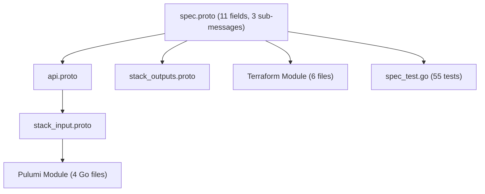

# GCP Spanner Instance Deployment Component

**Date**: February 15, 2026
**Type**: Feature
**Components**: API Definitions, GCP Provider, Pulumi CLI Integration, Provider Framework

## Summary

Added GcpSpannerInstance (R09) as a new deployment component in OpenMCF, enabling declarative provisioning of Google Cloud Spanner instances with support for three capacity models (fixed nodes, processing units, autoscaling), three editions (STANDARD, ENTERPRISE, ENTERPRISE_PLUS), free instances for development, and automatic backup scheduling. The component includes full Pulumi and Terraform implementations with feature parity, 55 validation tests, and production-quality documentation.

## Problem Statement / Motivation

Cloud Spanner is Google's globally distributed, strongly consistent relational database -- a critical service for mission-critical applications that need horizontal scalability without manual sharding. OpenMCF's GCP provider coverage lacked Spanner support, leaving users without a declarative way to provision Spanner instances through the framework.

### Pain Points

- No way to provision Spanner instances through OpenMCF manifests
- Spanner's complex capacity model (nodes vs processing units vs autoscaling) required careful validation to prevent misconfiguration
- FREE_INSTANCE type (zero-cost development) needed special handling -- cannot set capacity, edition, or automatic backups
- Edition field (STANDARD/ENTERPRISE/ENTERPRISE_PLUS) was missing from the T01 plan but is a significant pricing and feature lever
- GcpSpannerDatabase (next in queue) needs a Spanner instance to reference

## Solution / What's New

A complete deployment component following the forge workflow pattern, with corrections to the original plan based on deep research into the Terraform provider and Pulumi SDK.

### Component Structure

## Implementation Details

### Proto API

- **11 spec fields**: project_id (StringValueOrRef), instance_name, config, display_name, num_nodes, processing_units, autoscaling_config, instance_type, edition, default_backup_schedule_type, force_destroy
- **3 sub-messages**: GcpSpannerInstanceAutoscalingConfig, GcpSpannerInstanceAutoscalingLimits, GcpSpannerInstanceAutoscalingTargets
- **4 message-level CEL validations**: capacity mutual exclusion (3-way), FREE_INSTANCE restrictions (no capacity, no edition, no AUTOMATIC backup)
- **3 sub-message CEL validations**: autoscaling limits unit consistency, max >= min for both nodes and processing_units

### Corrections to T01 Plan

| Field | T01 Plan | Actual Implementation | Rationale |
|-------|----------|----------------------|-----------|
| `instance_name` | Not in plan | Added (required, immutable) | Consistent with R01-R08 pattern; GCP requires explicit name |
| `display_name` | Optional | Required | Both Terraform and Pulumi mark it as required |
| `edition` | Not in plan | Added | Significant pricing/feature lever (STANDARD/ENTERPRISE/ENTERPRISE_PLUS) |
| `instance_type` | Not in plan | Added | FREE_INSTANCE enables zero-cost dev; great UX differentiator |
| `default_backup_schedule_type` | Not in plan | Added | Controls automatic backup behavior for new databases |
| TF provider | `~> 5.0` | `~> 6.0` | v5.x does not support instance_type, edition, default_backup_schedule_type |

### IaC Modules

- **Pulumi**: `spanner.NewInstance` with conditional field setting for all three capacity modes, framework labels via `gcplabelkeys`
- **Terraform**: `google_spanner_instance` with dynamic `autoscaling_config` block, provider `~> 6.0`

### Validation Tests

55 tests (25 positive, 30 negative) covering:
- All capacity modes (nodes, processing_units, autoscaling)
- All editions (STANDARD, ENTERPRISE, ENTERPRISE_PLUS)
- FREE_INSTANCE type with all restriction validations
- Instance name regex boundary testing (6 and 30 chars)
- Display name boundary testing (4 and 30 chars)
- Autoscaling limits: unit consistency, max >= min
- Capacity mutual exclusion (all 3 combinations)
- Full-load scenario with all optional fields

### Documentation

- `README.md`: User-facing overview with capacity model, editions, and output descriptions
- `examples.md`: 6 examples from free instance to full production
- `docs/README.md`: Comprehensive research document covering architecture, deployment landscape, capacity model, edition model, and 80/20 scoping rationale
- `catalog-page.md`: Production catalog page following the ALB exemplar structure

### Presets

1. **free-instance**: Zero-cost development instance
2. **regional-production**: Single node, ENTERPRISE edition, automatic backups
3. **autoscaling-production**: Autoscaling 1-3 nodes, ENTERPRISE edition, CPU/storage targets

## Benefits

- GCP users can now provision Spanner instances declaratively through OpenMCF
- FREE_INSTANCE preset enables zero-cost development without modifying production configs
- Autoscaling support eliminates manual capacity planning for variable workloads
- 55 validation tests catch misconfigurations (mutual exclusion, FREE_INSTANCE restrictions) before any API calls
- GcpSpannerDatabase (R10) can now reference this instance via `StringValueOrRef`

## Impact

- **Users**: Can deploy Spanner instances via `openmcf apply -f` with validation
- **Infra Charts**: `gcp-spanner-application` chart can compose Instance + Database
- **R10 GcpSpannerDatabase**: Unblocked -- can reference `status.outputs.instance_name`
- **Enum 633 registered**: `cloud_resource_kind.proto` updated

## Related Work

- Part of the GCP Resource Expansion project (20260215.01.sp.gcp-resource-expansion)
- 10th resource forged (R01-R08b complete, R09 now done)
- Next: R10 GcpSpannerDatabase

---

**Status**: Production Ready
**Timeline**: Single session
