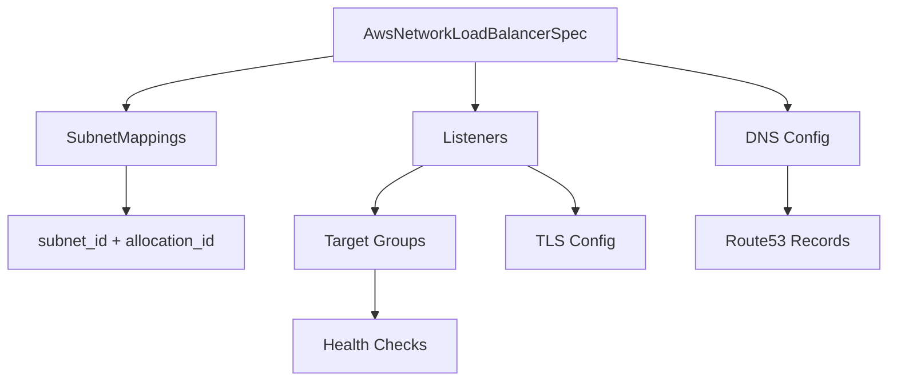

# AWS Network Load Balancer Resource Kind

**Date**: February 15, 2026
**Type**: Feature
**Components**: API Definitions, Pulumi CLI Integration, Terraform Module, Provider Framework

## Summary

Added AwsNetworkLoadBalancer (R09) as a new deployment component to OpenMCF, providing Layer 4 load balancing with bundled listeners and target groups, static IP support via Elastic IP subnet mappings, TLS termination, and Route53 DNS management. This is the eleventh new AWS resource kind in the cloud provider expansion project.

## Problem Statement / Motivation

OpenMCF's AWS load balancing coverage was limited to the Application Load Balancer (Layer 7). Many production workloads require Layer 4 load balancing for:

- TCP/UDP protocol support (databases, gaming, IoT, DNS)
- Static IP addresses for firewall allowlisting and DNS pinning
- TLS passthrough or NLB-level TLS termination
- Ultra-low latency and millions of connections per second
- NLB-in-front-of-ALB patterns combining static IPs with HTTP routing

### Pain Points

- No Layer 4 load balancer component in OpenMCF
- Users needing static IPs had no standardized component
- TCP/UDP workloads could not be load balanced through OpenMCF
- No way to compose NLB with other OpenMCF resources via StringValueOrRef

## Solution / What's New

### AwsNetworkLoadBalancer Component

A complete deployment component at `apis/org/openmcf/provider/aws/awsnetworkloadbalancer/v1/` with:

## Implementation Details

### Proto API (7 messages, ~45 fields, ~20 CEL validations)

- **AwsNetworkLoadBalancerSpec** — 9 top-level fields including subnet_mappings (with EIP allocation), security_groups, cross-zone LB, IP address type, DNS routing policy
- **AwsNetworkLoadBalancerSubnetMapping** — subnet_id (StringValueOrRef -> AwsVpc), allocation_id (StringValueOrRef), private_ipv4_address
- **AwsNetworkLoadBalancerListener** — name (map key), port, protocol (TCP/UDP/TLS/TCP_UDP), TLS config, TCP idle timeout, ALPN policy, inline target group
- **AwsNetworkLoadBalancerTlsConfig** — certificate_arn (StringValueOrRef -> AwsCertManagerCert), ssl_policy
- **AwsNetworkLoadBalancerTargetGroup** — port, protocol, target_type (instance/ip/alb), health check, deregistration delay, preserve_client_ip, proxy_protocol_v2, connection_termination, stickiness
- **AwsNetworkLoadBalancerHealthCheck** — protocol (TCP/HTTP/HTTPS), port, path, thresholds, interval, timeout, matcher
- **AwsNetworkLoadBalancerDns** — enabled, route53_zone_id (StringValueOrRef -> AwsRoute53Zone), hostnames

### Key Design Decisions

1. **Listeners bundled with target groups** — NLB only supports forward actions (no fixed-response/redirect like ALB). A listener without a target group is functionally useless. Each listener includes an inline target group definition.

2. **Subnet mappings instead of flat subnets** — Unlike ALB's simple subnet list, NLB uses subnet_mapping to support Elastic IP allocation for static public IPs. This is a primary differentiator of NLB over ALB.

3. **Map-keyed outputs** — Listener ARNs and target group ARNs are exported as maps keyed by listener name, enabling downstream services (ECS, EKS) to reference specific target groups via `valueFrom`.

4. **Security groups optional** — Unlike ALB where security groups are effectively required, NLB works without them. Field is optional.

5. **Named AwsNetworkLoadBalancer** — Full name instead of abbreviated AwsNlb, consistent with planned AwsApplicationLoadBalancer rename of AwsAlb.

### Validation Tests — 59 tests, all passing

- 25 happy path scenarios (minimal, TLS, UDP, TCP_UDP, static IPs, internal, cross-zone, DNS, health checks, production-ready)
- 34 failure scenarios (missing required fields, invalid protocols, range violations, cross-field CEL violations)

### Pulumi Module — 6 files

- `main.go` — Entry point, provider setup, orchestration
- `locals.go` — Tags, resource reference
- `outputs.go` — Output constant keys
- `nlb.go` — LoadBalancer creation with subnet mappings
- `listener.go` — Listener + target group creation with map-keyed outputs
- `dns.go` — Route53 alias records

### Terraform Module — 6 files

- `main.tf` — LB, target groups (for_each), listeners (for_each), DNS records
- `locals.tf` — Computed values, listener map, tags
- `variables.tf` — Input variables matching proto schema
- `outputs.tf` — Feature parity with Pulumi outputs
- `provider.tf` — AWS provider requirement
- `README.md` — Usage instructions

### Documentation

- `README.md` — NLB vs ALB comparison, spec reference, use cases
- `examples.md` — 7 examples from minimal to production
- `docs/README.md` — Architecture deep-dive (Layer 4, static IPs, client IP preservation, scaling model)
- `catalog-page.md` — Catalog page (audited, zero Critical issues)

### Presets

- `01-tcp-internal` — Internal TCP NLB for microservice communication
- `02-tls-internet-facing` — Internet-facing with TLS termination and ACM certificate
- `03-static-ip-production` — Production with Elastic IPs, TLS, DNS, health checks, cross-zone

### Enum Registration

- `AwsNetworkLoadBalancer = 280` in `cloud_resource_kind.proto`
- id_prefix: `awsnlb`

## Benefits

- **Layer 4 load balancing** — TCP, UDP, TLS, and TCP_UDP protocol support for non-HTTP workloads
- **Static IP addresses** — Elastic IP allocation per subnet for firewall allowlisting and DNS pinning
- **Composable infrastructure** — Map-keyed target group ARN outputs enable downstream ECS/EKS target registration via valueFrom
- **TLS termination** — Offload TLS processing from application servers with ACM certificate management
- **Production-ready** — Comprehensive health checks, connection draining, client IP preservation, Proxy Protocol v2

## Impact

- Adds the 36th AWS resource kind to OpenMCF (26th total, 11th new in the expansion project)
- Completes Layer 4 load balancing coverage alongside existing ALB (Layer 7)
- Enables NLB-in-front-of-ALB pattern via `alb` target type
- Unblocks infra charts requiring static IPs or TCP load balancing

## Related Work

- Previous session: AwsOpenSearchDomain (R08)
- Next in queue: AwsElasticIp (R10) — will enable `default_kind` for allocation_id
- Parent project: 20260212.01.openmcf-cloud-provider-expansion
- Sub-project: 20260215.02.sp.aws-resource-expansion

---

**Status**: Production Ready
**Timeline**: Single session
