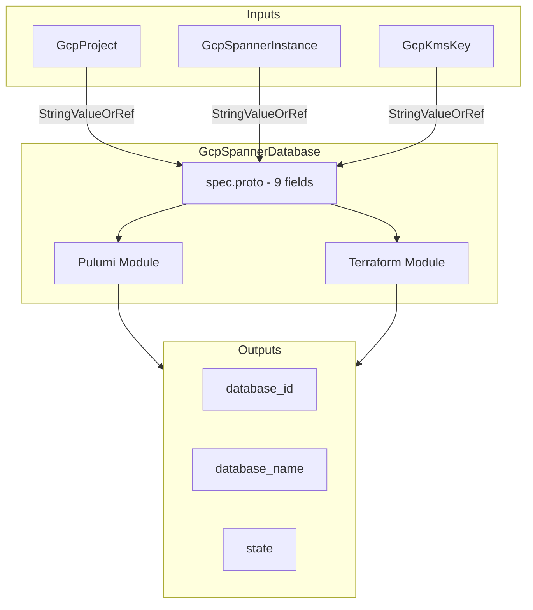

# GCP Spanner Database Deployment Component

**Date**: February 15, 2026
**Type**: Feature
**Components**: API Definitions, GCP Provider, Pulumi CLI Integration, Resource Management

## Summary

Added a new GcpSpannerDatabase deployment component to OpenMCF, enabling declarative provisioning of Cloud Spanner databases within existing Spanner instances. The component supports GoogleSQL and PostgreSQL dialects, initial DDL schema creation, CMEK encryption, configurable point-in-time recovery, and GCP API-level drop protection.

## Problem Statement / Motivation

GcpSpannerInstance (R09) was already available but only provisions the compute container. Users had no way to declaratively create Spanner databases -- the actual containers of tables, indexes, and data. Without GcpSpannerDatabase, the Spanner story in OpenMCF was incomplete: you could create the "server" but not the "database."

### Pain Points

- No declarative database creation within Spanner instances
- No infra-chart composability for the Spanner instance-to-database dependency
- Manual database creation required outside OpenMCF after instance provisioning
- No way to enforce CMEK encryption or drop protection through OpenMCF manifests

## Solution / What's New

### GcpSpannerDatabase (R10, enum 634, id_prefix: gcpspdb)

A complete deployment component following the established OpenMCF forge pattern:

## Implementation Details

### Proto API (4 proto files)

- `spec.proto` -- 9 fields with 1 CEL validation (database_dialect in-list)
- `stack_outputs.proto` -- 3 outputs (database_id, database_name, state)
- `api.proto` -- KRM envelope with `gcp.openmcf.org/v1` apiVersion
- `stack_input.proto` -- target + GcpProviderConfig

### Spec Fields

| Field | Type | Notes |
|---|---|---|
| `project_id` | StringValueOrRef | GcpProject reference |
| `instance` | StringValueOrRef | GcpSpannerInstance reference |
| `database_name` | string | Regex-validated, 2-30 chars |
| `database_dialect` | string | GOOGLE_STANDARD_SQL or POSTGRESQL |
| `version_retention_period` | string | 1h to 7d |
| `ddl` | repeated string | Atomic initial schema |
| `enable_drop_protection` | bool | GCP API-level protection |
| `kms_key_name` | StringValueOrRef | GcpKmsKey reference for CMEK |
| `default_time_zone` | string | IANA tz database name |

### Pulumi Module (4 Go files)

- `main.go` -- entry point with provider setup
- `locals.go` -- simplified struct (no labels -- Spanner databases don't support them)
- `spanner_database.go` -- creates `spanner.NewDatabase()` with all configuration
- `outputs.go` -- output constant definitions

### Terraform Module (6 files)

- `provider.tf` (Google `~> 6.0`), `variables.tf`, `locals.tf`, `main.tf`, `outputs.tf`, `README.md`
- Dynamic `encryption_config` block for CMEK
- Full feature parity with Pulumi implementation

### Validation Tests

33 tests (16 positive, 17 negative) covering:
- All required field validations
- Database name regex patterns (valid/invalid characters, boundary lengths)
- Database dialect in-list validation
- Full-featured spec acceptance
- Missing field rejections

### Documentation

- User-facing `README.md` with key configuration guide
- `examples.md` with 6 progressive examples (minimal through full production)
- `docs/README.md` with comprehensive research documentation
- `catalog-page.md` audited against source code (zero Critical issues)
- Pulumi `overview.md` and `README.md`

### Presets

| Preset | Use Case |
|---|---|
| `01-basic-database` | Minimal GoogleSQL database |
| `02-postgresql-database` | PostgreSQL dialect with 7-day retention |
| `03-cmek-encrypted` | GoogleSQL with CMEK, drop protection, UTC timezone |

## Key Design Decisions

1. **Added `database_name` field** -- consistent with R01-R09 naming pattern; GCP requires explicit name
2. **Added `project_id` field** -- needed for provider config, consistent with all GCP components
3. **Added `default_time_zone`** -- real GCP feature affecting SQL function behavior
4. **Excluded `deletion_protection`** -- IaC virtual field; GcpSpannerInstance doesn't have it either; `enable_drop_protection` is the proper GCP API-level mechanism
5. **Excluded `kms_key_names` (multi-key CMEK)** -- deferred to v2; single-key covers 90%+ of use cases
6. **No GCP labels** -- Spanner databases don't support labels (GCP limitation, not design choice)

## Benefits

- **Complete Spanner story** -- users can now provision instance + database declaratively
- **Infra-chart composable** -- three `StringValueOrRef` fields enable DAG wiring
- **Enterprise ready** -- CMEK encryption and drop protection for regulated environments
- **33 validation tests** -- comprehensive input validation before deployment

## Impact

- Advances GCP resource expansion from 10/22 to 11/22 completed resources
- Enables the `gcp-spanner-application` infra chart pattern (instance + database + VPC + firewall + service account)
- Unblocks downstream resources that reference Spanner databases

## Related Work

- Previous: GcpSpannerInstance (R09) -- the parent compute container
- Next: GcpAlloydbCluster (R11) -- another GCP database in the expansion queue
- Parent project: 20260212.01.openmcf-cloud-provider-expansion

---

**Status**: Production Ready
