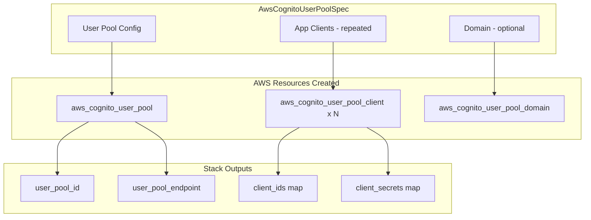

# AWS Cognito User Pool Resource Kind

**Date**: February 15, 2026
**Type**: Feature
**Components**: API Definitions, AWS Provider, Pulumi IaC, Terraform IaC

## Summary

Added AwsCognitoUserPool (R12) as a new AWS cloud resource kind in OpenMCF, providing managed user directory and authentication services with bundled app clients and an optional hosted UI domain. The component delivers 4 proto files, 47 passing validation tests, full Pulumi and Terraform modules with feature parity, 7 examples, 3 presets, and production-quality documentation.

## Problem Statement / Motivation

AWS Cognito User Pools is the primary managed authentication service for web and mobile applications on AWS. Before this addition, OpenMCF users needing user authentication had to manage Cognito infrastructure manually or outside the framework. This gap prevented infra charts from expressing auth-enabled deployment patterns -- a critical capability for serverless-api and web application charts where the user pool, API Gateway JWT authorizer, and Lambda functions must be wired together.

### Pain Points

- No declarative way to provision a Cognito User Pool with app clients through OpenMCF
- Infra charts could not express JWT authorizer dependencies (issuer URL, client IDs)
- Manual Cognito setup is error-prone: identity model choices (username vs alias attributes) are permanent (ForceNew)
- App clients require careful OAuth/OIDC configuration that benefits from validation guardrails

## Solution / What's New

A complete AwsCognitoUserPool deployment component following established OpenMCF patterns (SNS subscription bundling, Redis parameter group bundling).

### Component Architecture

### Key Design Decisions

- **Bundled app clients**: A pool without clients cannot authenticate anything. Each client's `name` field keys the `client_ids` and `client_secrets` output maps, enabling downstream `valueFrom` references.
- **Bundled domain**: Required for hosted UI and OAuth endpoints, ~70% of pools use it. Simpler than a separate component.
- **Identity providers deferred**: Social/OIDC/SAML providers have independent lifecycles and will be a separate AwsCognitoIdentityProvider component (queued as next).
- **SMS excluded from v1**: Requires separate IAM role + SNS setup. Most deployments start email-only.
- **Token validity in explicit units**: Access/ID tokens in minutes, refresh tokens in days -- eliminates the confusing unit selection from TF/Pulumi.

## Implementation Details

### Proto API (4 files)

- **spec.proto**: 15 top-level fields, 7 nested messages (~40 total fields), 15 CEL validations
  - Identity model: `username_attributes` XOR `alias_attributes` (mutually exclusive, ForceNew)
  - Password policy: 6 fields with range validations
  - MFA: string enum with software token dependency check
  - Email config: COGNITO_DEFAULT vs DEVELOPER with conditional source_arn requirement
  - Lambda triggers: 10 hooks, all StringValueOrRef -> AwsLambda
  - App clients: repeated with OAuth flows, scopes, token validity, auth flows, security settings
  - Domain: optional with custom domain certificate requirement
- **stack_outputs.proto**: 7 outputs including `client_ids` and `client_secrets` maps
- **api.proto**: KRM wiring with `aws.openmcf.org/v1` / `AwsCognitoUserPool`
- **stack_input.proto**: Standard stack input with AwsProviderConfig

### Validation Tests (47 tests)

- 22 happy path: minimal, alias attributes, username-only pool, password policy, MFA ON/OPTIONAL, auto-verification, account recovery, SES email, admin-only, custom attributes, Lambda triggers, OAuth clients, multi-client, Cognito domain, custom domain, production-ready full config
- 25 failure scenarios: mutual exclusion violations, invalid enum values, MFA dependency, missing clients, duplicate client names, empty names, invalid OAuth flows, invalid auth flows, password range violations, recovery priority/name violations, DEVELOPER email without source_arn, invalid attribute types, custom domain without certificate, token validity ranges

### Pulumi Module (6 files)

- `main.go`: Orchestrates pool -> clients -> domain with provider setup
- `locals.go`: Standard Locals struct with AwsTags
- `outputs.go`: 7 output constants
- `user_pool.go`: User pool with identity model, password policy, MFA, email config, admin config, custom attributes, Lambda triggers
- `client.go`: Iterates spec.clients, creates each with OAuth/token/security config, exports `client_ids` and `client_secrets` maps
- `domain.go`: Conditional domain creation with Cognito prefix vs custom domain handling

### Terraform Module (5 files)

- Dynamic blocks for password_policy, software_token_mfa, account_recovery_setting, email_configuration, admin_create_user_config, schema, lambda_config
- `for_each` on client_map for app clients
- Conditional domain via `count`
- Feature parity with Pulumi module

### Enum Registration

- `AwsCognitoUserPool = 300` in `cloud_resource_kind.proto` under "Auth / Identity" category

## Benefits

- **Infra chart composability**: `user_pool_endpoint` and `client_ids` enable JWT authorizer wiring in API Gateway charts
- **Validation guardrails**: 15 CEL rules catch common misconfiguration (wrong identity model, MFA without token, DEVELOPER email without SES)
- **ForceNew documentation**: Critical permanent choices (identity model, case sensitivity, client secrets) are documented prominently
- **Multi-client support**: SPA + server-side client patterns supported with separate OAuth configs and output maps

## Impact

- **New resource kind**: AwsCognitoUserPool (enum 300) -- 14th new AWS resource in the expansion project
- **Catalog addition**: Listed in the AWS catalog index
- **Downstream enablement**: API Gateway JWT authorization, Lambda triggers, ECS/EKS application env vars can now reference pool outputs

## Related Work

- Part of project **20260215.02.sp.aws-resource-expansion** (R12 of ~32)
- Follows the pattern established by AwsSnsTopicSubscription (bundled sub-resources with named output maps)
- AwsCognitoIdentityProvider planned as next resource to enable social/OIDC/SAML federation

---

**Status**: Production Ready
**Timeline**: ~2 hours (research, design review, implementation, testing, documentation)
