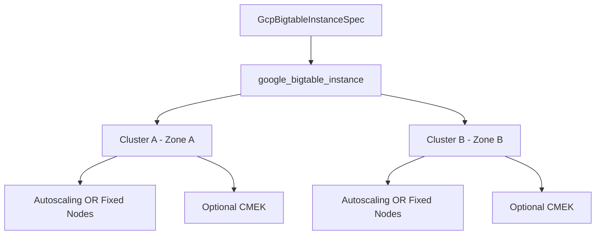

# GCP Bigtable Instance Deployment Component

**Date**: February 15, 2026
**Type**: Feature
**Components**: API Definitions, GCP Provider, Pulumi CLI Integration, Terraform Module

## Summary

Added GcpBigtableInstance as a new deployment component for provisioning Cloud Bigtable instances with bundled clusters. The component supports SSD and HDD storage types, per-cluster autoscaling, CMEK encryption via Cloud KMS, multi-cluster replication, and node scaling factors. This is the 13th GCP resource kind in the ongoing provider expansion effort.

## Problem Statement / Motivation

Cloud Bigtable is a critical GCP service for time-series data, IoT telemetry, ad-tech, fintech analytics, and ML feature stores. Without a dedicated deployment component, users had to manually provision Bigtable infrastructure outside of Planton, breaking the declarative, multi-cloud workflow.

### Pain Points

- No declarative way to provision Bigtable instances through Planton
- Multi-cluster replication configuration is complex and error-prone when done manually
- Autoscaling setup requires understanding Bigtable-specific parameters (CPU target, storage target ranges differ by storage type)
- CMEK encryption per cluster needs careful key-region alignment

## Solution / What's New

### Component Architecture

The component bundles the Bigtable instance (logical container) with one or more clusters (physical replicas), matching GCP's resource model where clusters are inline blocks within the instance rather than separate resources.

### Key Design Decisions

1. **Excluded `instance_type`** — GCP has deprecated the DEVELOPMENT/PRODUCTION distinction. All instances are effectively PRODUCTION. A 1-node cluster serves the same purpose as a former "DEVELOPMENT" instance.

2. **Proactive defaults** — `deletion_protection` defaults to `true` and `storage_type` defaults to `SSD` via `optional` + `(dev.planton.shared.options.default)`, following the mandatory default identification pattern.

3. **Simplified outputs** — Only `instance_id` (fully qualified path) and `instance_name` (short name) since Bigtable clients connect using project ID + instance name. Cluster IDs are deterministic (user-specified).

4. **`force_destroy` added** — Controls backup cleanup on instance destruction. Without this, users would be blocked from destroying instances with backups.

## Implementation Details

### Proto API (4 files, 3 messages)

- `GcpBigtableInstanceSpec` — 6 fields: project_id, instance_name, display_name, deletion_protection, force_destroy, clusters
- `GcpBigtableInstanceCluster` — 7 fields: cluster_id, zone, num_nodes, storage_type, kms_key_name, node_scaling_factor, autoscaling_config
- `GcpBigtableInstanceClusterAutoscalingConfig` — 4 fields: min_nodes, max_nodes, cpu_target, storage_target
- 2 `StringValueOrRef` fields with foreign key annotations: project_id (GcpProject), kms_key_name (GcpKmsKey)
- 4 CEL validations: scaling mutual exclusion, autoscaling max >= min, storage_type enum, node_scaling_factor enum

### Pulumi Module (4 Go files)

- `bigtable_instance.go` — Creates `bigtable.NewInstance()` with inline `InstanceClusterArray`
- Clusters are NOT separate resources (unlike AlloyDB); they are embedded in the instance
- Framework GCP labels applied at instance level (clusters don't support labels)

### Terraform Module (6 files)

- Dynamic `cluster` blocks with nested dynamic `autoscaling_config`
- Google provider `~> 6.0` for consistency with recent components
- All optional fields handled via conditional expressions

### Validation Tests (51 tests)

- 25 positive cases covering all field combinations and boundary values
- 26 negative cases covering missing required fields, invalid patterns, mutual exclusions, range violations

## Benefits

- Declarative Bigtable provisioning through Planton with both Pulumi and Terraform
- Multi-cluster replication configured in a single manifest
- Autoscaling and CMEK integrated as first-class spec fields
- Foreign key references enable composition with GcpProject and GcpKmsKey in infra charts
- 51 validation tests catch configuration errors before deployment

## Impact

- **Users**: Can now provision Bigtable instances declaratively through `planton apply`
- **Infra chart authors**: Can compose Bigtable into data platform environments using `valueFrom` references
- **Coverage**: GCP provider now has 20 resource kinds (was 19 + 12 from expansion = 32 total counting previous batches)

## Related Work

- Part of the GCP resource expansion sub-project (20260215.01.sp.gcp-resource-expansion)
- R12 in a queue of 22 new GCP resources
- Depends on GcpKmsKey (R04) for CMEK composition
- Follows patterns established by GcpAlloydbCluster (R11) and GcpSpannerInstance (R09)

---

**Status**: Production Ready
**Timeline**: Single session (~45 minutes)
