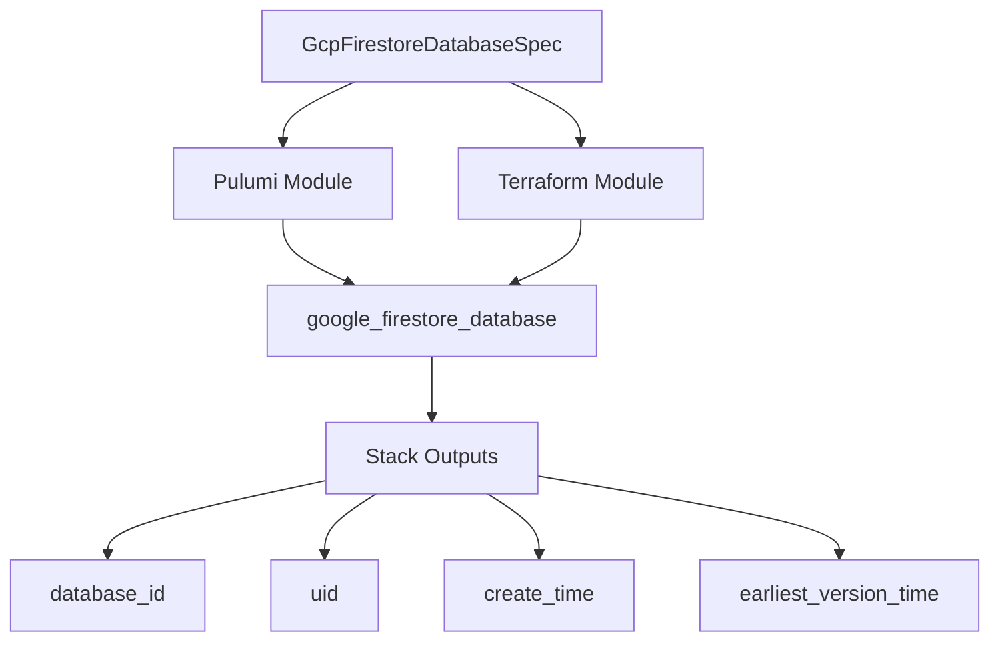

# GCP Firestore Database Deployment Component

**Date**: February 15, 2026
**Type**: Feature
**Components**: API Definitions, GCP Provider, Pulumi CLI Integration, Provider Framework

## Summary

Added the GcpFirestoreDatabase deployment component to Planton, enabling declarative provisioning of Google Cloud Firestore databases with configurable type (Native or Datastore mode), edition (Standard or Enterprise), CMEK encryption, point-in-time recovery, and delete protection. This is the 14th GCP resource in the provider expansion effort (R13 in the queue).

## Problem Statement / Motivation

Cloud Firestore is Google Cloud's primary NoSQL document database, used by mobile apps, web apps, and server-side workloads. Before this component, Planton users had no way to declaratively provision Firestore databases -- they had to fall back to the GCP Console, gcloud CLI, or raw Terraform/Pulumi.

### Pain Points

- No Planton-native way to provision Firestore databases
- No infra-chart composability for Firestore (couldn't reference GcpProject or GcpKmsKey via `valueFrom`)
- Users managing Firestore outside Planton had to maintain separate IaC configurations
- Gap in GCP database coverage alongside Spanner, AlloyDB, and Bigtable components

## Solution / What's New

A complete deployment component following the forge workflow: 4 proto files, Pulumi Go module, Terraform HCL module, 48 validation tests, comprehensive documentation, catalog page, and 3 presets.

### Component Architecture

## Implementation Details

### Proto API (9 spec fields)

**Required fields:**
- `project_id` (StringValueOrRef -> GcpProject)
- `location_id` (string -- multi-region nam5/eur3 or single-region)
- `database_name` (string -- `(default)` or 4-63 char custom name)
- `type` (string -- FIRESTORE_NATIVE or DATASTORE_MODE)

**Optional fields:**
- `concurrency_mode` (OPTIMISTIC, PESSIMISTIC, OPTIMISTIC_WITH_ENTITY_GROUPS)
- `point_in_time_recovery_enablement` (ENABLED/DISABLED)
- `delete_protection_state` (ENABLED/DISABLED, defaults to DISABLED)
- `database_edition` (STANDARD/ENTERPRISE)
- `kms_key_name` (StringValueOrRef -> GcpKmsKey)

**Validations:**
- 5 field-level CEL validations for enum values
- 1 message-level CEL: ENTERPRISE requires FIRESTORE_NATIVE
- Custom CEL for `database_name`: handles both `(default)` and regex pattern

### Design Decisions

**`deletion_policy` hardcoded to DELETE**: The GCP API defaults to "ABANDON" which only removes from IaC state on destroy, leaving the database orphaned. We hardcode "DELETE" in both Pulumi and Terraform modules so that IaC manages the full lifecycle. Users who want protection against accidental deletion should use `delete_protection_state`.

**`app_engine_integration_mode` excluded**: Legacy App Engine integration that 99% of modern deployments don't use. GCP defaults it sensibly. Including it would add a field with no practical value for new applications.

**CMEK flattened to `kms_key_name`**: The GCP API wraps CMEK in a `cmek_config` sub-message. We flatten this to a single `kms_key_name` field for consistency with GcpSpannerDatabase, GcpBigQueryDataset, and GcpBigtableInstance. The IaC modules wrap it in the appropriate structure internally.

**Enterprise-only modes deferred to v2**: `firestore_data_access_mode`, `mongodb_compatible_data_access_mode`, and `realtime_updates_mode` are ENTERPRISE-only features that auto-enable with sensible defaults. Including them in v1 would add 3 fields that most users never touch.

### Test Coverage

- **26 positive cases**: all field values, `(default)` name, named databases, all editions, all concurrency modes, CMEK, single/multi-region, full-featured spec
- **22 negative cases**: missing required fields, invalid enum values, ENTERPRISE+DATASTORE_MODE cross-field violation, name pattern violations (digits, hyphens, uppercase, length bounds)

### File Count

44 files total:
- 4 proto files + 4 generated .pb.go stubs + 1 BUILD.bazel
- 4 Pulumi module Go files + entrypoint + Pulumi.yaml + debug.sh + README + overview + BUILD.bazel files
- 6 Terraform files (provider, variables, locals, main, outputs, README) + .terraform.lock.hcl
- 6 preset files (3 YAML + 3 markdown)
- 6 documentation files (README, examples, docs/README, catalog-page, hack manifest)
- 1 spec_test.go

## Benefits

- **Declarative Firestore provisioning** via Planton manifests
- **Infra-chart composability** through StringValueOrRef on project_id and kms_key_name
- **Full validation before deployment** with 48 test cases covering all field combinations and edge cases
- **Consistent patterns** with the 13 prior GCP components in field naming, validation style, and module structure
- **Terraform and Pulumi feature parity** -- identical behavior regardless of IaC engine choice

## Impact

- **Users**: Can now provision Firestore databases through Planton with the same declarative workflow used for all other GCP resources
- **Infra chart authors**: Can compose Firestore databases with GcpProject and GcpKmsKey resources via `valueFrom` references
- **Platform**: GCP database coverage now includes CloudSQL, Spanner (instance+database), AlloyDB, Bigtable, Redis, Memorystore, and Firestore -- covering all major GCP database products

## Related Work

- Part of the GCP Resource Expansion project (20260215.01.sp.gcp-resource-expansion)
- 14th of 22 planned GCP resources (R13 in queue)
- Builds on patterns established by R10 GcpSpannerDatabase (closest analog -- simple database without labels)

---

**Status**: Production Ready
**Timeline**: Single session
