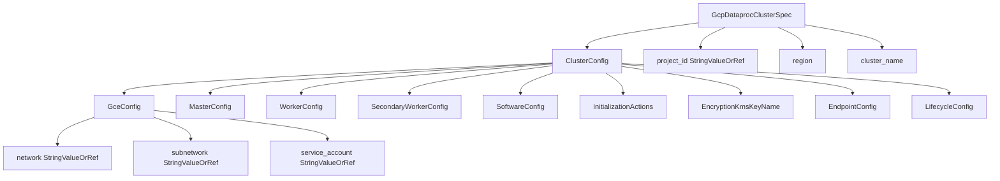

# GCP Dataproc Cluster Deployment Component

**Date**: February 15, 2026
**Type**: Feature
**Components**: API Definitions, GCP Provider, Pulumi CLI Integration, Terraform Module

## Summary

Added GcpDataprocCluster as a new deployment component in OpenMCF, enabling provisioning of standard (GCE-based) Google Cloud Dataproc clusters for Apache Spark, Hadoop, and related data processing frameworks. This is the 15th GCP resource in the expansion project (R14), and the most complex resource forged to date with 11 sub-message types and 8 StringValueOrRef cross-resource references.

## Problem Statement / Motivation

Organizations running Spark/Hadoop workloads on GCP needed a declarative, composable way to provision Dataproc clusters through OpenMCF. Without this component, teams had to manage cluster infrastructure outside the OpenMCF framework, losing the benefits of cross-resource composition (e.g., referencing GCS buckets, VPC networks, KMS keys via `valueFrom`).

### Pain Points

- No declarative Dataproc cluster provisioning in OpenMCF
- Manual GCP Console or ad-hoc Terraform scripts for Spark cluster setup
- No lifecycle management (auto-delete) leading to runaway cloud costs from forgotten clusters
- No integration with OpenMCF's cross-resource reference system for infra-chart composition

## Solution / What's New

### Component Architecture

### Key Design Decisions

- **cluster_config nesting preserved**: Mirrors Terraform/Pulumi structure for familiarity; enables future GcpDataprocVirtualCluster as a separate component
- **lifecycle_config added**: Critical for cost management of ephemeral Spark clusters (missing from original plan)
- **Secondary workers, not preemptible**: GCP now supports SPOT, PREEMPTIBLE, and NON_PREEMPTIBLE modes
- **Autoscaling via external policy**: References a separately-managed `google_dataproc_autoscaling_policy` by URI
- **GPU accelerators included**: On both master and worker nodes for ML-on-Spark workloads

## Implementation Details

### Proto API (4 files, 11 message types)

- `spec.proto`: 5 top-level fields, 12 cluster_config fields, 11 sub-messages
- 8 `StringValueOrRef` fields: project_id, staging_bucket, temp_bucket, network, subnetwork, service_account, encryption_kms_key_name
- 5 CEL validations: cluster_name regex, network/subnetwork mutual exclusion, preemptibility enum, boot_disk_type enum, duration formats
- `stack_outputs.proto`: cluster_id, cluster_name, cluster_uuid, staging_bucket

### Pulumi Module (4 Go files)

- `dataproc_cluster.go`: Single-function implementation with inline conditional blocks for all nested configurations
- Type-specific disk config and accelerator builders (Pulumi generates separate Go types per node group)
- Framework GCP labels applied to the cluster resource

### Terraform Module (6 files)

- 8 dynamic blocks for conditional nested configurations
- Provider version `~> 6.0` (Google provider v6.50.0 validated)
- Feature parity with Pulumi implementation

### Validation Tests (43 passing)

- 25 positive cases: all field combinations, preemptibility values, disk types, accelerators, lifecycle config, full-featured spec
- 18 negative cases: missing required fields, invalid names, invalid enums, format violations, accelerator constraints

### Documentation and Presets

- 3 presets: dev-jupyter, ha-production, cost-optimized-batch
- 7 YAML examples covering minimal, Jupyter, HA, batch, ML/GPU, init actions, foreign key references
- Catalog page, research docs, Pulumi overview

## Benefits

- **Declarative Spark infrastructure**: Provision Dataproc clusters via YAML manifests
- **Cross-resource composition**: Reference GCS buckets, VPCs, service accounts, KMS keys via `valueFrom`
- **Cost protection**: Lifecycle config prevents forgotten clusters from running indefinitely
- **Spot worker support**: Up to 80% cost savings for fault-tolerant batch workloads
- **ML-ready**: GPU accelerator support for distributed training workloads

## Impact

- **GCP resource count**: 19 existing + 15 new = 34 total (after this session)
- **R14 of 22 in the GCP expansion project** (64% complete)
- **New component added to queue**: GcpDataprocVirtualCluster (Dataproc-on-GKE) as future work

## Related Work

- Part of project 20260215.01.sp.gcp-resource-expansion (parent: 20260212.01.openmcf-cloud-provider-expansion)
- Builds on patterns established by R11 GcpAlloydbCluster (most complex previous component)
- GcpDataprocVirtualCluster queued as R14b for Dataproc-on-GKE support

---

**Status**: Production Ready
**Timeline**: Single session (~2 hours)
