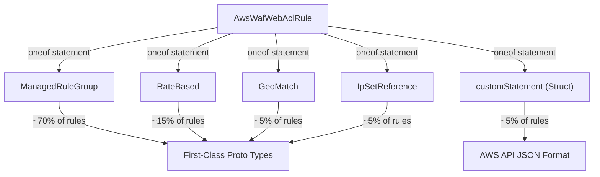

# AWS WAF Web ACL Deployment Component

**Date**: February 15, 2026
**Type**: Feature
**Components**: API Definitions, Pulumi CLI Integration, Provider Framework

## Summary

Added AwsWafWebAcl as a new Planton deployment component, enabling declarative management of AWS WAFv2 Web Access Control Lists. The component uses a hybrid statement modeling approach -- four first-class typed statements covering 90% of production rules, plus a `google.protobuf.Struct` escape hatch for advanced statement types -- balancing type safety with full WAFv2 API coverage.

## Problem Statement / Motivation

AWS WAFv2 is essential for protecting web applications from exploits, bots, and volumetric attacks. However, the WAFv2 API is one of the most complex in AWS, with 16 statement types, 3 levels of recursive nesting, and deeply nested action/match structures. Teams needed a way to declaratively manage WAF configurations without drowning in API complexity.

### Pain Points

- WAFv2 has 16 statement types with recursive AND/OR/NOT nesting up to 3 levels deep
- Modeling all statement types in protobuf would require 30-40 messages -- impractical for maintenance and usability
- Most teams only use 4-5 rule types in production but need occasional access to advanced features
- No existing Planton component for web application firewall protection

## Solution / What's New

### Hybrid Statement Modeling

Four statement types are modeled as first-class proto messages with full validation, auto-complete, and documentation. All other statement types (SQL injection, XSS, byte match, regex, compound logic) use the `customStatement` Struct escape hatch with native YAML authoring in the AWS API JSON format.

### RuleJson IaC Approach

Both Pulumi and Terraform modules use the `rule_json` field to construct rules as JSON in the AWS WAFv2 API format. This approach:

1. Handles typed and custom statements uniformly
2. Avoids mapping arbitrary Struct contents to deeply nested SDK types
3. Provides full WAFv2 API coverage via the escape hatch

### Bundled Logging

Logging is included as an optional inline configuration because ~60% of production WAFs enable logging and it is a security best practice. The spec supports destination ARN (CloudWatch/S3/Firehose) with field redaction for sensitive headers, URI path, and query string.

## Implementation Details

- **Proto API**: 15 message types, ~50 fields, 18 CEL validations including action/override_action mutual exclusivity, statement requirement, and range constraints
- **Validation**: 57 spec tests (30 happy path + 27 failure scenarios)
- **Pulumi module**: 6 files using `RuleJson` with builder functions per statement type
- **Terraform module**: `rule_json` with `jsonencode()`, dynamic blocks for custom response bodies and redacted fields
- **Documentation**: README, 7 examples, architecture deep-dive, catalog page
- **Presets**: 3 configurations (basic managed rules, rate limiting + managed rules, production web app)
- **Enum**: AwsWafWebAcl = 301 in cloud_resource_kind.proto

## Benefits

- **90% type safety**: The four most common rule types get full proto validation and auto-complete
- **100% coverage**: The escape hatch handles any WAFv2 statement type
- **Zero boilerplate**: Visibility config defaults eliminate the most common WAF configuration noise
- **Security by default**: Logging is one field away, with built-in sensitive field redaction
- **Consistent JSON approach**: Same rule construction in both Pulumi and Terraform

## Impact

- AWS resource coverage expands from 40 to 41 total resource kinds
- Phase 1 nears completion: 16 of 17 resources done (R14 AwsCloudwatchLogGroup and R15 AwsCloudwatchAlarm remain)
- Enables WAF-protected infra chart patterns for ALB, API Gateway, and CloudFront

## Related Work

- Part of the AWS Resource Expansion project (20260215.02.sp.aws-resource-expansion)
- Follows patterns established by AwsNetworkLoadBalancer (complex nested repeated rules) and AwsCognitoIdentityProvider (oneof typed configs)
- Referenced by AwsAlb, AwsHttpApiGateway, and AwsCloudFront via `web_acl_arn` output

---

**Status**: Production Ready
