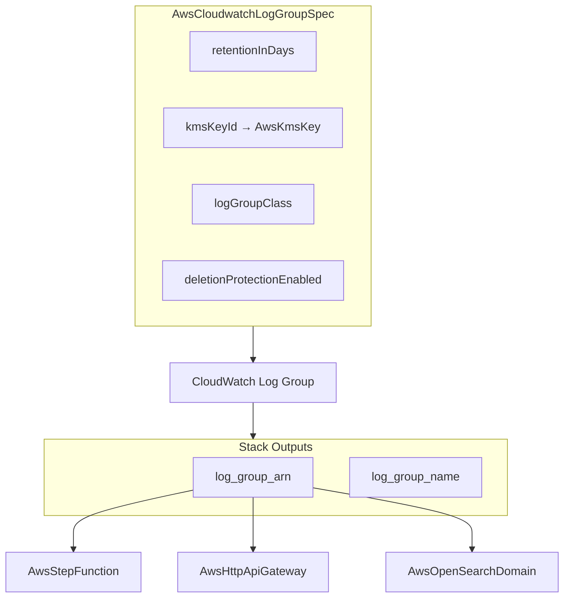

# AWS CloudWatch Log Group Deployment Component

**Date**: February 15, 2026
**Type**: Feature
**Components**: API Definitions, Pulumi CLI Integration, Provider Framework

## Summary

Added AwsCloudwatchLogGroup as the seventeenth new AWS resource kind in the resource expansion project (R14). This is a foundational observability component — a CloudWatch Logs log group with configurable retention, KMS encryption, log group class selection, and deletion protection. The component enables `valueFrom` dependency wiring for the logging layer across Step Functions, API Gateway, OpenSearch, and other AWS services.

## Problem Statement / Motivation

CloudWatch Log Groups are referenced by at least 5 already-completed AWS components (Step Functions, OpenSearch, HTTP API Gateway, WAF, ElastiCache), but until now there was no OpenMCF component representing the log group itself. This created a gap: users could not use `valueFrom` references to wire log groups into their infrastructure compositions.

### Pain Points

- Step Functions `log_destination`, OpenSearch `cloudwatch_log_group_arn`, and API Gateway `destination_arn` fields lacked `default_kind` annotations because the AwsCloudwatchLogGroup enum didn't exist
- Users had to hardcode log group ARNs instead of using declarative cross-resource references
- No way to manage log group retention, encryption, and class in the same declarative manifest pipeline as other AWS resources

## Solution / What's New

### Component Overview

### Spec Design (4 fields, 3 CEL validations)

- **retentionInDays** — Discrete AWS-allowed values only (0, 1, 3, 5, 7, 14, 30, 60, 90, 120, 150, 180, 365, 400, 545, 731, 1096, 1827, 2192, 2557, 2922, 3288, 3653). Validated via CEL `in` expression.
- **kmsKeyId** — StringValueOrRef with `default_kind = AwsKmsKey` for customer-managed encryption
- **logGroupClass** — STANDARD, INFREQUENT_ACCESS, or DELIVERY (ForceNew). DELIVERY class has a CEL guard preventing retention configuration.
- **deletionProtectionEnabled** — AWS API feature for deletion protection. Defined in spec but not yet implementable in IaC (provider version limitation).

### Backfill of 3 Completed Components

Added `default_kind = AwsCloudwatchLogGroup` with `default_kind_field_path = "status.outputs.log_group_arn"` to:

- `awsstepfunction` — `logging.log_destination` (line 131)
- `awsopensearchdomain` — `log_publishing_options[*].cloudwatch_log_group_arn` (line 532)
- `awshttpapigateway` — `stage.access_log.destination_arn` (line 218)

These fields exclusively reference CloudWatch log groups. Two other fields (WAF `destination_arn` and ElastiCache `destination`) were intentionally left without `default_kind` because they support multiple destination types.

## Implementation Details

### Proto API

- 4 spec fields, 0 nested messages
- 3 CEL validations: retention valid values, class valid values, DELIVERY class no-retention guard
- 24 validation tests (12 happy path + 12 failure scenarios), all passing
- StringValueOrRef for kms_key_id with default_kind = AwsKmsKey
- Enum: AwsCloudwatchLogGroup = 310 (Monitoring / Observability category)

### IaC Modules

**Pulumi** — 4 files: main.go, locals.go, outputs.go, log_group.go
- Single `cloudwatch.NewLogGroup` resource
- Conditional retention, KMS, class fields
- deletion_protection_enabled deferred (SDK v7 limitation)

**Terraform** — 5 files: main.tf, locals.tf, outputs.tf, variables.tf, provider.tf
- Single `aws_cloudwatch_log_group` resource
- deletion_protection_enabled deferred (provider 5.82.0 limitation)
- Feature parity with Pulumi module

### Documentation

- README.md with spec reference, When to Use/Not Use, outputs, minimal + production examples
- examples.md with 7 examples covering all patterns including cross-resource valueFrom wiring
- Catalog page following the standard structure
- 3 presets: standard-30d, encrypted-90d, infrequent-access-long-retention

## Benefits

- **Enables `valueFrom` dependency wiring** for the logging layer — Step Functions, API Gateway, and OpenSearch can now declaratively reference log groups
- **Cost optimization** via INFREQUENT_ACCESS class (~50% cheaper storage for high-volume logs)
- **Compliance** via KMS encryption and explicit retention policies
- **Simpler compositions** — log groups are no longer a gap in the resource DAG

## Impact

- **Downstream references**: 3 completed components now have `default_kind` annotations enabling `valueFrom` auto-wiring
- **Infra chart composability**: Log groups can now participate in DAG-based deployment ordering
- **Resource count**: AWS coverage increases from 41 to 42 resource kinds (25 existing + 17 new)

## Surprise Findings

1. **deletion_protection_enabled not in current provider versions** — Both Pulumi AWS SDK v7 and TF provider 5.82.0 lack this field. It exists in the latest provider source. Kept in spec for future-proofing; skipped in IaC modules with clear comments.
2. **DELIVERY class retention behavior** — AWS manages retention internally for DELIVERY log groups. TF provider has a DiffSuppressFunc that ignores retention changes. Added CEL guard to prevent user confusion.

## Related Work

- Part of the AWS resource expansion project (R14 of ~32)
- Previous: AwsWafWebAcl (R13), AwsCognitoIdentityProvider (R12a)
- Next: AwsCloudwatchAlarm (R15) — completes Phase 1 monitoring coverage

---

**Status**: Production Ready
