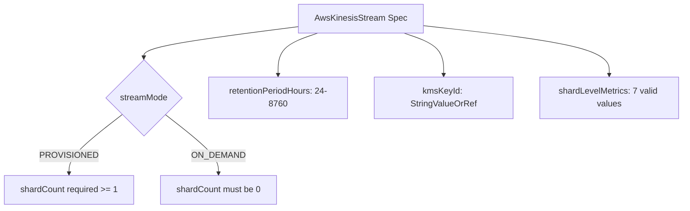

# AWS Kinesis Data Stream Deployment Component

**Date**: February 15, 2026
**Type**: Feature
**Components**: API Definitions, Pulumi CLI Integration, Provider Framework

## Summary

Added AwsKinesisStream (R16) as the first Phase 2 resource in the AWS expansion project. The component deploys Amazon Kinesis Data Streams with two capacity modes (PROVISIONED / ON_DEMAND), KMS encryption, configurable retention (up to 365 days), and shard-level CloudWatch monitoring — enabling real-time data streaming pipelines.

## Problem Statement / Motivation

Kinesis Data Streams is the backbone of real-time data architectures on AWS — click-streams, IoT telemetry, database CDC, financial transactions. Without it in OpenMCF, users building analytics or event-sourcing infra charts had to manage Kinesis outside the declarative framework, breaking the dependency graph.

### Pain Points

- No streaming data service in the AWS component catalog
- Kinesis Firehose (next in queue) requires a Kinesis stream as a source — blocking the analytics pipeline chart
- Lambda event source mappings and EventBridge targets need stream ARNs via `StringValueOrRef`

## Solution / What's New

### AwsKinesisStream Component

A complete deployment component following the OpenMCF forge process:

- **Proto API** — `spec.proto` with 7 fields, 0 nested messages, 6 CEL validations
- **Stack Outputs** — `stream_arn` and `stream_name` for downstream wiring
- **Pulumi Module** — 4 files: `main.go`, `locals.go`, `stream.go`, `outputs.go`
- **Terraform Module** — 5 files with feature parity
- **Validation Tests** — 31 spec tests (16 happy path + 15 failure scenarios), all passing
- **Documentation** — README.md, examples.md (7 examples), docs/README.md (architecture reference)
- **Presets** — 3 presets: on-demand-minimal, provisioned-encrypted, production-analytics
- **Catalog Page** — source-verified, following ALB exemplar structure

## Implementation Details

### Spec Design

Two capacity modes with conditional shard_count validation:

- `PROVISIONED` — requires `shardCount >= 1`, you manage capacity
- `ON_DEMAND` — requires `shardCount == 0`, AWS auto-scales

Encryption simplified: `kmsKeyId` presence implies KMS encryption (no separate `encryptionType` field). Follows the same pattern as AwsStepFunction.

### Deferred Fields

`maxRecordSizeInKib` — defined in spec (range 1024-10240) but deferred in both IaC modules. Not available in pinned Pulumi AWS SDK v7.3.0 or TF provider 5.82.0. Will be wired when dependencies are upgraded.

### Key Design Decisions

- **stream_mode required (not defaulted)** — forces explicit capacity mode choice; PROVISIONED vs ON_DEMAND have fundamentally different cost and operational characteristics
- **No encryption_type field** — KMS encryption inferred from kms_key_id presence (eliminates redundancy)
- **stream_mode flattened** — from TF's nested `stream_mode_details` block to top-level string for YAML ergonomics
- **Resource policy omitted (v1)** — separate TF resource (`aws_kinesis_resource_policy`), <20% usage
- **Stream consumers not bundled** — independent lifecycle (ForceNew on name + stream_arn), queued as R16a

## Benefits

- Enables real-time data streaming in OpenMCF infra charts
- Unblocks Kinesis Firehose (R17) which requires stream ARN as source
- `stream_arn` output enables `valueFrom` references from Lambda event source mappings and EventBridge targets
- Clean two-mode design makes the PROVISIONED vs ON_DEMAND tradeoff explicit

## Impact

- **New enum**: `AwsKinesisStream = 260` in `cloud_resource_kind.proto` (Analytics / Streaming category)
- **AWS component count**: 44 (25 existing + 19 new from this project)
- **Phase 2 kickoff**: First of 10 Phase 2 components (important services)
- **Pipeline**: Critical upstream dependency for Kinesis Firehose, Lambda event sources, and future data-pipeline infra charts

## Related Work

- Phase 1 complete: 18 new AWS resource kinds (R01-R15 + 3 ElastiCache splits)
- Next: R16a AwsKinesisStreamConsumer (enhanced fan-out), then R17 AwsKinesisFirehose
- Parent project: 20260212.01.openmcf-cloud-provider-expansion

---

**Status**: Production Ready
**Timeline**: Single session
