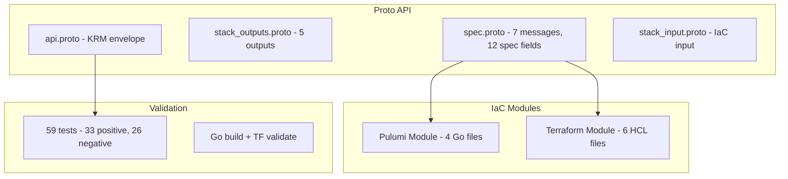

# GCP Filestore Instance Deployment Component

**Date**: February 15, 2026
**Type**: Feature
**Components**: API Definitions, GCP Provider, Pulumi CLI Integration, Terraform Module

## Summary

Added GcpFilestoreInstance as a complete deployment component for provisioning Google Cloud Filestore managed NFS instances. The component covers all eight Filestore tiers, singular file share and network configuration (matching GCP's actual API constraints), NFS export access controls, CMEK encryption, performance tuning, and deletion protection. Includes both Pulumi and Terraform IaC modules with full feature parity.

## Problem Statement / Motivation

OpenMCF's GCP provider lacked managed NFS file storage capability. Users needing shared file systems for GKE workloads, media rendering, EDA, genomics processing, or any multi-client file access pattern had no OpenMCF component to provision Filestore instances.

### Pain Points

- No managed NFS provisioning through OpenMCF
- GKE workloads needing ReadWriteMany persistent volumes had to use manual Filestore setup
- No composability between Filestore and other GCP resources (VPC, KMS) via infra charts

## Solution / What's New

A complete deployment component following the forge workflow, producing production-ready infrastructure-as-code for Filestore instances.

### Component Architecture

## Implementation Details

### Proto API (4 proto files, 7 message types)

- **GcpFilestoreInstanceSpec**: 12 fields covering all Filestore configuration
- **GcpFilestoreInstanceFileShare**: singular (not repeated) -- GCP supports exactly one share per instance
- **GcpFilestoreInstanceNetworkConfig**: singular -- GCP supports exactly one network per instance
- **GcpFilestoreInstanceNfsExportOption**: IP-based access controls with squash modes
- **GcpFilestoreInstancePerformanceConfig**: mutually exclusive fixed_iops / iops_per_tb
- **GcpFilestoreInstanceFixedIops**: fixed IOPS provisioning
- **GcpFilestoreInstanceIopsPerTb**: dynamic IOPS per TB

3 StringValueOrRef fields: `projectId` (GcpProject), `networkConfig.network` (GcpVpc), `kmsKeyName` (GcpKmsKey)

### Key Design Decisions (Corrections to Original Plan)

1. **`zone` replaced with `location`**: `zone` is deprecated in both Terraform and Pulumi. `location` accepts zones or regions depending on tier.
2. **Singular file_share and network_config**: Plan had repeated fields. GCP only supports one of each (MaxItems: 1). Singular sub-messages are honest.
3. **All 8 tiers**: Plan had 5. Added STANDARD, PREMIUM (rebranded BASIC_HDD/SSD names), and REGIONAL (multi-zone HA).
4. **Added 8 fields not in plan**: instance_name, description, protocol (NFS_V3/V4_1), kms_key_name, deletion_protection_enabled/reason, performance_config, connect_mode.
5. **Excluded 4 features**: directory_services (LDAP, niche), initial_replication (advanced DR), source_backup (operational), Resource Manager tags (not labels).
6. **MODE_IPV4 hardcoded**: IPv6 NFS is not a realistic use case.

### Pulumi Module (4 Go files)

- `filestore.NewInstance()` with singular `InstanceFileSharesArgs` and `InstanceNetworkArray` (single element)
- NFS export options mapped from spec repeated message to `InstanceFileSharesNfsExportOptionArray`
- IP addresses extracted from computed `Networks[0].IpAddresses` using `ApplyT`
- Performance config conditionally set with mutually exclusive sub-blocks
- Terraform provider `~> 6.0` required for full feature support

### Validation Tests (59 tests)

- **33 positive cases**: all 8 tiers, both protocols, connect modes, NFS export options, CMEK, deletion protection, performance configs, boundary values, full-featured spec
- **26 negative cases**: missing required fields, invalid names, invalid tier/protocol/connect_mode/access_mode/squash_mode, capacity below minimum, performance mutual exclusion, wrong api_version/kind

### Presets (3)

| Preset | Tier | Use Case |
|--------|------|----------|
| dev-basic | BASIC_SSD | Development, testing |
| production-enterprise | ENTERPRISE | Production HA with deletion protection |
| high-performance-zonal | ZONAL | Performance workloads with fixed IOPS |

## Benefits

- GCP users can now provision managed NFS storage through OpenMCF
- GKE workloads can reference Filestore IP addresses for ReadWriteMany persistent volumes
- Full composability with GcpVpc, GcpKmsKey, and GcpProject via StringValueOrRef
- All 8 Filestore tiers supported from cost-effective HDD to enterprise HA
- Performance tuning available for ZONAL/REGIONAL/ENTERPRISE tiers

## Impact

- **GCP provider**: 18th → 19th resource kind (continues the expansion from 19 to ~40)
- **Platform coverage**: fills the managed NFS gap in GCP storage offerings
- **Infra charts**: enables future GKE shared storage charts and data processing environments

## Related Work

- Part of project 20260215.01.sp.gcp-resource-expansion (R16 of 23)
- Preceded by R15 GcpCloudComposerEnvironment
- Next: R17 GcpCloudTasksQueue

---

**Status**: Production Ready
**Timeline**: Single session (~2 hours)
