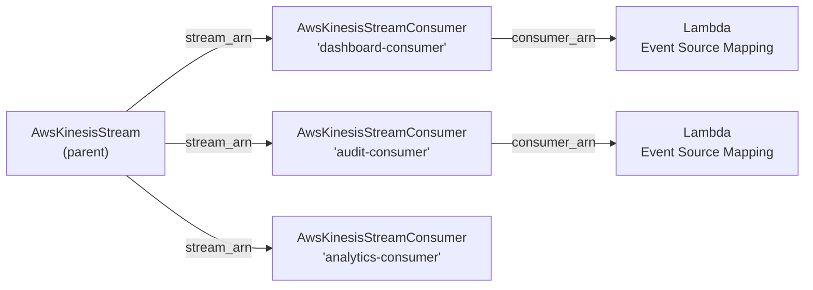

# AWS Kinesis Stream Consumer Deployment Component

**Date**: February 15, 2026
**Type**: Feature
**Components**: API Definitions, Pulumi CLI Integration, Provider Framework, Resource Management

## Summary

Added `AwsKinesisStreamConsumer` as the twentieth new AWS resource kind in the cloud provider expansion project. This component registers enhanced fan-out consumers for Kinesis Data Streams, providing dedicated 2 MB/s read throughput per shard per consumer -- independent of all other consumers on the same stream.

## Problem Statement / Motivation

Amazon Kinesis Data Streams support two consumer models: standard consumers (GetRecords API) that share 2 MB/s per shard across all readers, and enhanced fan-out consumers (SubscribeToShard API) that get dedicated 2 MB/s per shard per consumer via HTTP/2 push delivery.

### Pain Points

- Enhanced fan-out consumers have an independent lifecycle from the parent stream (both `name` and `stream_arn` are ForceNew)
- Bundling consumers into the AwsKinesisStream component would create unwieldy specs when 5-20 consumers are registered
- Lambda event source mappings with enhanced fan-out require the `consumer_arn` output -- without a dedicated component, there's no way to reference this ARN via `valueFrom`
- The parent AwsKinesisStream (R16) component's `enforce_consumer_deletion` field anticipates separately-managed consumers

## Solution / What's New

A complete deployment component for `AwsKinesisStreamConsumer` with the simplest possible spec: a single required field (`stream_arn` as StringValueOrRef -> AwsKinesisStream). The consumer name is derived from `metadata.name`.

### Component Architecture

Each consumer gets a dedicated 2 MB/s per shard throughput channel, enabling independent processing pipelines without contention.

## Implementation Details

### Proto API (4 files)

- **spec.proto**: Single field -- `stream_arn` (StringValueOrRef with `default_kind = AwsKinesisStream`, `default_kind_field_path = "status.outputs.stream_arn"`)
- **stack_outputs.proto**: 4 outputs -- `consumer_arn`, `consumer_name`, `stream_arn` (echo), `creation_timestamp`
- **api.proto**: Standard KRM envelope with `api_version = "aws.openmcf.org/v1"`, `kind = "AwsKinesisStreamConsumer"`
- **stack_input.proto**: Standard input envelope with target + provider config
- **No CEL validations needed** -- only 1 field, already validated by `buf.validate.field.required`

### Validation Tests (8 tests)

- 3 happy path: literal ARN, valueFrom reference, full metadata with labels
- 5 failure: missing stream_arn, wrong api_version, wrong kind, missing metadata, missing spec
- All 8 passing

### Pulumi Module (5 files)

- `consumer.go`: Single `kinesis.NewStreamConsumer` call with name, stream ARN, and tags
- `locals.go`: Pre-computes consumer name, AWS tags with resource kind identification
- `outputs.go`: Constants for 4 output keys matching stack_outputs fields
- `main.go`: Module orchestrator with provider creation pattern

### Terraform Module (5 files)

- `main.tf`: Single `aws_kinesis_stream_consumer` resource
- `locals.tf`: Extracts consumer name and stream ARN from variables
- `outputs.tf`: 4 outputs matching Pulumi feature parity
- Full feature parity with Pulumi module

### Documentation

- **README.md**: Standard vs enhanced fan-out comparison table, spec reference, prerequisites
- **examples.md**: 5 examples covering direct ARN, valueFrom, multiple consumers, Lambda integration, full metadata
- **docs/README.md**: Architecture reference -- consumer model, lifecycle/immutability, Lambda integration, cost model, security, limits

### Presets (2)

- **01-basic-consumer**: Literal stream ARN for standalone usage
- **02-stream-reference**: `valueFrom` pattern for infra chart composition

### Registration

- Enum `AwsKinesisStreamConsumer = 262` in `cloud_resource_kind.proto` (Analytics/Streaming category)
- Catalog page at `site/public/docs/catalog/aws/kinesis-stream-consumer.md`
- Site index updated with alphabetical insertion

## Benefits

- **Infra chart composability**: Consumer ARN available via `valueFrom` for Lambda event source mapping configuration
- **Independent lifecycle management**: Add/remove consumers without touching the parent stream
- **Clean DAG wiring**: Stream -> Consumer -> Lambda forms a natural dependency chain
- **Simplest possible UX**: 1 field in the spec -- users only need to specify which stream to register with

## Impact

- **New resource kind**: AwsKinesisStreamConsumer (enum 262) added to OpenMCF AWS provider
- **Files**: 42 files, ~2,350 lines
- **Test coverage**: 8 validation tests covering all spec constraints and API envelope
- **Cross-component**: Complements AwsKinesisStream (R16) -- the `enforce_consumer_deletion` field in the parent stream anticipates this component

## Related Work

- **R16 AwsKinesisStream** (same day) -- Parent stream component that this consumer registers with
- **R17 AwsKinesisFirehose** (next in queue) -- Delivery stream that can read from the same Kinesis streams
- **20260215.02.sp.aws-resource-expansion** -- Part of Phase 2 implementation queue

---

**Status**: Production Ready
