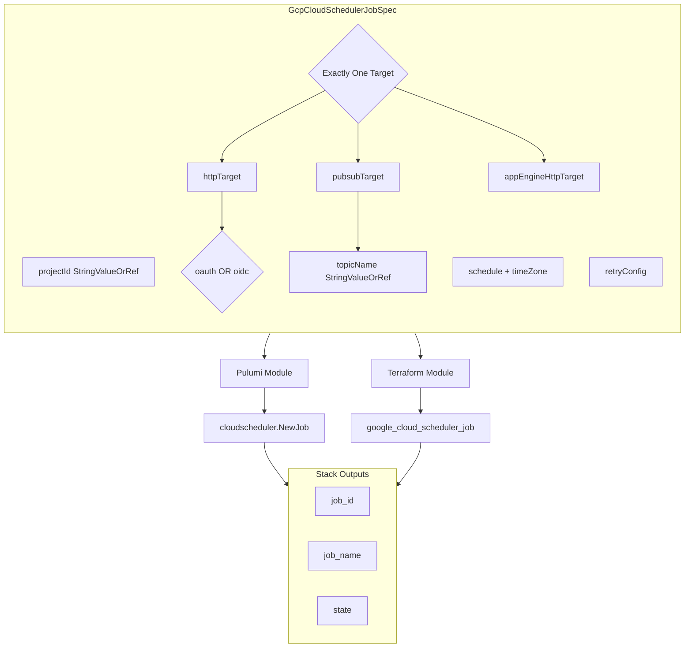

# GCP Cloud Scheduler Job Deployment Component

**Date**: February 15, 2026
**Type**: Feature
**Components**: GCP Provider, API Definitions, Pulumi Module, Terraform Module

## Summary

Added GcpCloudSchedulerJob (R18) as a complete deployment component for provisioning Google Cloud Scheduler jobs. The component supports all three target types (HTTP, Pub/Sub, App Engine), OIDC/OAuth authentication for secure endpoint invocation, configurable retry with exponential backoff, and Pub/Sub topic composition via StringValueOrRef.

## Problem Statement / Motivation

Cloud Scheduler is a fundamental GCP service for cron-based workload scheduling -- triggering Cloud Run services, publishing to Pub/Sub topics, and invoking App Engine handlers on a recurring basis. Without this component, Planton users had no declarative way to provision scheduled jobs alongside the endpoints they target.

### Pain Points

- No infrastructure-as-code support for Cloud Scheduler in Planton
- Manual scheduling via GCP Console doesn't version-control or compose with other resources
- No way to wire scheduler jobs to Pub/Sub topics or service accounts via cross-resource references

## Solution / What's New

A complete deployment component following Planton conventions:

### Component Architecture

## Implementation Details

### Proto API (4 files, 8 sub-messages, 12 spec fields)

- **spec.proto**: 8 sub-messages covering all 3 target types, OAuth/OIDC tokens, App Engine routing, and retry config
- **4 StringValueOrRef fields**: `project_id` (GcpProject), `oauth_token.service_account_email` (GcpServiceAccount), `oidc_token.service_account_email` (GcpServiceAccount), `pubsub_target.topic_name` (GcpPubSubTopic)
- **CEL validations**: Exactly-one-target mutual exclusion, OAuth/OIDC mutual exclusion, http_method enum, job_name pattern, relative_uri starts with "/", description max 500 chars
- **stack_outputs.proto**: job_id (fully qualified), job_name, state

### Pulumi Module (4 Go files)

- `cloud_scheduler_job.go`: Conditional target blocks for HTTP/PubSub/AppEngine, map-to-StringMap conversion for headers and attributes, job name fallback to metadata.name
- No GCP labels (Cloud Scheduler jobs don't support them)
- Exports job_id via `.ID()`, job_name via `.Name`, state via `.State`

### Terraform Module (6 files)

- Provider `~> 6.0` (Google provider)
- Dynamic blocks for all 3 target types with nested auth and routing blocks
- Feature parity with Pulumi implementation
- `state` output available in Terraform (unlike R17 Cloud Tasks where it was Pulumi-only)

### Validation Tests (52 total)

- 30 positive cases: All target types, all HTTP methods, OIDC/OAuth tokens, Pub/Sub with data/attributes, App Engine with routing, retry config, paused state, description boundary, full-featured specs, proto round-trip
- 22 negative cases: Missing required fields, no target, multiple targets, OAuth+OIDC mutual exclusion, invalid HTTP methods, invalid job_name, description overflow, missing auth fields, relative_uri validation

### Key Design Decisions (Corrections to T01 Plan)

| Decision | Rationale |
|----------|-----------|
| Added `job_name` | Consistent with R01-R17 naming pattern |
| Added `paused` boolean | Maps to TF `paused` field; cleaner than `desired_state` |
| `region` -> `location` | Consistency with R17 (GcpCloudTasksQueue) |
| Body fields as base64 | Both TF and Pulumi expect base64-encoded body |
| App Engine target included | Core target type (1 of 3), still widely used |
| No GCP labels | API limitation |

## Benefits

- **Complete Cloud Scheduler coverage**: All 3 target types, authentication, retry, pause/resume
- **Infra-chart composable**: 4 StringValueOrRef fields enable wiring to projects, service accounts, and Pub/Sub topics
- **Production-ready**: 52 validation tests, comprehensive documentation, 3 presets
- **Consistent with R01-R17**: Same patterns, naming conventions, and quality bar

## Impact

- **Users**: Can now provision Cloud Scheduler jobs declaratively alongside Cloud Run, Pub/Sub, and other GCP resources
- **Infra Charts**: Enables `serverless-api-backend` and `event-pipeline` charts to include scheduled triggers
- **Codebase**: 43 files, 4,711 lines added; enum 663 registered in cloud_resource_kind.proto

## Related Work

- R17 GcpCloudTasksQueue (sibling messaging component)
- R06 GcpPubSubTopic (target for Pub/Sub scheduled publishing)
- R07 GcpPubSubSubscription (consumer of scheduled Pub/Sub messages)
- Parent project: 20260215.01.sp.gcp-resource-expansion (19 of 23 resources complete -> 20 of 23)

---

**Status**: Production Ready
