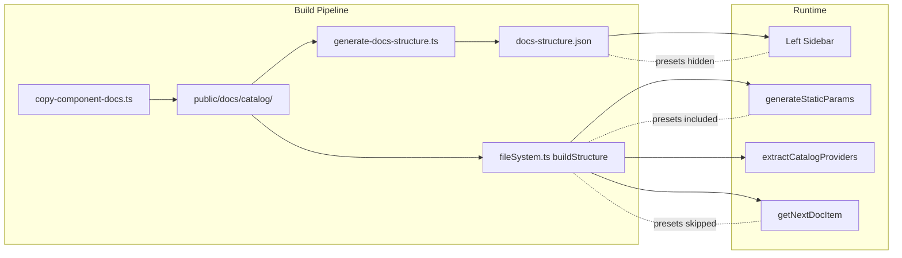

# Preset Documentation Pages for the Docs Site

**Date**: February 15, 2026
**Type**: Feature
**Components**: Documentation, Build System, UI Components, Site Navigation

## Summary

Added preset pages to the OpenMCF documentation site. Every component's presets (488 across 253 components) are now accessible as rendered pages with accordion-style browsing, dedicated detail pages, raw YAML/Markdown file access, and a right-sidebar discovery link on each catalog page. The sidebar and reading-order navigation remain unchanged — presets are a secondary content layer accessed through the right-sidebar TOC.

## Problem Statement / Motivation

The presets project (T01–T08b) created 375+ production-quality, ranked, deployable YAML manifests across all deployment components. These presets live in the source tree at `apis/.../v1/presets/` but were invisible on the documentation site. Developers browsing the catalog pages had no way to discover or access presets without cloning the repository.

### Pain Points

- Presets existed only as source files — no web access, no shareability
- No way to link to a specific preset in Slack, documentation, or CI scripts
- No ability to `curl` a preset manifest from a URL for automation
- Catalog pages had no indication that presets existed for a component

## Solution / What's New

### Preset List Page (accordion)

Each component gets a presets index at `/docs/catalog/{provider}/{component}/presets` with an accordion-style expand/collapse interface. Click a preset to see the full YAML manifest (with copy button) and the rendered description inline. Only one entry expanded at a time.

### Preset Detail Page (permalink)

Each individual preset has a shareable URL at `/docs/catalog/{provider}/{component}/presets/{name}`. Shows back navigation, rank badge, YAML viewer with copy-to-clipboard, rendered markdown description, and "Raw YAML" / "Raw Markdown" action buttons.

### Raw File Access

Direct file URLs for automation and sharing:
- `/docs/catalog/aws/documentdb/presets/01-production-ha.yaml` — raw YAML manifest
- `/docs/catalog/aws/documentdb/presets/01-production-ha.md` — raw description markdown

### Right-Sidebar Discovery

Catalog pages show a "Presets" section in the right sidebar (below the TOC) with the preset count and a "View presets" link. Always visible while scrolling, never injected into the page body.

### Sidebar Isolation

Presets are deliberately hidden from the left sidebar and the "Next article" reading order. The sidebar looks exactly as before — components are simple leaf links. Presets are accessed exclusively through the right-sidebar TOC link.

## Implementation Details

### Build Script Enhancement

`copy-component-docs.ts` was extended to:
- Convert all components from flat file output (`slug.md`) to directory layout (`slug/index.md`)
- Scan each component's `v1/presets/` directory for YAML/MD pairs
- Copy YAML files as-is (raw access)
- Generate preset detail `.md` files with frontmatter (title, type, rank, component metadata)
- Generate preset index `.md` with frontmatter listing all presets and their metadata

### Structure Generator Separation

The sidebar structure (`docs-structure.json`) and page-generation structure (`fileSystem.ts`) serve different purposes. The sidebar generator skips `presets` directories inside catalog components so they don't appear in the left sidebar. The page-generation structure keeps them for `generateStaticParams`.

### New React Components

- `PresetListPage.tsx` — Accordion-style list with rank badges, expand/collapse, copy-link and open-in-new-tab actions
- `PresetDetailPage.tsx` — Detail page with YAML viewer, markdown description, raw file links
- `PresetRankBadge.tsx` — Purple-tinted badge showing rank number ("01", "02")
- `PresetYamlViewer.tsx` — YAML code block with header bar and copy-to-clipboard

### Page Route Detection

`page.tsx` detects preset pages via frontmatter `type` field:
- `type: "preset-list"` → reads co-located YAML files at build time, renders `PresetListPage`
- `type: "preset"` → reads co-located YAML, renders `PresetDetailPage`
- Default → standard `MDXRenderer` with optional `presetsLink` passed to `RightSidebar`

### Files Created

- `site/src/app/docs/components/PresetListPage.tsx`
- `site/src/app/docs/components/PresetDetailPage.tsx`
- `site/src/app/docs/components/PresetRankBadge.tsx`
- `site/src/app/docs/components/PresetYamlViewer.tsx`

### Files Modified

- `site/scripts/copy-component-docs.ts` — directory-based output, preset scanning/copying, index generation
- `site/scripts/generate-docs-structure.ts` — hasIndex fix, presets sidebar filter
- `site/src/app/docs/utils/fileSystem.ts` — hasIndex fix, next-article presets skip
- `site/src/app/docs/[[...slug]]/page.tsx` — preset page detection, YAML loading, component count fix, presetsLink
- `site/src/app/docs/components/RightSidebar.tsx` — presetsLink prop and Presets section

## Benefits

- **Discoverability** — developers browsing the catalog see a "Presets" link in the right sidebar
- **Shareability** — every preset has a dedicated URL for Slack links, documentation references, and CI scripts
- **Automation** — raw YAML accessible via `curl` for pipeline integration
- **Zero sidebar pollution** — presets are invisible in the left sidebar; the catalog browsing experience is unchanged
- **Build pipeline only** — no changes to the build order or process; `copy-docs` now also copies presets

## Impact

- **New pages**: ~1000 additional static pages (488 preset detail pages + 253 preset index pages + raw files)
- **Build time**: ~24 seconds (up from ~15 seconds pre-presets)
- **Pagefind**: 1048 indexed pages (presets are searchable)
- **Sidebar**: Unchanged — components remain simple leaf links
- **Next article**: Unchanged — presets are excluded from reading order

## Related Work

- Presets project (T01–T08b): Created the 375+ preset YAML/MD pairs in the source tree
- Catalog page rewrite system: Established the catalog page standard that presets pages complement
- Planton.ai changelog system: Inspired the accordion expand/collapse interaction pattern

---

**Status**: Production Ready
**Timeline**: Single session
