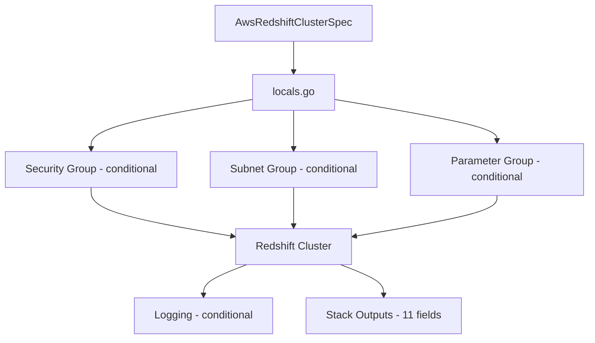

# AWS Redshift Cluster Deployment Component

**Date**: February 16, 2026
**Type**: Feature
**Components**: API Definitions, Provider Framework, Pulumi CLI Integration

## Summary

Added AwsRedshiftCluster as a new deployment component (R20, enum 265) to the AWS provider, enabling declarative provisioning of Amazon Redshift data warehouse clusters with full VPC networking, encryption, IAM role management, audit logging, and parameter group support. This is part of the AWS resource expansion project targeting ~32 new resource kinds.

## Problem Statement / Motivation

Amazon Redshift is a core AWS analytics service used in data warehousing, ETL pipelines, and business intelligence workloads. Before this component, OpenMCF users had no declarative way to provision Redshift clusters with the framework's cross-resource reference system (StringValueOrRef), tag management, and dual IaC engine support.

### Pain Points

- No standardized way to deploy Redshift clusters through OpenMCF
- Manual Redshift provisioning requires coordinating multiple resources: cluster, subnet group, security group, parameter group, and logging configuration
- Credential management (master password) requires separate Secrets Manager setup
- No cross-resource reference support for VPC subnets, security groups, KMS keys, and IAM roles

## Solution / What's New

A complete deployment component following the AwsRdsCluster pattern with bundled sub-resources for a streamlined user experience.

### Component Architecture

### Bundled Resources (Conditional Creation)

- **Redshift Cluster** -- always created (the core resource)
- **Redshift Subnet Group** -- created when `subnetIds` provided (auto-derived from VPC subnets)
- **EC2 Security Group** -- created when `securityGroupIds` or `allowedCidrBlocks` provided (ingress rules on cluster port)
- **Redshift Parameter Group** -- created when inline `parameters` provided (family: redshift-1.0)
- **Redshift Logging** -- created when `logging` config provided (S3 or CloudWatch destination)

## Implementation Details

### Proto API (4 files)
- `spec.proto`: 31 fields across 7 categories (node config, database, networking, encryption, IAM, snapshots, maintenance) with 3 nested messages (Logging, Parameter, Spec) and 5 CEL cross-field validations
- `stack_outputs.proto`: 11 observable outputs (cluster identifiers, endpoints, conditional resource names)
- `api.proto`: KRM envelope with const validation for `apiVersion` and `kind`
- `stack_input.proto`: Stack input with target + provider config

### Key Design Decisions
- **No engine field** -- Unlike RDS, Redshift has a single engine. Omitted to avoid unnecessary complexity.
- **`encrypted` defaults to true** -- Uses `optional bool` with `(org.openmcf.shared.options.default) = "true"` to match AWS behavior and avoid accidentally disabling encryption.
- **Logging as separate Pulumi resource** -- Terraform's `aws_redshift_logging` is a separate resource, so the Pulumi module creates `redshift.NewLogging` with `pulumi.DependsOn` on the cluster.
- **Fixed parameter group family** -- Always "redshift-1.0" (unlike RDS where it depends on engine/version).
- **Security group pattern from AwsRdsCluster** -- Reused the `securityGroupIds` (creates ingress rules) + `associateSecurityGroupIds` (directly attached) pattern for consistency.

### Pulumi Module (8 files)
- `main.go`, `locals.go`, `outputs.go`, `cluster.go`, `subnet_group.go`, `security_group.go`, `parameter_group.go`, `logging.go`

### Terraform Module (5 files)
- `provider.tf`, `variables.tf`, `locals.tf`, `main.tf`, `outputs.tf`

### Validation Tests
- 6 Ginkgo/Gomega tests: 1 positive (minimal valid spec) + 5 negative (password mutual exclusion, final snapshot required, subnets or group, S3 bucket required, CloudWatch exports required)

### Documentation
- User-facing README.md, examples.md (3 examples)
- Research document (docs/README.md) with deployment landscape analysis
- Catalog page with configuration reference tables
- Pulumi README.md, overview.md, examples.md
- Terraform README.md

### Presets (3)
- `01-single-node-dev` -- dc2.large, 1 node, skip final snapshot
- `02-multi-node-production` -- ra3.xlplus, 2 nodes, CMK encryption, CloudWatch logging, SSL
- `03-analytics-workload` -- ra3.4xlarge, 4 nodes, Multi-AZ, concurrency scaling, Spectrum IAM

## Benefits

- **One manifest, many resources** -- A single AwsRedshiftCluster manifest provisions up to 5 coordinated AWS resources
- **Cross-resource references** -- StringValueOrRef enables declarative references to VPC subnets, security groups, KMS keys, and IAM roles from other OpenMCF components
- **Secure defaults** -- Encryption on by default, managed password recommended, SSL enforceable via parameter group
- **Dual IaC support** -- Both Pulumi and Terraform modules with feature parity

## Impact

- Adds enum 265 (AwsRedshiftCluster) to cloud_resource_kind.proto
- Enables data warehouse provisioning in upcoming data-pipeline and analytics infra charts
- Provides a reference implementation for other analytics service components (Athena, Glue, Redshift Serverless)

## Related Work

- Part of project **20260215.02.sp.aws-resource-expansion** (R20 of ~32 new AWS resource kinds)
- Follows the AwsRdsCluster pattern for database-like resources with VPC integration
- Preceded by AwsAthenaWorkgroup (R18) and AwsGlueCatalogDatabase (R19) in the analytics category

---

**Status**: Production Ready
**Timeline**: Single session
