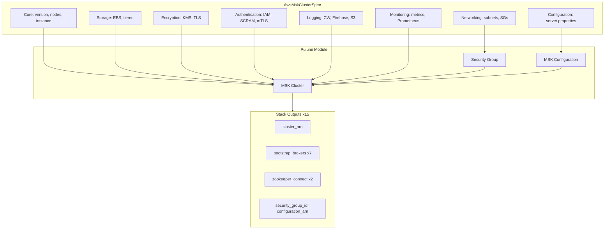

# AWS MSK Cluster Deployment Component

**Date**: February 16, 2026
**Type**: Feature
**Components**: API Definitions, Pulumi CLI Integration, Provider Framework, Resource Management

## Summary

Added the AwsMskCluster deployment component for Amazon Managed Streaming for Apache Kafka -- a medium-complexity, VPC-backed managed Kafka service supporting multi-method authentication (SASL/IAM, SASL/SCRAM, mTLS), customer-managed KMS encryption, inline Kafka configuration management via server.properties, three simultaneous broker log destinations (CloudWatch, Firehose, S3), Prometheus monitoring exporters, and tiered S3-backed storage.

## Problem Statement / Motivation

The AWS resource expansion project targets comprehensive AWS coverage across messaging, streaming, analytics, and other categories. MSK (Managed Streaming for Apache Kafka) is a core streaming service used by organizations building event-driven architectures, real-time data pipelines, change data capture (CDC) systems, and microservice communication layers.

### Pain Points

- No managed Kafka component in the Planton catalog
- Teams deploying MSK clusters manually or via raw Terraform/Pulumi without the benefits of Planton's cross-resource composition, preset system, and declarative KRM API
- Kafka configuration management (server.properties) typically requires a separate resource and workflow

## Solution / What's New

A complete AwsMskCluster deployment component following the forge workflow with 8 phases across 20 rules, resulting in a production-ready component with full proto API, both IaC implementations, comprehensive documentation, and 3 presets.

### Architecture

## Implementation Details

### Proto API (24 top-level fields, 5 nested messages, 6 CEL validations)

- **Core**: kafka_version, number_of_broker_nodes, instance_type
- **Networking**: managed security group pattern adapted for Kafka multi-port model (9092-9098 for broker protocols, 2181-2182 for ZooKeeper) -- differs from single-port RDS/Redshift pattern
- **Storage**: EBS volume size, provisioned throughput, LOCAL/TIERED storage mode
- **Encryption**: KMS key (ForceNew), client-broker mode (TLS/TLS_PLAINTEXT/PLAINTEXT), inter-broker (ForceNew)
- **Authentication**: SASL/IAM, SASL/SCRAM, mTLS with ACM PCA CAs, unauthenticated
- **Configuration**: inline server_properties map (creates MSK Configuration) OR external configuration_arn reference (mutually exclusive via CEL)
- **Logging**: CloudWatch, Firehose, S3 -- all three simultaneously, each with its own enabled flag and destination reference
- **Monitoring**: enhanced_monitoring levels, Prometheus JMX + Node exporters

### Validation (34 tests, all passing)

- 12 happy path scenarios covering minimal through production-ready configurations
- 18 failure scenarios for required fields, storage constraints, enum validation, mutual exclusion, logging requirements
- 4 API envelope tests

### Pulumi Module (6 files)

- `security_group.go`: Dual port-range ingress rules (Kafka 9092-9098, ZK 2181-2182) from both SG sources and CIDR blocks
- `configuration.go`: Serializes `map<string,string>` to sorted `.properties` format for MSK Configuration
- `cluster.go`: Maps all 6 MSK config blocks with conditional construction

### Key Design Decisions

1. **Managed SG with multi-port ranges** instead of single port (Kafka uses 4 protocol-specific ports + 2 ZK ports)
2. **Inline configuration via server.properties map** for user-friendly Kafka property management without requiring external MSK Configuration resource
3. **15 stack outputs** including 7 bootstrap broker variants organized by auth/connectivity for maximum infra chart composability
4. **ForceNew fields clearly documented** in proto comments -- security_groups, subnets, KMS key, in-cluster encryption are all immutable after creation

## Benefits

- **25th new AWS resource kind** in the expansion project (R21 of ~32)
- **Streaming infrastructure as code** -- event-driven architectures can now be composed in infra charts with MSK alongside Lambda, SQS, SNS, EventBridge, and Kinesis
- **Inline Kafka configuration** eliminates the need for separate configuration management
- **7 bootstrap broker outputs** enable downstream consumers to connect using their preferred auth method
- **3 presets** cover basic development, production encrypted, and multi-auth logging scenarios

## Impact

- Developers and DevOps engineers can deploy managed Kafka clusters through Planton's declarative API
- Infra chart authors can compose MSK with VPC, security groups, KMS keys, log groups, Firehose streams, and S3 buckets using `valueFrom` references
- The AWS catalog grows to 50 resource kinds (25 original + 25 new from expansion)

## Related Work

- Part of the `20260215.02.sp.aws-resource-expansion` sub-project (R21)
- Parent project: `20260212.01.planton-cloud-provider-expansion`
- Follows the managed SG pattern established by AwsRdsCluster and AwsRedshiftCluster, adapted for MSK's multi-port model
- Next: R22 AwsSagemakerDomain

---

**Status**: Production Ready
**Timeline**: Single session
