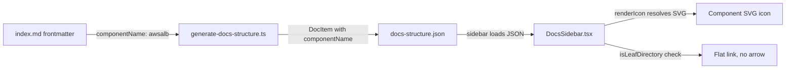

# Fix Sidebar Component Icons After Directory Migration

**Date**: February 16, 2026
**Type**: Bug Fix
**Components**: Documentation Site, Sidebar Navigation

## Summary

Fixed two sidebar regressions introduced when component documentation pages were migrated from flat markdown files to directory-based layout during the T09 preset documentation work. Component-specific SVG icons were replaced by generic folder icons, and unnecessary expand/collapse arrows appeared on every component entry.

## Problem Statement / Motivation

The T09 preset documentation feature converted all 267 component doc pages from flat files (e.g., `catalog/aws/alb.md`) to directories (e.g., `catalog/aws/alb/index.md`) to support nested preset sub-pages under each component. This conversion broke the sidebar in two visible ways.

### Pain Points

- **Lost component icons**: Every component in the sidebar showed a generic purple folder icon instead of its service-specific SVG icon (e.g., ALB icon, CloudFront icon, Certificate Manager icon)
- **Unwanted expand arrows**: Every component entry gained an expand/collapse chevron arrow, even though clicking it revealed no children (the `presets/` subdirectory was correctly filtered from the sidebar, leaving zero visible children)
- **Degraded user experience**: The sidebar went from a clean, visually distinct list of components to a wall of identical folder icons with non-functional expand buttons

## Solution / What's New

Three targeted fixes across the docs site build pipeline and sidebar rendering component.



### Fix 1: Propagate `componentName` to Directory Items

Both structure builders (`generate-docs-structure.ts` for build-time and `fileSystem.ts` for runtime) already read frontmatter from `index.md` files but omitted `componentName` when constructing directory `DocItem` objects. Added `componentName: metadata.componentName` to both.

### Fix 2: Recognize Component Directories in Icon Rendering

The `renderIcon()` function in `DocsSidebar.tsx` had a hard check for `item.type === 'file'` when resolving component SVG icons at path depth 3 under `catalog/`. Extended the condition to also match directories with `hasIndex: true`, which covers all component directories.

### Fix 3: Render Leaf Directories as Flat Links

Introduced a "leaf directory" concept: a directory with `hasIndex: true` and no visible children renders identically to a file -- as a direct clickable link with the component icon and no expand/collapse arrow. This applies to all 267 component directories whose only child (the `presets/` subdirectory) is already filtered from the sidebar.

## Implementation Details

### Files Changed

| File | Change |
|------|--------|
| `site/scripts/generate-docs-structure.ts` | Added `componentName` field to directory DocItem construction |
| `site/src/app/docs/utils/fileSystem.ts` | Added `componentName` field to directory DocItem construction |
| `site/src/app/docs/components/DocsSidebar.tsx` | Extended icon condition for directories; added leaf directory rendering |

### Key Code Changes

**Icon resolution condition** (DocsSidebar.tsx):
```typescript
// Before: only matched files
if (pathParts.length === 3 && pathParts[0] === 'catalog' && item.type === 'file')

// After: matches files and directory-based components
if (pathParts.length === 3 && pathParts[0] === 'catalog' &&
    (item.type === 'file' || (item.type === 'directory' && item.hasIndex)))
```

**Leaf directory detection** (DocsSidebar.tsx):
```typescript
const isLeafDirectory = item.type === 'directory' && item.hasIndex &&
    (!item.children || item.children.length === 0);

if (item.type === 'directory' && !isLeafDirectory) {
  // Existing directory rendering with expand/collapse arrow
}
// Leaf directories fall through to the file rendering block (flat link, no arrow)
```

## Benefits

- **Icons restored**: All 267 component entries show their correct service-specific SVG icons
- **Clean sidebar**: No expand/collapse arrows on component entries (they have no visible children)
- **Consistent UX**: Sidebar now looks identical to the production site while supporting the new directory-based layout underneath
- **Zero regressions**: Provider directories (AWS, GCP, Azure, etc.) retain their expand arrows and provider icons as expected

## Impact

- **Users**: Documentation sidebar is visually correct again -- component entries are easily distinguishable by their unique icons
- **Developers**: No changes to the preset system, build scripts, or page routing. The fix is entirely within the sidebar rendering layer.

## Related Work

- T09 Preset Documentation Pages (`_changelog/2026-02/2026-02-15-213453-preset-documentation-pages.md`) -- the session that introduced the directory migration and these regressions

---

**Status**: Production Ready
**Timeline**: Single session fix
