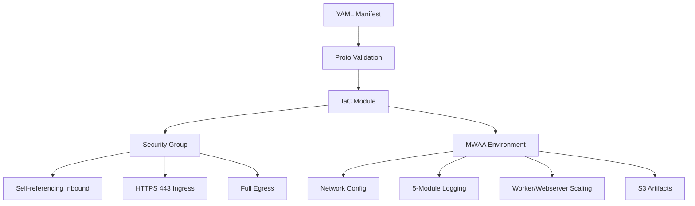

# AWS MWAA Environment Resource Kind

**Date**: February 16, 2026
**Type**: Feature
**Components**: API Definitions, Provider Framework, Pulumi CLI Integration, Terraform Module

## Summary

Added the AwsMwaaEnvironment resource kind (R24) to Planton, enabling declarative deployment of Amazon Managed Workflows for Apache Airflow environments. The component includes managed security group creation, 5-module CloudWatch logging, S3 artifact management (DAGs, plugins, requirements, startup scripts), auto-scaling workers and webservers, KMS encryption, and endpoint management -- delivering the twenty-eighth new AWS resource kind in the expansion project.

## Problem Statement / Motivation

Data engineering teams need a declarative, version-controlled way to provision Apache Airflow environments on AWS. MWAA environments require careful orchestration of VPC networking (security groups with self-referencing rules), IAM execution roles, S3 bucket configuration, and logging -- a setup that is error-prone when done manually or with ad-hoc scripts.

### Pain Points

- MWAA security group configuration is a common stumbling block (requires self-referencing inbound rules for VPC endpoint intercommunication)
- No declarative abstraction existed for MWAA in Planton, leaving a gap in the data pipeline orchestration space
- Production MWAA deployments require coordinating 5+ resources (environment, security groups, IAM roles, S3 buckets, CloudWatch log groups) across multiple services

## Solution / What's New

A complete AwsMwaaEnvironment deployment component with 28 spec fields, 3 proto messages, 5 CEL cross-field validations, managed security group pattern, and full Pulumi + Terraform IaC implementations.

### Component Architecture

### Key Features

- **Managed Security Group**: When `vpcId` is provided with `securityGroupIds` or `allowedCidrBlocks`, a security group is created with self-referencing inbound rules (MWAA's VPC endpoints need to talk to each other) plus HTTPS ingress from specified sources. Follows the established MSK/Redshift pattern for consistency.
- **5-Module Logging**: Independent control of DAG processing, scheduler, task, webserver, and worker logs with per-module enabled/log-level configuration.
- **S3 Artifact Management**: DAGs, plugins.zip, requirements.txt, and startup scripts with optional version pinning for deterministic deployments.
- **Auto-Scaling**: Min/max workers, min/max webservers, and scheduler count with cross-field CEL validations (max >= min).
- **Environment Classes**: mw1.micro through mw1.2xlarge with CEL-validated enum values.

## Implementation Details

### Proto API (spec.proto)

- 28 top-level fields across 7 functional groups: Airflow Config, S3 Source, IAM, VPC Networking, Encryption, Environment Sizing, Access/Networking
- 3 messages: `AwsMwaaEnvironmentSpec`, `AwsMwaaEnvironmentLoggingConfiguration`, `AwsMwaaEnvironmentLoggingModuleConfig`
- 5 cross-field CEL validations: max_workers >= min_workers, max_webservers >= min_webservers, dag_s3_path no leading slash, vpc_id required for managed SG, security coverage required
- StringValueOrRef for all cross-resource references: source_bucket_arn, execution_role_arn, subnet_ids, security_group_ids, kms_key_arn, vpc_id

### Pulumi Module (5 files)

- `main.go`: Orchestrates provider, security group, and environment creation
- `locals.go`: Standard labels and spec extraction
- `outputs.go`: 8 output constants
- `security_group.go`: Managed SG with self-referencing inbound + HTTPS ingress + full egress
- `environment.go`: MWAA environment with 5 typed logging module builder functions (Pulumi SDK has distinct Go types for each module despite identical fields)

**Note**: `WorkerReplacementStrategy` is in the spec but deferred in Pulumi IaC due to pulumi-aws SDK v7.3.0 not including the field. The Terraform module supports it.

### Terraform Module (5 files)

- Full feature parity with Pulumi module including `worker_replacement_strategy`
- Dynamic blocks for all 5 logging modules
- Conditional managed security group with `for_each` for source SG rules

### Validation Tests (41 tests)

- 21 happy path: minimal, all config variations, managed SG, logging, scaling, valueFrom, production-ready
- 15 failure: required field violations, invalid enums, CEL cross-field failures, CIDR validation
- 5 API envelope: wrong apiVersion/kind, missing metadata/spec, valid envelope

## Benefits

- **Declarative MWAA**: Data engineers can version-control their Airflow infrastructure alongside DAG code
- **Correct Security by Default**: Managed SG pattern eliminates the #1 MWAA networking misconfiguration
- **Infra Chart Composability**: Rich StringValueOrRef outputs enable MWAA to be composed with VPC, IAM, S3, and KMS components in infra charts
- **Production-Ready Presets**: 3 presets covering development, production, and extensible configurations

## Impact

- **Users**: Can now deploy MWAA environments through Planton CLI with 41 validated spec fields
- **Infra Charts**: Enables new data pipeline infra charts combining MWAA with S3, Glue, Athena, and Redshift components
- **AWS Coverage**: Brings AWS to 28 new resource kinds (of ~32 target), completing Phase 2 item R24

## Related Work

- Part of the 20260215.02.sp.aws-resource-expansion project (R24 of ~32)
- Follows the managed security group pattern established in R21 AwsMskCluster and R20 AwsRedshiftCluster
- Next in queue: R25 AwsTransitGateway

---

**Status**: Production Ready
**Timeline**: Single session (2026-02-16)
