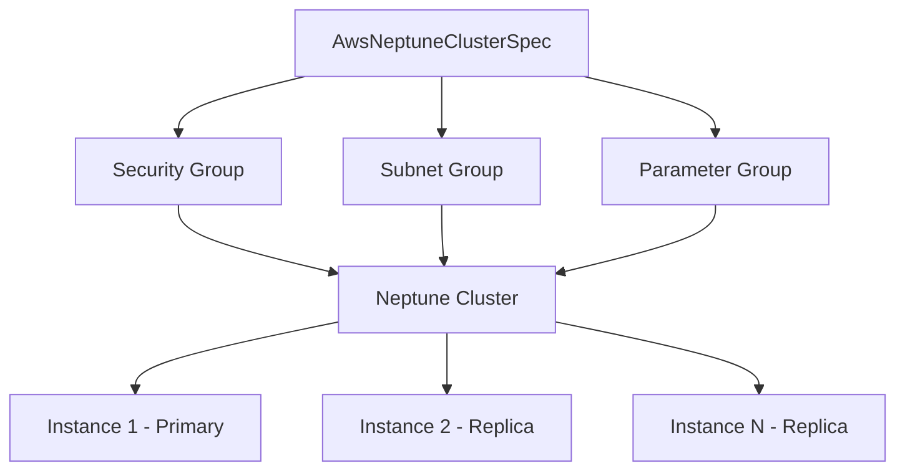

# AWS Neptune Cluster Resource Kind

**Date**: February 16, 2026
**Type**: Feature
**Components**: API Definitions, AWS Provider, Pulumi Module, Terraform Module

## Summary

Added `AwsNeptuneCluster` (R26) as a new deployment component in OpenMCF, enabling fully managed graph database provisioning on AWS. Neptune supports property-graph (Gremlin) and RDF (SPARQL) query languages. The component bundles cluster, instances, subnet group, security group, and parameter group into a single resource definition, following the established DocumentDB/RDS Cluster pattern.

## Problem Statement / Motivation

OpenMCF's AWS provider lacked graph database support. Users building knowledge graphs, fraud detection systems, recommendation engines, social networks, or IT operations graphs had no declarative way to provision Neptune through OpenMCF.

### Pain Points

- No graph database resource kind in the AWS provider catalog
- Users had to manually provision Neptune clusters outside of OpenMCF's IaC workflow
- No cross-resource reference support (`StringValueOrRef`) for Neptune dependencies (VPC, security groups, KMS, IAM roles)

## Solution / What's New

A complete `AwsNeptuneCluster` deployment component covering:

- **Protobuf API** — spec, api, stack_input, stack_outputs with full buf.validate rules and CEL cross-field validations
- **Pulumi module** — 8 Go files implementing cluster, instances, subnet group, security group, and parameter group
- **Terraform module** — 9 HCL files with feature parity to the Pulumi module
- **22 spec validation tests** — all passing, covering valid inputs, invalid inputs, CIDR validation, port ranges, window formats, storage types, parameter group apply methods, and serverless scaling bounds
- **3 presets** — graph-database (dev), high-availability (production), serverless-v2 (auto-scaling)
- **Production-quality documentation** — README, examples, comprehensive research docs, catalog page

### Key Design Decision: No Master Password

Unlike DocumentDB and RDS Cluster, Neptune does not use master username/password authentication. Access is controlled via:
- **IAM database authentication** — temporary credentials from IAM roles/users
- **Network-level security** — VPC security groups and subnet isolation

This fundamentally simplifies the spec compared to other database components.

### Neptune-Specific Features

- **Serverless v2 scaling** — auto-scales between 1.0 and 128.0 Neptune Capacity Units (NCUs)
- **I/O-Optimized storage** (`iopt1`) — higher throughput for read-heavy graph workloads
- **IAM role attachment** — enables S3 bulk data loading via `aws neptune load`
- **Dual query language support** — Gremlin (property graph) and SPARQL (RDF) on the same cluster

## Implementation Details

### Resource Architecture



### File Structure

```
apis/org/openmcf/provider/aws/awsneptunecluster/v1/
├── spec.proto                    # 27 fields, 4 CEL validations
├── stack_outputs.proto           # 10 outputs
├── api.proto                     # KRM wiring
├── stack_input.proto             # IaC module input
├── spec_test.go                  # 22 validation tests
├── catalog-page.md               # User-facing catalog page
├── README.md                     # Component overview
├── examples.md                   # 4 YAML examples
├── docs/README.md                # Comprehensive Neptune research
├── iac/
│   ├── pulumi/
│   │   ├── module/
│   │   │   ├── main.go           # Orchestrator
│   │   │   ├── locals.go         # Labels and config
│   │   │   ├── outputs.go        # Output constants
│   │   │   ├── cluster.go        # Neptune cluster
│   │   │   ├── instances.go      # Cluster instances
│   │   │   ├── subnet_group.go   # Neptune subnet group
│   │   │   ├── security_group.go # VPC security group
│   │   │   └── parameter_group.go# Cluster parameter group
│   │   ├── main.go               # Pulumi entrypoint
│   │   ├── Pulumi.yaml           # Pulumi project config
│   │   └── Makefile              # Operations targets
│   └── tf/
│       ├── main.tf               # Cluster + instances
│       ├── variables.tf          # Input variables
│       ├── outputs.tf            # Output values
│       ├── locals.tf             # Computed values
│       ├── provider.tf           # AWS provider
│       ├── subnet_group.tf       # Neptune subnet group
│       ├── security_group.tf     # VPC security group
│       └── parameter_group.tf    # Cluster parameter group
└── presets/
    ├── 01-graph-database.yaml    # Dev/test single instance
    ├── 01-graph-database.md
    ├── 02-high-availability.yaml # Production 2-instance
    ├── 02-high-availability.md
    ├── 03-serverless-v2.yaml     # Auto-scaling serverless
    └── 03-serverless-v2.md
```

## Benefits

- **Graph database coverage** — Neptune is now a first-class resource kind in OpenMCF
- **Cross-resource references** — `StringValueOrRef` for VPC subnets, security groups, KMS keys, and IAM roles
- **Serverless support** — cost-efficient for variable workloads without capacity planning
- **22 validation tests** — comprehensive spec validation preventing misconfiguration
- **Dual IaC** — both Pulumi and Terraform modules with feature parity

## Impact

- **New resource kind**: `AwsNeptuneCluster` (enum 341, id_prefix: `awsnep`)
- **Phase 3 progress**: 1 of 7 specialized components complete (R26)
- **Infra chart enablement**: Graph database patterns now available for future composition

## Related Work

- Part of project `20260215.02.sp.aws-resource-expansion` (Phase 3: Specialized Services)
- Follows the AwsDocumentDB cluster+instance pattern
- Enum 341 registered in `cloud_resource_kind.proto`

---

**Status**: Production Ready
**Timeline**: Single session
