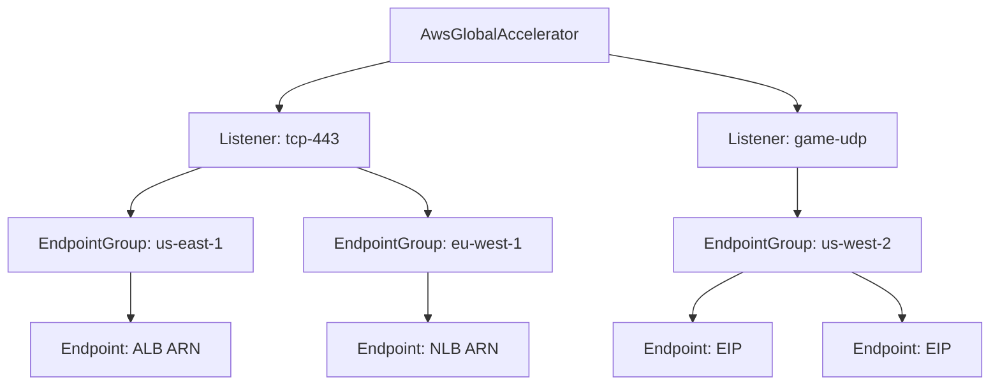

# AWS Global Accelerator Resource Kind

**Date**: February 16, 2026
**Type**: Feature
**Components**: API Definitions, Pulumi CLI Integration, Provider Framework

## Summary

Added AwsGlobalAccelerator as a new deployment component (R30, enum 283) — a Layer 4 networking service that provides static anycast IP addresses and routes traffic through the AWS global network to healthy endpoints across multiple regions. This is the deepest nested spec in the Planton AWS provider, bundling the full accelerator-listener-endpoint group-endpoint hierarchy into a single resource.

## Problem Statement / Motivation

The AWS resource expansion project targets ~57 resource kinds for comprehensive workload coverage. Global Accelerator fills a critical gap in the networking category — the ability to provide static anycast IPs with automatic health-based failover across regions, which is essential for gaming, financial services, IoT, and any global application requiring deterministic IP addresses with sub-second failover.

### Pain Points

- No way to provision AWS Global Accelerator through Planton
- Multi-region failover required separate manual configuration of accelerator, listeners, and endpoint groups
- No infra-chart composability for global anycast networking patterns

## Solution / What's New

A complete AwsGlobalAccelerator deployment component with three-level nested spec design following the NLB listener-bundling pattern.

### Resource Hierarchy

## Implementation Details

### Proto API (4 files)

- **spec.proto**: 23 fields across 7 messages (AwsGlobalAcceleratorSpec, FlowLogs, Listener, PortRange, EndpointGroup, Endpoint, PortOverride)
- **4 CEL validations** at spec level (ip_address_type, BYOIP max 2)
- **4 CEL validations** at listener level (protocol, client_affinity, port_ranges max)
- **5 CEL validations** at endpoint group level (health check protocol, interval 10/30 only, path required for HTTP, traffic dial range, port overrides max)
- **stack_outputs.proto**: 7 outputs including map outputs for listener ARNs and endpoint group ARNs (composite key: listener_name/group_name)

### Validation Tests (25 tests)

- 10 happy path: minimal, full production, UDP with affinity, BYOIP, HTTPS health check, interval 10s, traffic dial 0, multiple port ranges, valueFrom references, disabled accelerator
- 12 failure scenarios: empty listeners, invalid protocol, missing name, missing port ranges, missing endpoint groups, invalid ip_address_type, too many BYOIP, invalid health check interval (not 10 or 30), HTTP without path, weight out of range, port out of range, invalid client affinity
- 3 API envelope tests

### Pulumi Module (6 Go files)

- `main.go` — orchestrates accelerator, listeners, endpoint groups
- `accelerator.go` — creates globalaccelerator.NewAccelerator with flow logs
- `listener.go` — iterates spec.listeners, creates ListenerResult map
- `endpoint_group.go` — nested iteration over listeners/groups, creates composite-keyed map
- `locals.go` — standard AWS tag initialization
- `outputs.go` — output key constants

### Terraform Module (5 HCL files)

- Flattened nested structure via `locals.tf` for clean `for_each` iteration
- `listeners_map` keyed by name, `endpoint_groups_map` keyed by composite key
- Dynamic blocks for port_ranges, endpoint_configuration, port_override, and flow log attributes

### Key Design Decisions

1. **Bundled full hierarchy** — accelerator + listeners + endpoint groups + endpoints in one resource (follows Transit Gateway and NLB precedents)
2. **Excluded custom routing** — fundamentally different resource type (~5% adoption), separate component if needed
3. **Excluded cross-account attachments** — separate lifecycle, enterprise feature
4. **Included BYOIP** — trivial complexity (1 field), enables key differentiator, ForceNew means can't add later
5. **Endpoints optional within groups** — allows creating infrastructure first, registering endpoints later
6. **Health check interval is 10 or 30 only** — AWS constraint, validated via CEL (not a continuous range)

## Benefits

- Single manifest deploys complete Global Accelerator with multi-region endpoint groups
- Polymorphic endpoint support (ALB, NLB, EIP, EC2) via StringValueOrRef
- Traffic dial percentage enables zero-downtime regional migrations
- Source IP affinity for stateful protocols (gaming, WebSocket)
- Flow log integration for traffic analysis

## Impact

- **AWS resource kinds**: 283 enum registered, id_prefix "awsga"
- **Files created**: ~50 files across proto, IaC, docs, presets, site catalog
- **Infra chart enablement**: Global anycast networking for multi-region charts
- **Phase 3 progress**: 2 of 7 specialized components complete

## Related Work

- AwsNetworkLoadBalancer (R09) — listener bundling pattern reference
- AwsTransitGateway (R25) — sub-resource bundling pattern reference
- 20260215.02.sp.aws-resource-expansion — parent project context

---

**Status**: Production Ready
**Timeline**: Single session
