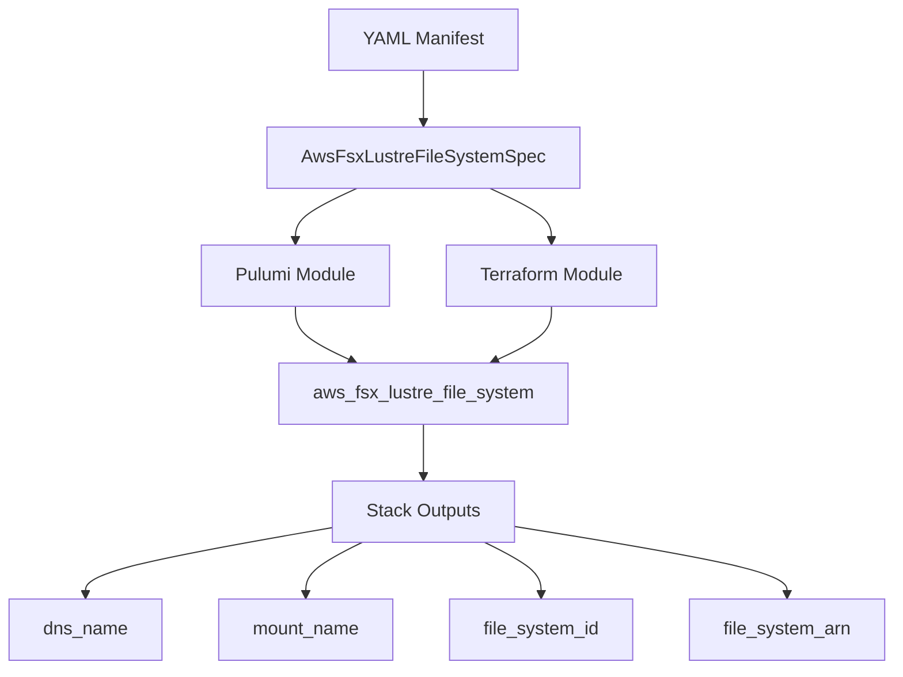

# Add AwsFsxLustreFileSystem Resource Kind

**Date**: February 16, 2026
**Type**: Feature
**Components**: API Definitions, Provider Framework, Pulumi CLI Integration, Terraform Module

## Summary

Added `AwsFsxLustreFileSystem` as a new cloud resource kind in Planton, providing declarative management of Amazon FSx for Lustre file systems — high-performance storage optimized for HPC, ML training, and batch processing workloads. This is the first of a planned family of FSx components, following a key design decision to model each FSx type as a separate resource kind.

## Problem Statement / Motivation

FSx for Lustre is a critical AWS service for compute-intensive workloads, but it was missing from Planton's resource catalog. The original plan treated all FSx types (Lustre, Windows, OpenZFS, ONTAP) as a single component, which would have produced a confusing, unmaintainable abstraction.

### Pain Points

- No declarative way to provision Lustre file systems through Planton
- The original single-component design would have created a massive spec where ~80% of fields are irrelevant for any given FSx type
- Each FSx type is a fundamentally different Terraform resource with distinct schemas, sub-resources, and use cases

## Solution / What's New

### Design Decision: Split FSx Into Separate Components

Deep research into the Terraform provider revealed that AWS FSx is a family of four completely separate services. Following the same pattern used for ElastiCache (Redis/Memcached/Serverless), FSx was split into separate resource kinds:

- `AwsFsxLustreFileSystem` (enum 291) — this component
- `AwsFsxOpenzfsFileSystem` (enum 292) — planned
- `AwsFsxWindowsFileSystem` (enum 293) — planned
- `AwsFsxOntapFileSystem` (enum 294) — planned

### Component Architecture

## Implementation Details

### Proto API (4 files)

- **spec.proto**: 18 fields covering deployment type, storage, networking, encryption, S3 integration, logging, backups, maintenance, and metadata configuration. Includes 9 CEL cross-field validations (e.g., HDD requires PERSISTENT_1, metadata_configuration requires PERSISTENT_2).
- **stack_outputs.proto**: 8 outputs (file_system_id, arn, dns_name, mount_name, network_interface_ids, vpc_id, file_system_type_version, owner_id).
- **api.proto**: KRM envelope wiring.
- **stack_input.proto**: IaC module input (target + provider config).

### IaC Modules

- **Pulumi (Go)**: 4 files (main.go, locals.go, outputs.go, file_system.go). Creates a single `fsx.LustreFileSystem` resource with all spec fields mapped to Pulumi args. Clean, linear code readable by Terraform-background engineers.
- **Terraform (HCL)**: 5 files (main.tf, variables.tf, outputs.tf, locals.tf, provider.tf). Single `aws_fsx_lustre_file_system` resource with dynamic blocks for log_configuration and metadata_configuration.

### Validation

- **52 spec tests** covering all CEL validations, field-level rules, and happy paths.
- All tests pass. Pulumi module compiles. Protos build clean.

### Documentation

- User-facing README.md with deployment type comparison, prerequisites, and examples
- 5-example examples.md covering scratch, persistent, HDD, and valueFrom patterns
- Comprehensive technical reference in docs/README.md
- Catalog page matching the AwsAlb exemplar structure
- Pulumi module overview and debug script

### Presets (3)

1. **scratch-development**: SCRATCH_2, 1200 GiB SSD — cheapest for dev/test
2. **persistent-high-throughput**: PERSISTENT_2, 2400 GiB SSD, 1000 MB/s/TiB — ML training
3. **persistent-capacity-datalake**: PERSISTENT_1, 6000 GiB HDD, 12 MB/s/TiB — data lakes

## Benefits

- Declarative provisioning of Lustre file systems through Planton CLI
- Clean separation of FSx types prevents spec pollution and confusion
- Rich cross-field validations catch misconfigurations before deployment
- StringValueOrRef integration enables infra chart wiring (VPC, SG, KMS, CloudWatch)
- Three presets cover the most common Lustre deployment patterns

## Impact

- **Users**: Can now deploy FSx Lustre via `planton pulumi up --manifest lustre.yaml`
- **Platform**: FSx family expansion path is clear (5 more components planned)
- **Infra Charts**: Enables ML notebook and HPC cluster infra charts with Lustre backing storage

## Related Work

- Part of the AWS Resource Expansion sub-project (20260215.02.sp)
- Follows ElastiCache split pattern (R7/R7a/R7b)
- Also fixed `IGNORE_IF_UNPOPULATED` → `IGNORE_IF_ZERO_VALUE` in AwsBatchComputeEnvironment spec (parallel agent fix)

---

**Status**: Production Ready
**Timeline**: Single session
