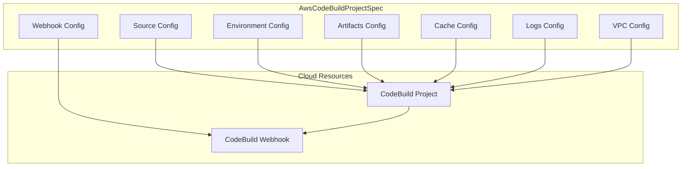

# AWS CodeBuild Project Resource Kind

**Date**: February 16, 2026
**Type**: Feature
**Components**: API Definitions, AWS Provider, Pulumi CLI Integration

## Summary

Added the AwsCodeBuildProject deployment component (enum 330, id_prefix `awscb`), providing declarative infrastructure management for AWS CodeBuild projects with optional webhook triggers. The component covers the primary CI/CD build use cases: GitHub-triggered CI, Docker image builds, and CodePipeline stages.

## Problem Statement / Motivation

AWS CodeBuild is a core CI/CD service used by teams building on AWS. Without an Planton component, teams deploying CodeBuild projects alongside other managed infrastructure had to maintain separate Terraform or Pulumi code outside the declarative resource model.

### Pain Points

- CodeBuild projects deployed separately from the infrastructure they build and test against
- No cross-resource referencing between build projects and VPCs, IAM roles, S3 buckets, or log groups
- Webhook configuration managed manually or through separate tooling
- No preset-based quick starts for common CI/CD patterns

## Solution / What's New

A complete AwsCodeBuildProject deployment component with full proto API, dual IaC modules (Pulumi + Terraform), comprehensive validation, and production documentation.

### Component Architecture

### Key Design Decisions

- **Webhook bundled as optional sub-resource** — 1:1 with project, useless in isolation. Omitted for CodePipeline and manual projects.
- **Source credentials, report groups, fleets excluded** — Independent lifecycles, account-level or shared resources.
- **9 source types supported** — GITHUB, BITBUCKET, CODECOMMIT, CODEPIPELINE, GITHUB_ENTERPRISE, GITLAB, GITLAB_SELF_MANAGED, NO_SOURCE, S3.
- **7 environment types** — Standard Linux, GPU, ARM, Windows 2019/2022, Lambda Linux/ARM.
- **6 CEL cross-field validations** — CODEPIPELINE source/artifacts must match, location required for real sources, buildspec required for NO_SOURCE, S3 needs bucket, webhook requires compatible source.

## Implementation Details

### Proto API (4 files, 14 messages)

- `spec.proto` — 14 message types covering source, environment, artifacts, cache, logs, VPC, and webhook
- `stack_outputs.proto` — 5 outputs: project_arn, project_name, service_role_arn, webhook_url, webhook_payload_url
- `api.proto` — KRM wiring with `aws.planton.dev/v1` API version
- `stack_input.proto` — Stack input with target + provider config

### StringValueOrRef Cross-References (9 fields)

- `serviceRole` → AwsIamRole
- `encryptionKey` → AwsKmsKey
- `artifacts.location` → AwsS3Bucket
- `cache.location` → AwsS3Bucket
- `logsConfig.cloudwatchLogs.groupName` → AwsCloudwatchLogGroup
- `logsConfig.s3Logs.location` → AwsS3Bucket
- `vpcConfig.vpcId` → AwsVpc
- `vpcConfig.subnetIds` → AwsVpc
- `vpcConfig.securityGroupIds` → AwsSecurityGroup

### Pulumi Module (5 Go files)

- `main.go` — Orchestrates project creation + optional webhook
- `locals.go` — Tag initialization from metadata
- `outputs.go` — Output key constants
- `project.go` — CodeBuild project with all nested blocks (source, environment, artifacts, cache, logs, VPC)
- `webhook.go` — Optional webhook with filter groups

### Terraform Module (5 HCL files)

- `main.tf` — Project + conditional webhook with dynamic blocks
- `variables.tf` — Full type-safe variable definitions
- `locals.tf` — Tag computation + feature flags
- `provider.tf` — AWS provider configuration

### Validation Tests (42 tests)

Coverage includes:
- Valid configurations (9 tests: GitHub, CodePipeline, NO_SOURCE, S3, Lambda, ARM, local cache, webhook)
- Required field validations (7 tests)
- Enum/string-in validations (7 tests)
- Range validations (5 tests: timeouts, description length)
- Cross-field CEL validations (10 tests: CODEPIPELINE matching, location requirements, webhook compatibility)
- VPC config validations (4 tests: missing fields, max items)

## Benefits

- **Declarative CI/CD** — CodeBuild projects managed alongside the infrastructure they build
- **Cross-resource references** — Service roles, VPCs, S3 buckets, and log groups referenced via `valueFrom`
- **3 presets** — Instant starting points for GitHub CI, Docker builds, and CodePipeline stages
- **42 validation tests** — Catch configuration errors before deployment

## Impact

- **New resource kind**: AwsCodeBuildProject (enum 330, id_prefix `awscb`)
- **Files created**: 34 files, 4,958 lines
- **Test coverage**: 42 spec validation tests, all passing
- **Documentation**: README, examples (5), catalog page, 3 preset pairs (YAML + Markdown)
- **Build validation**: Pulumi module compiles, Terraform module validates

## Related Work

- Part of the 20260215.02.sp.aws-resource-expansion sub-project (R31 of ~38)
- Complements the planned AwsCodePipeline (R32) which will reference CodeBuild projects as pipeline stages
- Uses patterns established in AwsBatchComputeEnvironment (R28) for optional sub-resource bundling

---

**Status**: Production Ready
