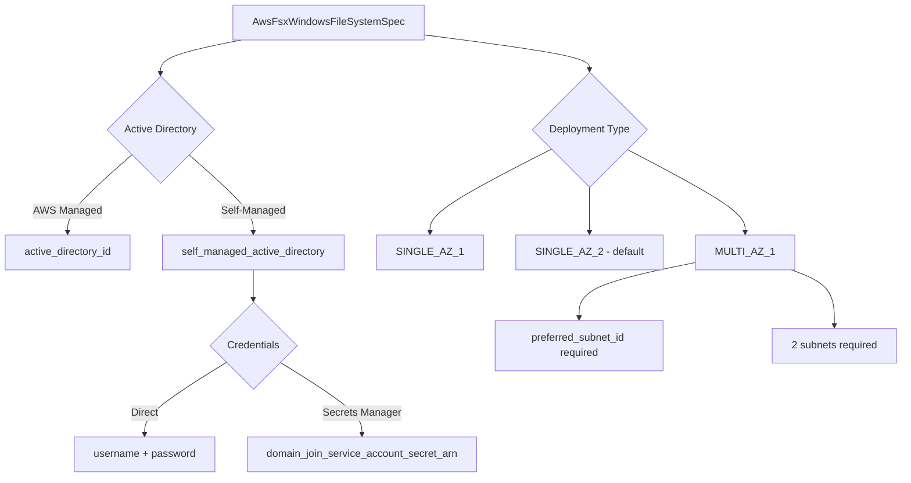

# AWS FSx for Windows File Server Resource Kind

**Date**: February 16, 2026
**Type**: Feature
**Components**: API Definitions, AWS Provider, Pulumi CLI Integration, Terraform Module

## Summary

Added AwsFsxWindowsFileSystem as a new OpenMCF resource kind (enum 293, id prefix `awsfxw`), continuing the FSx family expansion alongside Lustre (R29a) and OpenZFS (R29b). This component deploys fully managed Windows file systems with mandatory Active Directory integration, SMB protocol access, audit logging, and multi-AZ failover support.

## Problem Statement / Motivation

The FSx family was split into separate components because each file system type has fundamentally different Terraform resources, schemas, and use cases. Windows File Server is the most enterprise-oriented FSx type, providing Windows-native features like SMB, DFS namespaces, Windows ACLs, and Active Directory authentication that are essential for .NET applications, SQL Server, home directories, and content management systems.

### Pain Points

- No OpenMCF component for managed Windows file shares
- Windows workloads on AWS require AD-integrated SMB storage
- MULTI_AZ deployments need careful subnet and failover configuration
- Audit logging for compliance requires non-trivial setup

## Solution / What's New

A complete deployment component covering the full lifecycle of an FSx for Windows File Server file system.

### Component Architecture

## Implementation Details

### Proto API (4 files)

- **spec.proto** — 18 fields across the main spec plus 3 nested messages (SelfManagedActiveDirectory, AuditLogConfiguration, DiskIopsConfiguration). 10 CEL cross-field validations covering AD mutual exclusion, HDD compatibility, throughput valid values, and more.
- **stack_outputs.proto** — 8 outputs including Windows-specific `preferred_file_server_ip` and `remote_administration_endpoint`.
- **api.proto** — KRM wiring with `aws.openmcf.org/v1` API version.
- **stack_input.proto** — Standard AWS provider config + target resource.

### Key Design Decisions

1. **Active Directory is mandatory** — unlike Lustre/OpenZFS, every Windows file system must join an AD domain. CEL enforces exactly one of `active_directory_id` or `self_managed_active_directory`.

2. **Self-managed AD credential options** — supports both direct credentials (username/password) and Secrets Manager secret ARN, with CEL mutual exclusion validation.

3. **Default deployment_type = SINGLE_AZ_2** — consistent with OpenZFS. Latest generation, recommended for new workloads.

4. **Default backup_retention = 7 days** — enterprise workloads expect backups, unlike Lustre/OpenZFS which default to 0.

5. **Pulumi SDK limitation** — The `domain_join_service_account_secret` field is not available in Pulumi AWS SDK v7.3.0. The proto spec retains the field for forward compatibility and Terraform module support.

### Validation Coverage

79 spec tests covering all CEL rules, field-level constraints, AD configuration permutations, audit log levels, IOPS modes, and boundary conditions.

### IaC Modules

- **Pulumi (Go)** — 4 files handling both AD paths, audit logging, disk IOPS, DNS aliases, and all optional fields with conditional application.
- **Terraform (HCL)** — 5 files with dynamic blocks for `self_managed_active_directory`, `audit_log_configuration`, and `disk_iops_configuration`.

## Benefits

- Windows workloads on AWS get a declarative, version-controlled file system configuration
- Both AWS Managed AD and self-managed AD supported out of the box
- Multi-AZ failover for mission-critical deployments
- Audit logging for compliance (SOC 2, HIPAA, PCI DSS)
- 3 presets covering development, production, and high-availability patterns

## Impact

- **Operators**: Can deploy Windows file shares with a single YAML manifest
- **Security teams**: Audit logging configuration is declarative and auditable
- **Platform teams**: Consistent resource management alongside other FSx types
- **Developers**: Cross-resource wiring via `valueFrom` for VPC, security groups, and KMS keys

## Code Metrics

- **37 files** created, **5,205 lines** of code
- **79 validation tests**, all passing
- **3 presets**: development, production, multi-AZ HA
- **8 stack outputs**
- **10 CEL validations**
- **3 nested messages** (SelfManagedActiveDirectory, AuditLogConfiguration, DiskIopsConfiguration)

## Related Work

- Part of the FSx family expansion: R29a (Lustre), R29b (OpenZFS), R29c (Windows), with R29d-R29f (ONTAP) pending
- Follows the ElastiCache split precedent (R7/R7a/R7b) for fundamentally different service types sharing a brand name
- Parent project: 20260212.01.openmcf-cloud-provider-expansion

---

**Status**: Production Ready
