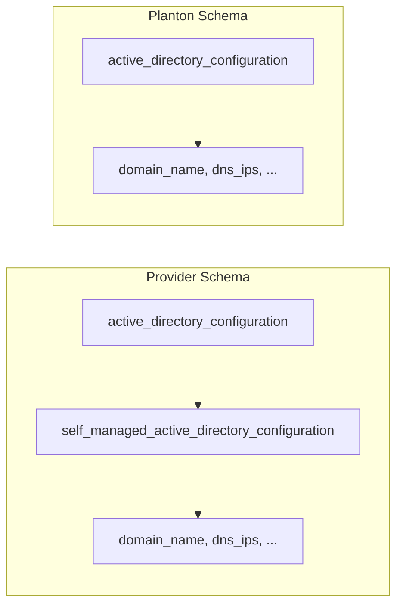
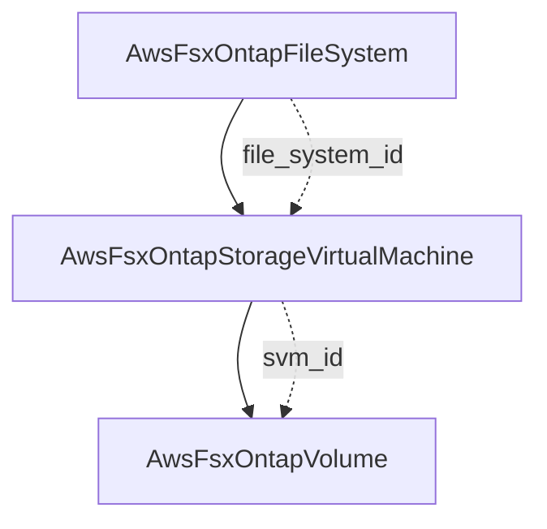

# AWS FSx ONTAP Storage Virtual Machine Component

**Date**: February 16, 2026
**Type**: Feature
**Components**: API Definitions, Pulumi CLI Integration, Provider Framework

## Summary

Added AwsFsxOntapStorageVirtualMachine (R29e) as a new AWS cloud resource kind, completing the second-to-last piece of the FSx ONTAP hierarchy. The SVM provides multi-protocol data access (NFS, SMB, iSCSI) and serves as the parent container for ONTAP volumes. This component features a flattened Active Directory configuration that simplifies the user experience compared to the native provider's nested structure.

## Problem Statement / Motivation

FSx for ONTAP uses a three-tier architecture: File System → Storage Virtual Machine → Volume. While the file system (R29d) was already implemented, the SVM layer was missing, blocking the creation of ONTAP volumes (R29f) and leaving the ONTAP resource hierarchy incomplete.

### Pain Points

- Users could create ONTAP file systems but had no way to create the SVMs needed for data access
- The SVM is the layer that provides protocol endpoints (NFS, SMB, iSCSI) — without it, the file system is infrastructure without data access
- ONTAP volumes require an SVM as their parent, making this a blocking dependency

## Solution / What's New

A complete deployment component for FSx ONTAP Storage Virtual Machines with:

- **Proto API** — spec.proto with 5 fields + 1 nested message (flattened AD configuration), 5 CEL cross-field validations, stack_outputs.proto with 12 fields across 4 endpoint types
- **Pulumi module** — 4 Go files with `ApplyT()` endpoint extraction for all 4 endpoint types (iSCSI, management, NFS, SMB)
- **Terraform module** — 4 HCL files with dynamic `active_directory_configuration` block
- **39 spec tests** — comprehensive validation coverage, all passing
- **3 presets** — nfs-unix, smb-windows, multiprotocol
- **Production documentation** — README.md, examples.md (5 examples), docs/README.md (technical reference), catalog-page.md

### Key Design Decision: Flattened Active Directory

The Terraform/Pulumi providers nest AD configuration two levels deep (`active_directory_configuration.self_managed_active_directory_configuration`), because FSx Windows supports both AWS Managed AD and self-managed AD. ONTAP SVMs only support self-managed AD, making the second nesting level unnecessary.

The proto spec flattens this into a single `active_directory_configuration` message, reducing YAML indentation and eliminating a false choice between AD types that doesn't exist for ONTAP SVMs.



## Implementation Details

### Resource Hierarchy



### Component Files

- **Proto**: 4 files (spec.proto, api.proto, stack_outputs.proto, stack_input.proto)
- **Pulumi**: 4 module files (main.go, locals.go, outputs.go, svm.go) + entrypoint
- **Terraform**: 4 HCL files (main.tf, variables.tf, outputs.tf, provider.tf)
- **Tests**: spec_test.go with 39 validations (13 happy path, 15 field-level, 8 CEL, 3 API envelope)
- **Presets**: 3 configurations (NFS-only, SMB+AD, multiprotocol)
- **Docs**: 5 documentation files + catalog page

### Endpoint Extraction Pattern

The Pulumi module extracts 4 endpoint types using `ApplyT()`, matching the pattern established by AwsFsxOntapFileSystem:

```
Endpoints → [iSCSI, Management, NFS, SMB] → each with dns_name + ip_addresses
```

SMB endpoints are only populated when Active Directory is configured.

## Benefits

- Completes the SVM layer in the FSx ONTAP hierarchy, unblocking volume creation (R29f)
- Flattened AD configuration reduces YAML complexity for end users
- 12 stack outputs enable downstream volume resources to reference SVM endpoints via `valueFrom`
- Multi-tenancy support — multiple SVMs on a single file system for workload isolation

## Impact

- **End users**: Can now provision ONTAP SVMs for NFS, SMB, and iSCSI workloads
- **Downstream components**: AwsFsxOntapVolume (R29f) can now reference `svm_id` from these outputs
- **Registry**: Registered as enum 295 in `cloud_resource_kind.proto` with id_prefix `awsfxosvm`

## Related Work

- `AwsFsxOntapFileSystem` (R29d) — parent file system, completed in same expansion
- `AwsFsxOntapVolume` (R29f) — child volumes, next in queue
- `AwsFsxWindowsFileSystem` (R29c) — sibling with AD pattern reference (mandatory AD, both managed and self-managed)
- Part of the AWS resource expansion project (20260215.02.sp.aws-resource-expansion)

---

**Status**: Production Ready
**Timeline**: Single session
