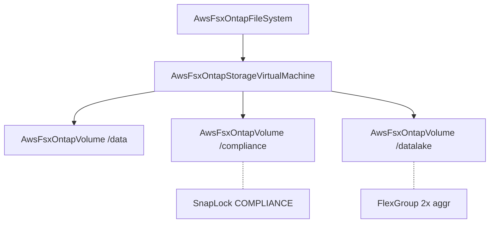

# AWS FSx ONTAP Volume Component

**Date**: February 16, 2026
**Type**: Feature
**Components**: API Definitions, Pulumi CLI Integration, Provider Framework

## Summary

Added AwsFsxOntapVolume (R29f) — the final component in the FSx ONTAP hierarchy and the last AWS resource in the cloud provider expansion project. ONTAP Volumes are data containers within a Storage Virtual Machine, supporting tiering, SnapLock WORM compliance, FlexGroup distribution, and storage efficiency.

## Problem Statement / Motivation

The FSx ONTAP hierarchy in OpenMCF was incomplete. File systems (R29d) and SVMs (R29e) were already implemented, but there was no way to create the actual data containers — volumes — that users interact with. Without volumes, the ONTAP stack was like having a database server with no databases.

### Pain Points

- Users could create ONTAP infrastructure (file systems, SVMs) but couldn't provision volumes through OpenMCF
- No declarative way to configure SnapLock WORM compliance for regulatory workloads
- No OpenMCF support for tiering policies that optimize storage costs
- FlexGroup volumes for high-throughput workloads required manual CLI operations

## Solution / What's New

A complete AwsFsxOntapVolume component covering the full `aws_fsx_ontap_volume` Terraform resource surface, including all three optional configuration blocks (tiering, SnapLock, aggregates).

### Component Architecture

## Implementation Details

### Proto API (7 messages, 33 fields, 18 CEL validations)

- **AwsFsxOntapVolumeSpec** — 15 fields covering parent reference, identity, size, configuration, deletion behavior, and 3 nested config blocks
- **AwsFsxOntapVolumeTieringPolicy** — tiering name (NONE/SNAPSHOT_ONLY/AUTO/ALL) + cooling period
- **AwsFsxOntapVolumeSnaplockConfiguration** — SnapLock type, audit log, privileged delete, volume append mode, autocommit, retention
- **AwsFsxOntapVolumeAutocommitPeriod** — type + value for auto-WORM commitment
- **AwsFsxOntapVolumeRetentionPeriod** — default/minimum/maximum retention bounds
- **AwsFsxOntapVolumeRetentionDuration** — shared time unit (SECONDS through INFINITE)
- **AwsFsxOntapVolumeAggregateConfiguration** — FlexGroup aggregate distribution

### Validation Tests (47 passing)

- 16 happy path (minimal, full production, DP type, FlexGroup, all security styles, SnapLock variants, tiering policies)
- 5 required field failures (missing SVM ID, empty name, name too long, size below minimum, size zero)
- 3 name format failures (hyphens, spaces, special characters)
- 3 enum value failures (invalid volume type, style, security style)
- 1 junction path format failure
- 5 tiering policy failures (invalid name, cooling period with wrong policy, range violations)
- 5 SnapLock failures (missing type, invalid type, invalid privileged delete, invalid autocommit type, invalid retention type)
- 1 aggregate failure (too many aggregates)
- 3 API envelope tests

### Pulumi Module (4 Go files)

- `main.go` — Entry point with AWS provider setup
- `locals.go` — Tag initialization with resource kind metadata
- `outputs.go` — 6 output constants
- `volume.go` — Single `fsx.NewOntapVolume` with conditional nested blocks for tiering, SnapLock (3 levels deep), and aggregates

### Terraform Module (4 HCL files)

- Dynamic blocks for `tiering_policy`, `snaplock_configuration` (with nested `autocommit_period`, `retention_period` with nested `default_retention`/`minimum_retention`/`maximum_retention`), and `aggregate_configuration`
- Full feature parity with Pulumi module

### Key Design Decisions

- **`size_in_megabytes` only** — excluded `size_in_bytes` (for >2 PB volumes). Int32 max covers ~2.1 PB, which is sufficient for 99.9% of use cases
- **Explicit `name` field** — ONTAP volume names (alphanumeric + underscore) are incompatible with OpenMCF metadata names (hyphens), same pattern as the SVM sibling
- **`volume_type` excluded** — always "ONTAP" in this context, implicit from component name
- **`final_backup_tags` excluded** — deletion-time tag configuration, very niche
- **SnapLock included** — despite 3-level nesting, this is ONTAP's flagship compliance feature. Excluding it would make the component incomplete for its primary enterprise use case

## Benefits

- **Complete ONTAP hierarchy** — users can now provision the full stack (file system → SVM → volume) declaratively
- **Compliance-ready** — SnapLock COMPLIANCE mode enables SEC 17a-4, HIPAA, and FINRA workloads
- **Cost optimization** — tiering policies automatically manage data lifecycle across SSD and capacity pool
- **High-throughput workloads** — FlexGroup support enables data lake and genomics pipelines

## Impact

- Completes the FSx ONTAP component family (R29a-R29f: 6 components)
- Completes the entire AWS resource expansion (R01-R32: 35 new components + F1-F6 fixes)
- Enables future infra charts combining ONTAP file systems, SVMs, and volumes

## Related Work

- `2026-02-16-152255-aws-fsx-ontap-storage-virtual-machine.md` — Parent SVM component
- `2026-02-16-*-aws-fsx-ontap-file-system.md` — Grandparent file system component
- Project: `20260215.02.sp.aws-resource-expansion` — AWS expansion sub-project (now complete)

---

**Status**: Production Ready
**Timeline**: Single session
