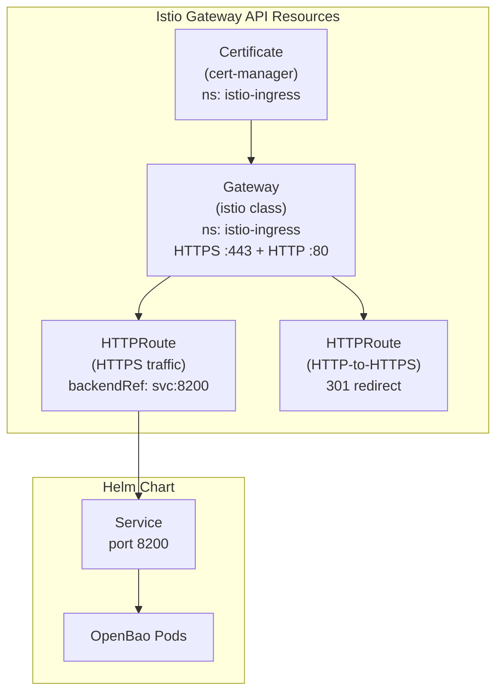

# KubernetesOpenBao: Replace Helm Ingress with Istio Gateway API

**Date**: February 18, 2026
**Type**: Enhancement
**Components**: Kubernetes Provider, API Definitions, Pulumi CLI Integration

## Summary

Replaced the non-functional Helm-based Kubernetes Ingress in the KubernetesOpenBao deployment component with Istio Gateway API ingress (Certificate, Gateway, HTTPRoutes). This brings OpenBAO to feature parity with the KubernetesOpenFga component's proven ingress pattern, enabling TLS-terminated external access with automatic HTTP-to-HTTPS redirect.

## Problem Statement / Motivation

The KubernetesOpenBao component configured ingress through the OpenBao Helm chart's `server.ingress.*` values, which creates a traditional Kubernetes Ingress resource. On Istio-based clusters (the standard platform infrastructure), this Ingress resource is non-functional because Istio does not watch for `networking.k8s.io/v1 Ingress` objects -- it requires Gateway API resources.

### Pain Points

- OpenBAO had no working external access despite `ingress.enabled: true` in the deployment spec
- The proto schema carried 3 unused fields (`ingress_class_name`, `tls_enabled`, `tls_secret_name`) that were specific to the Helm Ingress approach
- Inconsistency between OpenBAO and OpenFGA components -- same platform, different ingress strategies

## Solution / What's New

Adopted the identical Gateway API pattern already proven in the KubernetesOpenFga component:

1. **cert-manager Certificate** in the `istio-ingress` namespace for automatic TLS provisioning
2. **Istio Gateway** with HTTPS (port 443, TLS terminate) and HTTP (port 80) listeners
3. **HTTPRoute** for HTTP-to-HTTPS 301 redirect
4. **HTTPRoute** for HTTPS traffic routed to the OpenBao service on port 8200



## Implementation Details

### Proto Simplification

Simplified `KubernetesOpenBaoIngress` from 5 fields to 2:

**Before:**
```protobuf
message KubernetesOpenBaoIngress {
  bool enabled = 1;
  string hostname = 2;
  string ingress_class_name = 3;  // removed
  bool tls_enabled = 4;           // removed
  string tls_secret_name = 5;     // removed
}
```

**After:**
```protobuf
message KubernetesOpenBaoIngress {
  bool enabled = 1;
  string hostname = 2;
}
```

No impact on existing deployments or presets -- all only used `enabled` + `hostname`.

### Pulumi Module

- **`module/vars.go`**: Added `GatewayExternalLoadBalancerServiceHostname`, `GatewayIngressClassName`, `IstioIngressNamespace` constants
- **`module/locals.go`**: Added 7 ingress-related fields (`IngressCertClusterIssuerName`, `IngressCertSecretName`, `IngressHostnames`, `IngressCertificateName`, `IngressGatewayName`, `IngressHttpRedirectRouteName`, `IngressHttpsRouteName`) with domain extraction for ClusterIssuer derivation
- **`module/ingress.go`**: New file -- 4 Gateway API resources with proper dependency ordering (Certificate -> Gateway -> HTTPRoutes)
- **`module/main.go`**: Wired `ingress()` call after `helmChart()` when ingress is enabled
- **`module/helm_chart.go`**: Removed the entire Helm `server.ingress.*` configuration block

### Terraform Module

- **`locals.tf`**: Added 7 ingress computed locals matching the Pulumi pattern
- **`ingress.tf`**: New file -- 4 `kubernetes_manifest` resources with `count` guards and `depends_on` chains
- **`helm_chart.tf`**: Removed all Helm ingress `dynamic "set"` blocks
- **`variables.tf`**: Removed `ingress_class_name`, `tls_enabled`, `tls_secret_name` from the ingress object type
- **`outputs.tf`**: Updated to use renamed local variable names

## Benefits

- **Working external access**: OpenBAO is now reachable via HTTPS through the Istio gateway
- **Automatic TLS**: cert-manager provisions and renews certificates automatically
- **HTTP-to-HTTPS redirect**: All HTTP traffic is 301-redirected to HTTPS
- **Clean API surface**: Only 2 fields (`enabled`, `hostname`) instead of 5
- **Platform consistency**: Identical ingress pattern across OpenBAO and OpenFGA components
- **Feature parity**: Both Pulumi and Terraform modules implement the same resources

## Impact

- **Deployment operators**: Ingress now works on Istio-based clusters without manual workarounds
- **API consumers**: Simplified ingress configuration -- just set `enabled: true` and a `hostname`
- **Platform maintainers**: One ingress pattern to maintain across all Kubernetes deployment components

## Verification

Deployed to production and verified end-to-end:

```
$ bao status  # via https://openbao-app-prod-main.planton.live
Initialized: true, Sealed: false, HA Enabled: false

$ bao kv put secret/test hello=world    # KV v2 write
$ bao kv get secret/test                # KV v2 read
$ bao write -f transit/keys/test        # Transit key create
```

## Related Work

- KubernetesOpenFga ingress (reference implementation)
- Config Manager implementation project (`20260116.01.config-manager-implementation`) -- OpenBAO is the secrets backend

---

**Status**: Production Ready
**Timeline**: Single session
