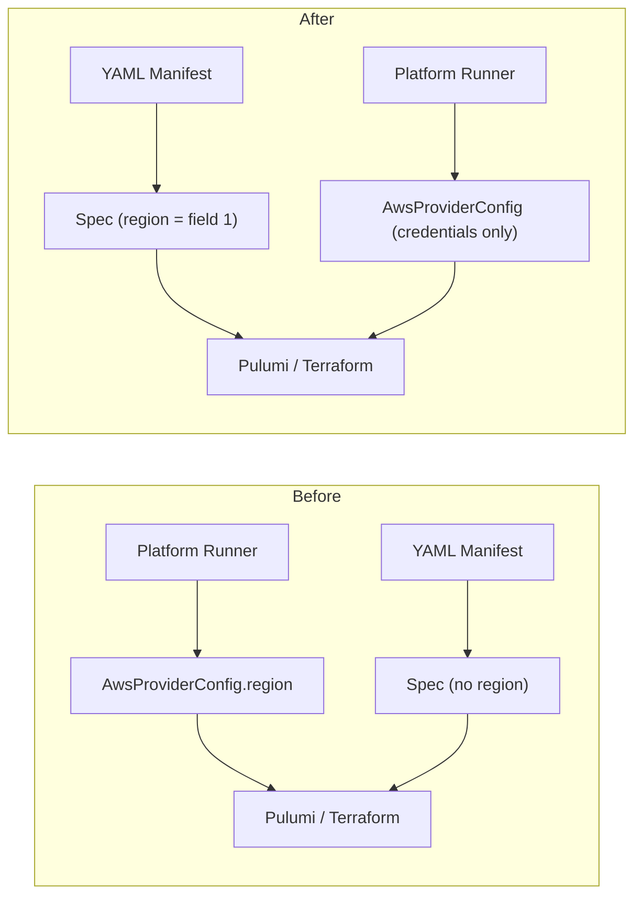

# Add Region Field to All 66 AWS Component Specs

**Date**: February 18, 2026
**Type**: Feature
**Components**: API Definitions, Pulumi CLI Integration, Provider Framework, Manifest Processing

## Summary

Added a required `region` field as the first field in every AWS component's protobuf spec, making each component's YAML manifest fully self-contained. Previously, the AWS region was only available through `AwsProviderConfig` (a provider-level concern); now each component explicitly declares which region it deploys to. All 66 AWS components were updated across spec protos, Go stubs, Pulumi modules, Terraform modules, documentation, examples, presets, hack manifests, and tests.

## Problem Statement / Motivation

OpenMCF's design philosophy requires that a component's YAML manifest is the single source of truth for provisioning. The manifest should express everything needed to deploy a resource without relying on ambient configuration.

### Pain Points

- Region was specified only in `AwsProviderConfig`, which is assembled at deployment time by the platform runner -- invisible to the manifest author
- Reading a YAML manifest did not reveal which AWS region the resource would deploy to
- The spec was not self-contained: understanding where a resource would be created required looking beyond the manifest
- Inconsistency: `awss3bucket` and `awss3objectset` had `aws_region` in their specs while 64 other components did not

## Solution / What's New

A required `string region` field was added as **field 1** in every `Aws*Spec` protobuf message. All existing fields were renumbered sequentially starting from 2. IaC modules (Pulumi and Terraform) now read region from `spec.region` instead of `provider_config.region`.

### Architecture: Before and After

## Implementation Details

### Proto Schema (66 spec.proto files)

- Added `string region = 1 [(buf.validate.field).string.min_len = 1]` to every `Aws*Spec` message
- Renumbered all existing fields sequentially starting from 2
- For `awss3bucket` and `awss3objectset`: renamed `aws_region` to `region`
- Nested/sub-messages were not modified
- Regenerated all Go, Java, TypeScript, and Python proto stubs via `buf generate`

### Pulumi Modules (66 module/main.go files)

- Changed `awsProviderConfig.GetRegion()` to `locals.<Component>.Spec.Region` for AWS provider initialization
- Both nil and non-nil provider config branches now use spec region
- Special case: `awsroute53zone` uses region in CloudWatch Log Group ARN construction (3 usage sites updated)
- Special case: `awss3bucket` referenced `spec.AwsRegion` (renamed to `spec.Region`)

### Terraform Modules (66 provider.tf + 66 variables.tf)

- Converged three existing patterns (empty provider, direct assignment, conditional null check) to `region = var.spec.region`
- Added `region = string` as the first field in every `variable "spec"` object

### Documentation (~400 files)

- All `examples.md` files (root, pulumi, terraform): added `region:` as first spec field in every YAML example
- All `catalog-page.md` files: added `region` to Required Fields table and all YAML examples
- All `presets/*.yaml` files: added `region: <aws-region>` as first spec field
- All `iac/hack/manifest.yaml` files: added `region: us-west-2`
- All `spec_test.go` files: added `Region: "us-west-2"` to every test struct initializer
- Removed stale `awsProviderConfigId` references from YAML examples

## Benefits

- **Self-contained manifests**: A YAML file now tells you exactly where a resource deploys
- **Consistency across 66 components**: Every AWS component follows the same pattern
- **Improved readability**: Region is field 1, the first thing you see in any spec
- **Foundation for validation**: Region in spec enables future cross-field validation (e.g., AZ prefixes must match region)

## Impact

- All 66 AWS components updated
- Approximately 800+ files modified across proto, Go, Terraform, and documentation
- `AwsProviderConfig.region` remains unchanged (still present for backward compatibility)
- IaC modules exclusively use `spec.region` -- provider config region is ignored

## Related Work

- Platform philosophy: self-contained KRM manifests as the source of truth
- Future: Apply the same pattern to GCP and Azure providers (region/location in spec)

---

**Status**: Production Ready
**Timeline**: Single session
