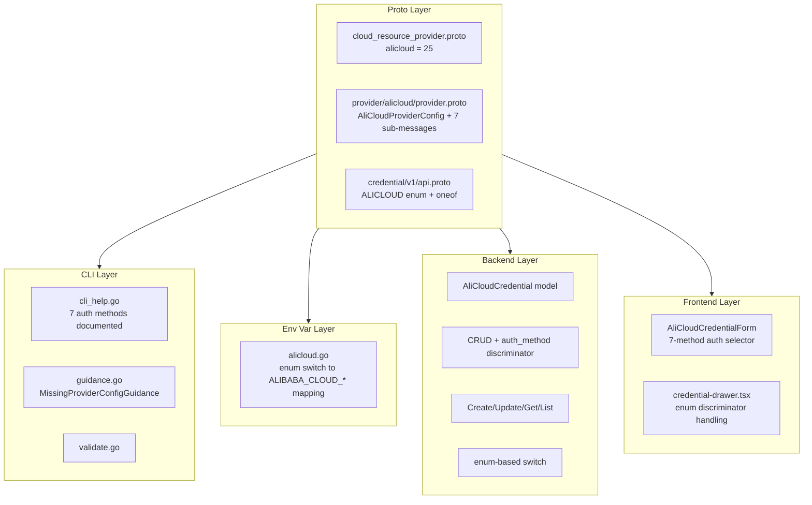
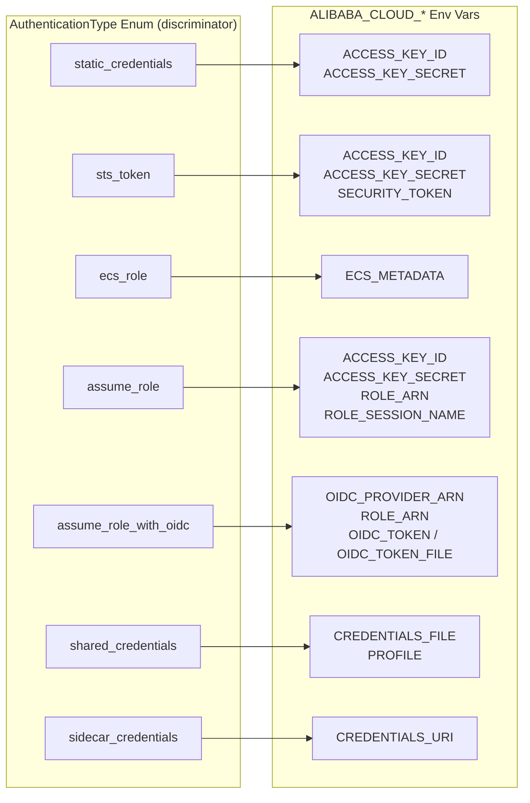

# Alibaba Cloud Provider Integration

**Date**: February 18, 2026
**Type**: Feature
**Components**: Provider Framework, API Definitions, CLI Integration, Backend Services, Frontend Credentials

## Summary

Added Alibaba Cloud (alicloud) as provider #25 to Planton, enabling users to manage Alibaba Cloud credentials through the platform. The integration spans all 6 system layers -- proto definitions, CLI guidance, stack input / env var processing, provider detection, backend credential CRUD, and frontend credential forms. This integration introduces a **new proto pattern** (enum discriminator + separate messages, no protobuf oneof) to support all 7 upstream authentication methods with clean per-method typing.

## Problem Statement / Motivation

Planton had no Alibaba Cloud support. Organizations using Alibaba Cloud infrastructure could not store credentials, use the unified `--provider-config` flag, or leverage credential auto-resolution for Alibaba Cloud deployments.

### Pain Points

- No `alicloud` entry in the `CloudResourceProvider` enum
- No credential storage or management for Alibaba Cloud
- No environment variable mapping for the Terraform Alibaba Cloud provider
- No frontend UI for capturing Alibaba Cloud credentials
- No CLI guidance for missing or invalid Alibaba Cloud credentials

## Solution / What's New

Implemented comprehensive Alibaba Cloud provider support covering all 7 authentication methods supported by the upstream Terraform provider, using a new proto design pattern.

### Architecture

### Authentication Model

## Implementation Details

### 1. Proto Definitions

**Provider registration** (`cloud_resource_provider.proto`): `alicloud = 25`

**Provider config** (`provider/alicloud/provider.proto`): `AliCloudProviderConfig` with a package-scope `AuthenticationType` enum and 7 separate sub-message types. The enum is at package scope (not nested in the message) to avoid protobuf C++ scoping conflicts between enum values and message field names.

**Credential API** (`credential/v1/api.proto`): Added `ALICLOUD = 8` to `CredentialProvider` enum and `alicloud = 15` to the `CredentialProviderConfig` oneof.

### 2. CLI Guidance

The `cli_help.go` constants document all 7 authentication methods with export commands organized by method. Static credentials shown as primary in `ConfigFileExample` with assume role and ECS role as commented alternatives.

### 3. Env Var Mapping

`loadAliCloudEnvVars` switches on the `AuthenticationType` enum to emit method-specific `ALIBABA_CLOUD_*` environment variables. Common fields (region, account_id, account_type) are emitted for all methods. Uses only the modern `ALIBABA_CLOUD_*` prefix; deprecated `ALICLOUD_*` names omitted (except `ALICLOUD_ASSUME_ROLE_SESSION_EXPIRATION` which has no modern equivalent).

### 4. Backend Credential Management

`AliCloudCredential` model stores all possible fields flat in MongoDB with an `AuthMethod` string discriminator. The `alicloudProtoToModel` function switches on the `AuthenticationType` enum (not a proto oneof type assertion) to extract the correct sub-message -- this is the new pattern distinct from OpenStack's oneof type switch.

### 5. Frontend Credential Form

`AliCloudCredentialForm` uses a `SimpleSelect` for auth method selection with 7 options, conditionally rendering method-specific fields. Static credentials is the default selection. Common fields (region, account_id, account_type) are shown for all methods.

### 6. Catalog Documentation

Added Alibaba Cloud provider page at `/docs/catalog/alicloud` with placeholder for future resource kinds.

## Files Changed

| Layer | New Files | Modified Files |
|-------|-----------|----------------|
| Proto | `provider/alicloud/provider.proto` | `cloud_resource_provider.proto`, `credential/v1/api.proto` |
| Provider | `provider/alicloud/cli_help.go`, `BUILD.bazel` | -- |
| Stack Input | `providerenvvars/alicloud.go` | `loader.go` |
| Provider Detect | -- | `guidance.go`, `validate.go` |
| Backend | -- | `credential.go`, `credential_repo.go`, `credential_service.go`, `credential_resolver.go` |
| Frontend | `alicloud.tsx` | `types.ts`, `credential-drawer.tsx`, `index.ts`, `utils.ts` |
| Catalog | `alicloud/index.md` | -- |
| Generated | `provider.pb.go`, `provider_pb.ts` | `api.pb.go`, `api_pb.ts`, `cloud_resource_provider.pb.go`, `cloud_resource_provider_pb.ts` |

**Total**: ~30 files, ~1400 insertions

## Benefits

### For Users

- **Credential management**: Store Alibaba Cloud credentials securely through the web UI
- **CLI integration**: Pass credentials via the unified `-p` / `--provider-config` flag
- **7-method auth**: Choose from static credentials, STS tokens, ECS roles, RAM role assumption, OIDC, shared credentials, or sidecar credentials
- **Rich guidance**: Clear terminal output with all 7 auth methods documented when credentials are missing

### For Developers

- **New proto pattern**: Enum discriminator + separate messages provides a clean alternative to protobuf oneof for multi-method auth
- **Pattern consistency**: Follows established provider patterns across all layers
- **Foundation for resources**: Ready for Alibaba Cloud resource kinds in future phases

## Impact

### Direct

- Alibaba Cloud appears in the credential provider dropdown in the web UI
- The `-p` flag accepts Alibaba Cloud provider config files
- Backend API supports Alibaba Cloud credential CRUD
- CLI guidance displays Alibaba Cloud-specific help

### Future Work Enabled

- Alibaba Cloud resource kinds (CloudResourceKind range to be assigned)
- ECS, VPC, RDS, OSS, SLB, and other Alibaba Cloud service resources
- Terraform IaC modules wrapping the terraform-provider-alicloud

## Related Work

- [2026-02-12 Scaleway Provider Integration](2026-02-12-181851-scaleway-provider-integration.md) -- Most recent flat provider integration
- [2026-02-08 OpenStack Provider Integration](2026-02-08-215116-openstack-provider-integration.md) -- Multi-method auth reference (proto oneof)

---

**Status**: Production Ready
**Build**: CLI `go build` passes, Backend `go build` passes, Frontend proto stubs generated
