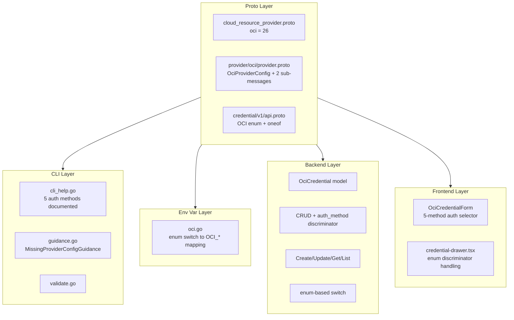
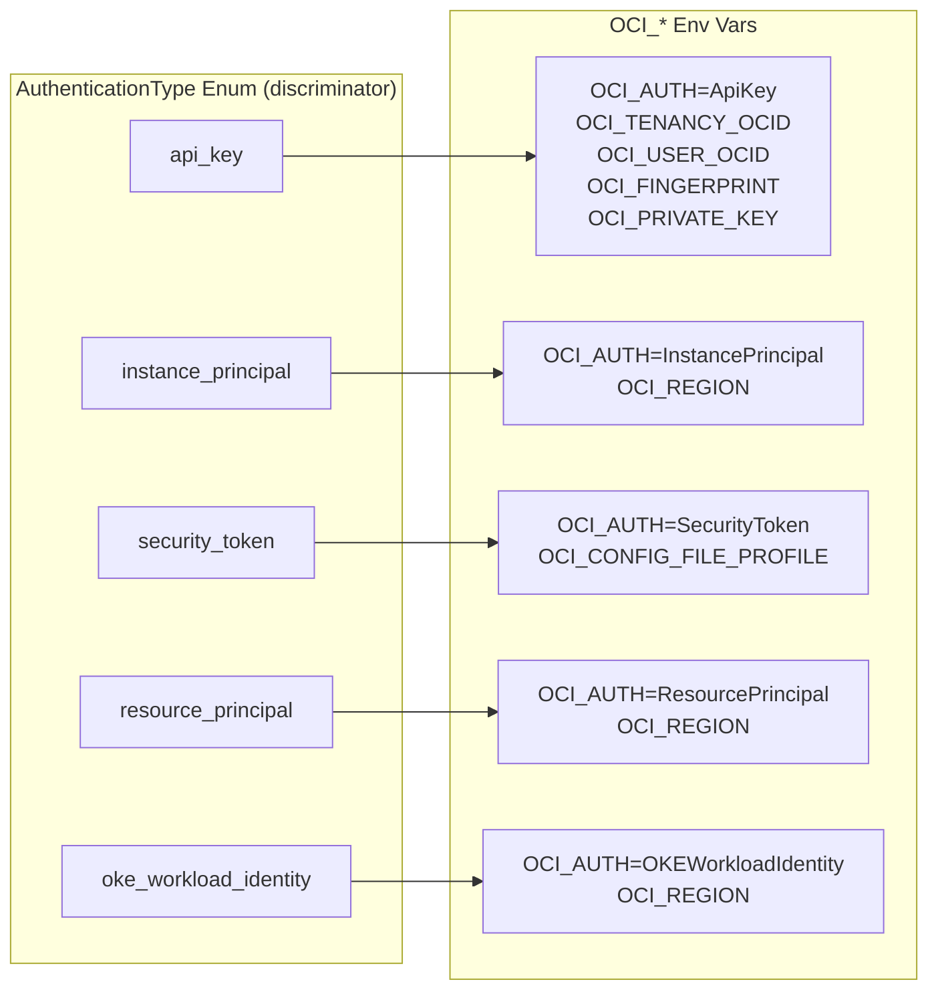

# OCI Provider Integration

**Date**: February 18, 2026
**Type**: Feature
**Components**: Provider Framework, API Definitions, CLI Integration, Backend Services, Frontend Credentials

## Summary

Added Oracle Cloud Infrastructure (OCI) as provider #26 to Planton, enabling users to manage OCI credentials through the platform. The integration spans all 6 system layers -- proto definitions, CLI guidance, stack input / env var processing, provider detection, backend credential CRUD, and frontend credential forms. OCI's multi-method authentication model (API Key, Instance Principal, Security Token, Resource Principal, OKE Workload Identity) is handled via the enum-discriminator pattern introduced by AliCloud, with sub-messages only for methods that carry credential fields.

## Problem Statement / Motivation

Planton had no Oracle Cloud Infrastructure support. Organizations using OCI could not store credentials, use the unified `--provider-config` flag, or leverage credential auto-resolution for OCI deployments.

### Pain Points

- No `oci` entry in the `CloudResourceProvider` enum
- No credential storage or management for OCI
- No environment variable mapping for the Terraform OCI provider
- No frontend UI for capturing OCI credentials
- No CLI guidance for missing or invalid OCI credentials

## Solution / What's New

Implemented comprehensive OCI provider support covering all 5 practical authentication methods supported by the upstream Terraform provider, using the enum-discriminator pattern established by the AliCloud integration.

### Architecture

### Authentication Model

## Implementation Details

### 1. Proto Definitions

**Provider registration** (`cloud_resource_provider.proto`): `oci = 26`

**Provider config** (`provider/oci/provider.proto`): `OciProviderConfig` with a package-scope `AuthenticationType` enum and 2 sub-messages (`OciApiKeyAuth`, `OciSecurityTokenAuth`). The 3 ambient methods (Instance Principal, Resource Principal, OKE Workload Identity) have no credential fields and therefore no sub-messages -- the enum value plus the common `region` field is sufficient.

**Credential API** (`credential/v1/api.proto`): Added `OCI = 9` to `CredentialProvider` enum and `oci = 16` to the `CredentialProviderConfig` oneof.

### 2. CLI Guidance

The `cli_help.go` constants document all 5 authentication methods with export commands organized by method. API Key shown as primary in `ConfigFileExample` with Instance Principal and Security Token as commented alternatives.

### 3. Env Var Mapping

`loadOciEnvVars` switches on the `AuthenticationType` enum to emit method-specific `OCI_*` environment variables. The enum value maps to the canonical Terraform provider auth string (e.g., `api_key` -> `"ApiKey"`, `instance_principal` -> `"InstancePrincipal"`). The common `region` field is emitted for all methods.

### 4. Backend Credential Management

`OciCredential` model stores credentials flat in MongoDB with an `AuthMethod` string discriminator. All 5 auth methods are storable -- the 3 ambient methods store just name + auth_method + region. The `ociProtoToModel` function switches on the `AuthenticationType` enum to extract the correct sub-message fields.

### 5. Frontend Credential Form

`OciCredentialForm` uses a `SimpleSelect` for auth method selection with 5 options, conditionally rendering method-specific fields. API Key is the default selection. Ambient methods (Instance Principal, Resource Principal, OKE Workload Identity) show only the common Region field.

### 6. Catalog Documentation

Added OCI provider page at `/docs/catalog/oci` with placeholder for future resource kinds.

## Files Changed

| Layer | New Files | Modified Files |
|-------|-----------|----------------|
| Proto | `provider/oci/provider.proto` | `cloud_resource_provider.proto`, `credential/v1/api.proto` |
| Provider | `provider/oci/cli_help.go`, `BUILD.bazel` | -- |
| Stack Input | `providerenvvars/oci.go` | `loader.go` |
| Provider Detect | -- | `guidance.go`, `validate.go` |
| Backend | -- | `credential.go`, `credential_repo.go`, `credential_service.go`, `credential_resolver.go` |
| Frontend | `oci.tsx` | `types.ts`, `credential-drawer.tsx`, `index.ts`, `utils.ts` |
| Catalog | `oci/index.md` | -- |
| Generated | `provider.pb.go`, `provider_pb.ts` | `api.pb.go`, `api_pb.ts`, `cloud_resource_provider.pb.go`, `cloud_resource_provider_pb.ts` |

**Total**: ~30 files, ~1000 insertions

## Benefits

### For Users

- **Credential management**: Store OCI credentials securely through the web UI
- **CLI integration**: Pass credentials via the unified `-p` / `--provider-config` flag
- **5-method auth**: Choose from API Key, Instance Principal, Security Token, Resource Principal, or OKE Workload Identity
- **Rich guidance**: Clear terminal output with all 5 auth methods documented when credentials are missing

### For Developers

- **Pattern consistency**: Follows the enum-discriminator pattern established by AliCloud
- **Lean proto design**: Only 2 sub-messages (for methods with credential fields); ambient methods use enum + region alone
- **Foundation for resources**: Ready for OCI resource kinds in future phases

## Impact

### Direct

- OCI appears in the credential provider dropdown in the web UI
- The `-p` flag accepts OCI provider config files
- Backend API supports OCI credential CRUD
- CLI guidance displays OCI-specific help

### Future Work Enabled

- OCI resource kinds (CloudResourceKind range to be assigned)
- Compute, VCN, Block Storage, Load Balancer, and other OCI service resources
- Terraform IaC modules wrapping the terraform-provider-oci

## Related Work

- [2026-02-18 Alibaba Cloud Provider Integration](2026-02-18-195200-alicloud-provider-integration.md) -- Introduced the enum-discriminator pattern used here
- [2026-02-08 OpenStack Provider Integration](2026-02-08-215116-openstack-provider-integration.md) -- Multi-method auth reference (proto oneof, older pattern)

---

**Status**: Production Ready
**Build**: CLI `go build` passes, Backend `go build` passes, Frontend proto stubs generated, `make build` passes
