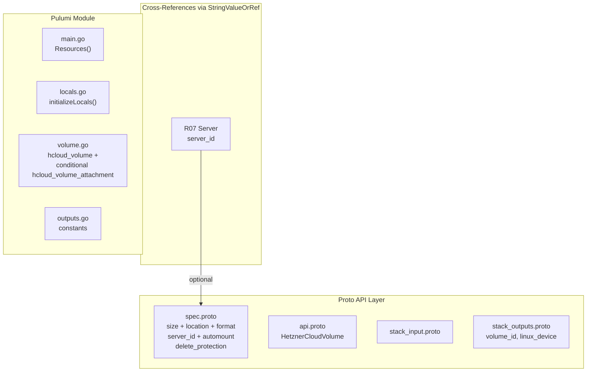

# HetznerCloudVolume: Block Storage with Separate Attachment Lifecycle

**Date**: February 19, 2026
**Type**: Feature
**Components**: API Definitions, Pulumi CLI Integration, Terraform Module

## Summary

Added the `HetznerCloudVolume` deployment component (R08, enum 3521, id_prefix: `hcvol`) to OpenMCF. This component bundles `hcloud_volume` with an optional `hcloud_volume_attachment`, providing block storage that persists independently of servers. It is the first Hetzner Cloud component to use a separate provider resource for an optional sub-resource rather than an inline field on the main resource, driven by the provider's mutual exclusivity constraint between `location` and `server_id`.

## Problem Statement / Motivation

Hetzner Cloud volumes are the persistent block storage primitive. Servers need durable storage for databases, application state, and data that must survive server replacement. Until now, OpenMCF had no way to declaratively provision volumes or manage their attachment to servers.

### Pain Points

- No way to manage Hetzner Cloud block storage through OpenMCF
- The `hcloud_volume` provider resource treats `location` and `server_id` as mutually exclusive at creation time, requiring a design choice about how to expose both
- Volume formatting (ext4/xfs) and auto-mount are create-time-only settings not persisted in provider state

## Solution / What's New

### Design Decisions

**D1: Always require `location`, use separate `hcloud_volume_attachment` for server attachment.** The Hetzner Cloud API treats `location` and `server_id` as mutually exclusive on the volume creation call. Rather than making the user conditionally omit a fundamental property, we always require `location` (users should always know where their data lives) and use `hcloud_volume_attachment` as a separate resource for optional server attachment. This cleanly separates volume lifecycle from attachment lifecycle.

**D2: `Format` as an enum, not a free-form string.** The Hetzner API only supports `ext4` and `xfs`. Using a proto enum is type-safe and self-documenting, consistent with the `IpType` enum pattern in FloatingIp. `format_unspecified` (0) means raw/unformatted.

**D3: Document create-time-only fields clearly.** Both `format` and `automount` are passed to the provider at creation/attachment time but are not persisted in state. The provider cannot read them back. Changing them after the initial apply has no effect. This is documented in the spec proto comments.

### Component Architecture

## Implementation Details

### Proto Schema

- **Spec**: 6 fields -- `size` (int32, 10-10240 GB), `location` (required string), `format` (enum: ext4/xfs/unspecified), `server_id` (optional StringValueOrRef), `automount` (bool), `delete_protection` (bool)
- **Format enum**: Embedded inside the spec message with three values: `format_unspecified` (raw), `ext4`, `xfs`
- **Outputs**: `volume_id` (Hetzner numeric ID), `linux_device` (device path on attached server)

### Pulumi Module

- `volume.go` creates `hcloud.Volume` with Location (always), Format (when non-default), Labels, DeleteProtection
- When `server_id` is set: converts volume ID via `ApplyT` (CG02 pattern), parses server_id via `strconv.Atoi`, creates `hcloud.VolumeAttachment` with VolumeId, ServerId, Automount
- Exports `volume_id` and `linux_device`

### Terraform Module

- `hcloud_volume` with `format` conditionally set (null when `format_unspecified`)
- `hcloud_volume_attachment` with `count = server_id != null ? 1 : 0`
- All ID references use `tonumber()` for string-to-int conversion

### Validation

- 14/14 Ginkgo spec tests pass (8 valid cases, 6 invalid cases)
- `go build` / `go vet` clean
- `terraform validate` passes
- Kind map generated and compiles

## Benefits

- Enables persistent block storage as a first-class OpenMCF component
- Clean lifecycle separation: volume exists independently of server attachment
- Establishes the pattern for `hcloud_volume_attachment` as a separate sub-resource (contrast with FloatingIp which uses inline `server_id`)
- `linux_device` output gives users the device path needed for OS-level mounting

## Impact

- **Users**: Can declaratively provision volumes and optionally attach them to servers
- **Future components**: R09 (Snapshot) does not directly reference Volume, but Volume+Server together enable the complete compute stack
- **Infra charts**: server-environment and ha-server-cluster charts use Volume for persistent data storage
- **Pattern precedent**: Separate attachment resource pattern established (used inline by FloatingIp for comparison)

## Files Changed

| Area | Files | Description |
|------|-------|-------------|
| Proto | 4 | spec (with Format enum), api, stack_input, stack_outputs |
| Enum | 1 | cloud_resource_kind.proto (added 3521) |
| Tests | 1 | spec_test.go (14 test cases) |
| Pulumi | 5 | module (4 files) + entrypoint |
| Terraform | 5 | provider, variables, locals, main, outputs |
| Hack | 1 | manifest.yaml |
| Generated | 5+ | .pb.go stubs, BUILD.bazel, kind_map_gen.go |

## Related Work

- References: R07 (Server) via StringValueOrRef for server_id
- Referenced by: None directly (volumes are leaf resources in the dependency graph)
- Uses CG01 (label handling), CG02 (Pulumi ID string-to-int conversion)
- Follows FloatingIp (R06) as closest pattern, with key difference of using separate attachment resource

---

**Status**: Production Ready
**Timeline**: Single session
