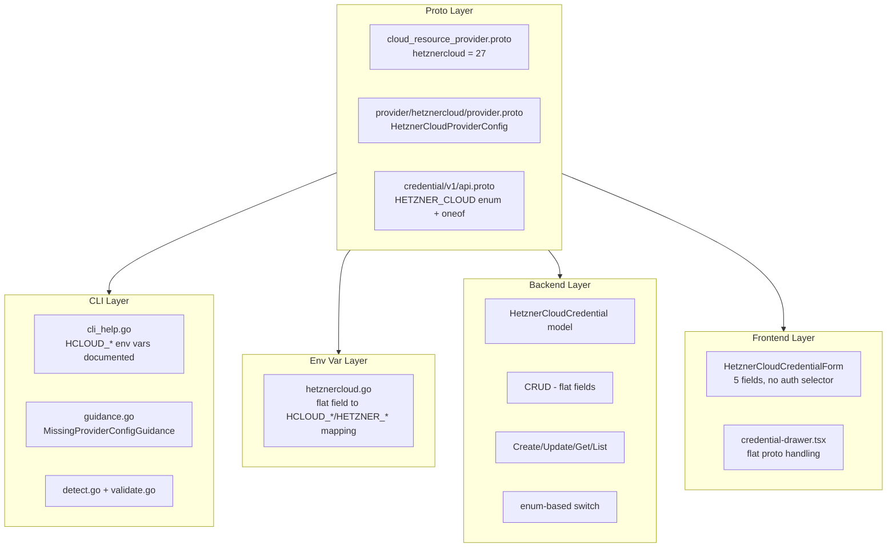
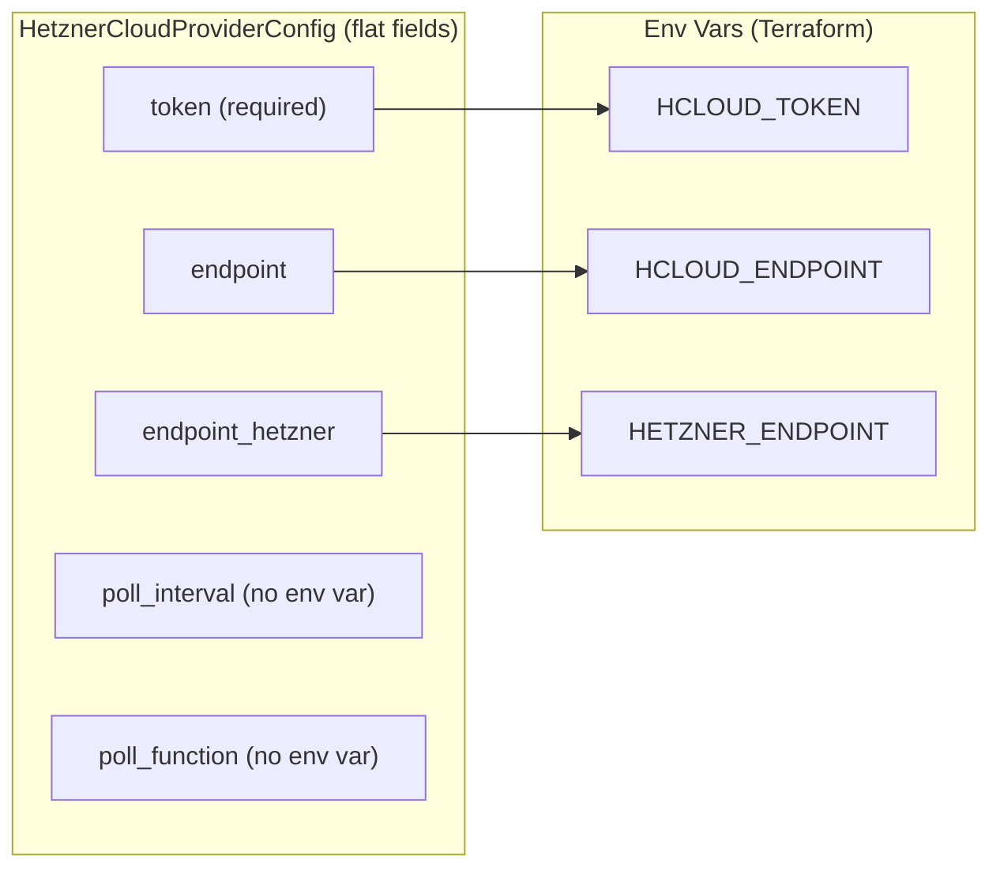

# Hetzner Cloud Provider Integration

**Date**: February 19, 2026
**Type**: Feature
**Components**: Provider Framework, API Definitions, CLI Integration, Backend Services, Frontend Credentials

## Summary

Added Hetzner Cloud as provider #27 to Planton, enabling users to manage Hetzner Cloud credentials through the platform. The integration spans all 6 system layers -- proto definitions, CLI guidance, stack input / env var processing, provider detection, backend credential CRUD, and frontend credential forms. Hetzner Cloud's single API token authentication model maps cleanly to 3 `HCLOUD_*`/`HETZNER_*` environment variables without the multi-method complexity required by providers like OpenStack, AliCloud, or OCI.

## Problem Statement / Motivation

Planton had no Hetzner Cloud support. Organizations using Hetzner Cloud infrastructure could not store credentials, use the unified `--provider-config` flag, or leverage credential auto-resolution for Hetzner Cloud deployments.

### Pain Points

- No `hetznercloud` entry in the `CloudResourceProvider` enum
- No credential storage or management for Hetzner Cloud
- No environment variable mapping for the Terraform hcloud provider
- No frontend UI for capturing Hetzner Cloud credentials
- No CLI guidance for missing or invalid Hetzner Cloud credentials

## Solution / What's New

Implemented comprehensive Hetzner Cloud provider support following the established flat provider patterns. Hetzner Cloud uses a single authentication method (64-character API token), making it the simplest provider integration -- no auth method selector, no discriminator, no sub-messages.

The proto config includes 5 fields: the required `token` plus optional `endpoint`, `endpoint_hetzner`, `poll_interval`, and `poll_function`. The latter two have no upstream environment variable mapping and are intentionally skipped in the env var loader -- they're available for programmatic access by consumers who read the proto directly.

### Architecture

### Authentication Model

## Implementation Details

### 1. Proto Definitions

**Provider registration** (`cloud_resource_provider.proto`): `hetznercloud = 27`

**Provider config** (`provider/hetznercloud/provider.proto`): `HetznerCloudProviderConfig` with 5 flat fields -- `token` (required), `endpoint`, `endpoint_hetzner`, `poll_interval`, `poll_function`.

**Credential API** (`credential/v1/api.proto`): Added `HETZNER_CLOUD = 10` to `CredentialProvider` enum and `hetznercloud = 17` to the `CredentialProviderConfig` oneof.

### 2. CLI Guidance

The `cli_help.go` constants document the 3 environment variables with export commands. `ConfigFileExample` shows the required token with optional fields commented.

### 3. Env Var Mapping

`loadHetznerCloudEnvVars` maps 3 flat proto fields to environment variables. `poll_interval` and `poll_function` are intentionally skipped because the upstream Terraform provider does not read them from environment variables.

### 4. Backend Credential Management

`HetznerCloudCredential` model stores 5 flat fields in MongoDB. No `AuthMethod` discriminator needed (single auth method). The service layer validates that `token` is provided.

### 5. Frontend Credential Form

`HetznerCloudCredentialForm` renders 5 input fields. Token is required and rendered as a password field. No auth method selector needed.

### 6. Catalog Documentation

Added Hetzner Cloud provider page at `/docs/catalog/hetznercloud` with placeholder for future resource kinds.

## Files Changed

| Layer | New Files | Modified Files |
|-------|-----------|----------------|
| Proto | `provider/hetznercloud/provider.proto` | `cloud_resource_provider.proto`, `credential/v1/api.proto` |
| Provider | `provider/hetznercloud/cli_help.go`, `BUILD.bazel` | -- |
| Stack Input | `providerenvvars/hetznercloud.go` | `loader.go` |
| Provider Detect | -- | `detect.go`, `guidance.go`, `validate.go` |
| Backend | -- | `credential.go`, `credential_repo.go`, `credential_service.go`, `credential_resolver.go` |
| Frontend | `hetznercloud.tsx` | `types.ts`, `credential-drawer.tsx`, `index.ts`, `utils.ts` |
| Catalog | `hetznercloud/index.md` | -- |
| Generated | `provider.pb.go`, `provider_pb.ts` | `api.pb.go`, `api_pb.ts`, `cloud_resource_provider.pb.go`, `cloud_resource_provider_pb.ts` |

**Total**: ~27 files, ~500 insertions

## Benefits

### For Users

- **Credential management**: Store Hetzner Cloud credentials securely through the web UI
- **CLI integration**: Pass credentials via the unified `-p` / `--provider-config` flag
- **Simple auth model**: Only API token required
- **Rich guidance**: Clear terminal output with environment variable export commands when credentials are missing

### For Developers

- **Pattern consistency**: Follows established flat provider patterns across all layers
- **Foundation for resources**: Ready for Hetzner Cloud resource kinds in future phases
- **Clean model**: Flat credential model -- no oneof complexity, no auth method discriminator

## Impact

### Direct

- Hetzner Cloud appears in the credential provider dropdown in the web UI
- The `-p` flag accepts Hetzner Cloud provider config files
- Backend API supports Hetzner Cloud credential CRUD
- CLI guidance displays Hetzner Cloud-specific help

### Future Work Enabled

- Hetzner Cloud resource kinds (CloudResourceKind range to be assigned)
- Server, Volume, Network, Load Balancer, Firewall, and other Hetzner Cloud service resources
- Terraform IaC modules wrapping the terraform-provider-hcloud

## Related Work

- [2026-02-18 OCI Provider Integration](2026-02-18-203551-oci-provider-integration.md) -- Most recent provider integration
- [2026-02-12 Scaleway Provider Integration](2026-02-12-181851-scaleway-provider-integration.md) -- Flat model pattern reference

---

**Status**: Production Ready
**Build**: CLI `go build` passes, Backend `go build` passes, Frontend proto stubs generated
