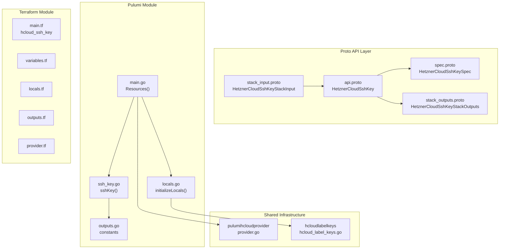

# HetznerCloudSshKey: First Hetzner Cloud Component

**Date**: February 19, 2026
**Type**: Feature
**Components**: API Definitions, Provider Framework, Pulumi CLI Integration, Terraform Module

## Summary

Added the first Hetzner Cloud deployment component to Planton: `HetznerCloudSshKey` (enum 3500, id_prefix: `hcssh`). This establishes the foundation patterns -- reusable provider infrastructure, label handling, and proto/IaC conventions -- that all 11 remaining Hetzner Cloud components will follow.

## Problem Statement / Motivation

Planton had zero Hetzner Cloud resource kinds. The Hetzner Cloud provider was registered (`hetznercloud = 27`) with credential configuration (`HetznerCloudProviderConfig`), but no actual deployment components existed.

### Pain Points

- No Hetzner Cloud resources available for deployment via Planton
- No reusable Pulumi provider helper or label key infrastructure for Hetzner Cloud
- No established patterns for Hetzner Cloud components to follow

## Solution / What's New

Implemented `HetznerCloudSshKey` as the first component, along with shared infrastructure that all future Hetzner Cloud components will reuse.

### Component Architecture

## Implementation Details

### Shared Infrastructure (reusable by all Hetzner components)

- **`pulumihcloudprovider/provider.go`**: Maps `HetznerCloudProviderConfig` (token, endpoint, endpoint_hetzner, poll_interval, poll_function) to `hcloud.ProviderArgs`. Falls back to `HCLOUD_TOKEN` env var when config is nil/empty.
- **`hcloudlabelkeys/hcloud_label_keys.go`**: Standard label key constants using `planton-ai_*` prefix pattern matching GCP/Scaleway conventions.
- **Go dependency**: Added `github.com/pulumi/pulumi-hcloud/sdk v1.32.1`.

### Proto Schema

- **Spec**: Single field `public_key` (required, min_len=1). Name from `metadata.name`. Labels derived from metadata (not a spec field) -- consistent with the Scaleway VPC pattern.
- **Outputs**: `ssh_key_id` (string) and `fingerprint` (string).
- **Enum**: `HetznerCloudSshKey = 3500` registered in `cloud_resource_kind.proto`.

### Label Handling (key design decision)

Hetzner Cloud uses `map<string,string>` labels (like GCP), not flat string tags (like Scaleway). The module builds labels as a map:

1. Standard labels from metadata (resource, name, kind, org, env, id)
2. User labels from `metadata.labels`
3. Standard labels take precedence over user labels

### Validation

- 4/4 Ginkgo spec tests pass (valid spec, RSA key, empty key rejection, missing key rejection)
- `go build` / `go vet` clean
- `terraform validate` passes

## Benefits

- First Hetzner Cloud component available for deployment
- Reusable shared infrastructure established for remaining 11 components
- Clean patterns for label handling, provider wiring, and test structure
- Consistent with existing Planton conventions (Scaleway, GCP, etc.)

## Impact

- **Users**: Can now manage Hetzner Cloud SSH keys through Planton
- **Future components**: R02-R12 can follow the patterns established here
- **Infra charts**: SSH key is a foundation dependency for all 3 planned Hetzner infra charts

## Files Changed

| Area | Files | Description |
|------|-------|-------------|
| Shared infra | 2 | Provider helper + label keys |
| Proto | 4 | spec, api, stack_input, stack_outputs |
| Enum | 1 | cloud_resource_kind.proto |
| Tests | 1 | spec_test.go |
| Pulumi | 5 | module (4 files) + entrypoint |
| Terraform | 5 | provider, variables, locals, main, outputs |
| Hack | 1 | manifest.yaml |
| Generated | 5+ | .pb.go stubs, BUILD.bazel, kind_map_gen.go |

---

**Status**: Production Ready
**Timeline**: Single session
