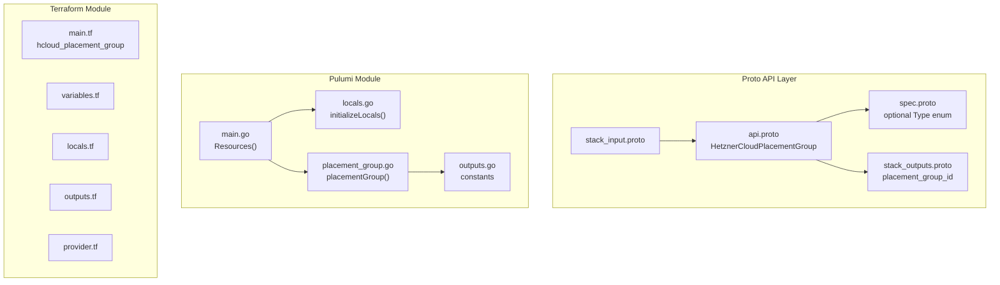

# HetznerCloudPlacementGroup: Server Anti-Affinity for HA Workloads

**Date**: February 19, 2026
**Type**: Feature
**Components**: API Definitions, Pulumi CLI Integration, Terraform Module

## Summary

Added the `HetznerCloudPlacementGroup` deployment component (R02, enum 3501, id_prefix: `hcpg`) to OpenMCF. This is the second Hetzner Cloud component and enables server anti-affinity placement -- servers assigned to a spread placement group are guaranteed to run on different physical hosts, providing fault tolerance for HA workloads.

## Problem Statement / Motivation

High-availability server deployments on Hetzner Cloud require anti-affinity guarantees so that co-located failures don't take down multiple servers simultaneously. Placement groups with the "spread" strategy provide this guarantee at the infrastructure level.

### Pain Points

- No way to manage Hetzner Cloud placement groups through OpenMCF
- The upcoming HetznerCloudServer component (R07) needs placement group references via StringValueOrRef
- All three planned infra charts (ha-server-cluster in particular) depend on placement groups

## Solution / What's New

Implemented `HetznerCloudPlacementGroup` as a minimal, clean component that wraps `hcloud_placement_group` with a single optional enum field.

### Design Decision: Optional Enum with Default

The placement group resource has only one user-configurable attribute beyond metadata: `type`, which currently only supports `"spread"`. Rather than leaving the spec empty and hardcoding the type, we exposed it as an optional enum field with a default:

```proto
optional Type type = 1 [(org.openmcf.shared.options.default) = "spread"];

enum Type {
  type_unspecified = 0;
  spread = 1;
}
```

This approach is self-documenting, future-proof for when Hetzner adds new placement strategies, and follows the platform's `optional` + default-option pattern. The middleware applies the default before IaC modules run, so users can simply use `spec: {}`.

### Component Architecture



## Implementation Details

### Proto Schema

- **Spec**: Single optional `Type` enum field with default `"spread"`. No required fields.
- **Outputs**: `placement_group_id` (string) -- the Hetzner Cloud numeric ID, referenced by HetznerCloudServer via StringValueOrRef.
- **Deliberately excluded**: The provider's computed `servers` field (always empty at creation, dynamic, not useful for cross-referencing).

### Pulumi Module

- Reuses shared infrastructure from R01: `pulumihcloudprovider` and `hcloudlabelkeys`
- Creates `hcloud.NewPlacementGroup` with name from metadata, type from spec (via getter), labels from CG01 pattern
- Exports `placement_group_id` from the created resource's ID

### Terraform Module

- `hcloud_placement_group` resource with name, type (`coalesce` to default "spread"), and standard labels
- Same label merge pattern as R01 with `"planton-ai_kind" = "HetznerCloudPlacementGroup"`

### Validation

- 2/2 Ginkgo spec tests pass (unset type accepted, explicit spread accepted)
- `go build` / `go vet` clean
- `terraform validate` passes
- Kind map generated and compiles

## Benefits

- Enables server anti-affinity for HA deployments on Hetzner Cloud
- Clean, minimal design with sensible defaults (users can deploy with `spec: {}`)
- Establishes the optional-enum-with-default pattern for future components
- Foundation dependency for the ha-server-cluster infra chart

## Impact

- **Users**: Can create placement groups to ensure server fault tolerance
- **Future components**: R07 (HetznerCloudServer) will reference placement groups via `placement_group_id`
- **Infra charts**: Required by hetzner-ha-server-cluster

## Files Changed

| Area | Files | Description |
|------|-------|-------------|
| Proto | 4 | spec, api, stack_input, stack_outputs |
| Enum | 1 | cloud_resource_kind.proto (added 3501) |
| Tests | 1 | spec_test.go |
| Pulumi | 5 | module (4 files) + entrypoint |
| Terraform | 5 | provider, variables, locals, main, outputs |
| Hack | 1 | manifest.yaml |
| Generated | 5+ | .pb.go stubs, BUILD.bazel, kind_map_gen.go |

## Related Work

- Follows patterns established by R01 (HetznerCloudSshKey)
- Referenced by upcoming R07 (HetznerCloudServer) via StringValueOrRef

---

**Status**: Production Ready
**Timeline**: Single session
