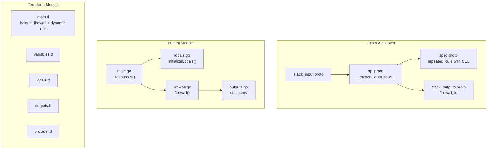

# HetznerCloudFirewall: Stateful Firewall Rules for Server Security

**Date**: February 19, 2026
**Type**: Feature
**Components**: API Definitions, Pulumi CLI Integration, Terraform Module

## Summary

Added the `HetznerCloudFirewall` deployment component (R03, enum 3502, id_prefix: `hcfw`) to Planton. This is the third Hetzner Cloud component and the first to use nested repeated messages with cross-field CEL validations, establishing patterns for all subsequent complex components. Firewalls define inbound/outbound traffic rules that servers reference via `firewall_ids`.

## Problem Statement / Motivation

Hetzner Cloud servers need network-level access control. Without firewalls, servers are exposed to all traffic by default. The firewall component is a prerequisite for the HetznerCloudServer component (R07), which references firewalls via StringValueOrRef.

### Pain Points

- No way to manage Hetzner Cloud firewalls through Planton
- The upcoming HetznerCloudServer component (R07) needs firewall references via StringValueOrRef
- All three planned infra charts require firewalls for security boundaries

## Solution / What's New

Implemented `HetznerCloudFirewall` wrapping `hcloud_firewall` with inline rules. Rules are defined as a repeated nested message with direction, protocol, optional port, and source/destination CIDR blocks.

### Design Decision: Exclude apply_to (Pull Model Only)

The Hetzner Cloud firewall resource has an `apply_to` attribute that pushes firewall assignments to servers. We deliberately excluded this in favor of the pull model: servers reference firewalls via `firewall_ids` in their spec.

**Rationale:**
- Avoids bidirectional coupling (firewall -> server AND server -> firewall)
- Planton's composability model (StringValueOrRef) favors explicit pull-model wiring
- Infra-charts handle composition, making label-based targeting redundant
- Cleaner dependency graph for the DAG visualization

### Design Decision: Cross-Field CEL Validations

This is the first Hetzner Cloud component to use message-level CEL constraints (via `buf.validate`). Three cross-field validations catch common misconfigurations at API admission time rather than at Terraform/Pulumi apply:

1. **Port required for TCP/UDP** -- prevents silent failures
2. **Source IPs required for inbound rules** -- inbound rules without sources are useless
3. **Destination IPs required for outbound rules** -- same logic for outbound

### Component Architecture

## Implementation Details

### Proto Schema

- **Spec**: `repeated Rule rules` with nested `Rule` message containing `Direction` and `Protocol` enums, optional `port`, `source_ips`, `destination_ips`, and `description`
- **CEL validations**: Three message-level constraints on `Rule` for cross-field consistency
- **Outputs**: `firewall_id` (string) -- the Hetzner Cloud numeric ID, referenced by HetznerCloudServer via StringValueOrRef
- **Deliberately excluded**: `apply_to` (push model), `firewall_attachment` resource

### Pulumi Module

- Iterates `spec.Rules`, building `hcloud.FirewallRuleArray` with conditional field assignment
- Converts proto enums to strings via `.String()` (returns `"in"`, `"tcp"`, etc. -- matches Hetzner API)
- Handles optional fields: empty `port`/`description` strings are skipped (not passed as empty strings)
- Creates `hcloud.NewFirewall` with name, labels, and rules array

### Terraform Module

- Uses `dynamic "rule"` block to iterate `var.spec.rules`
- Optional fields (`port`, `source_ips`, `destination_ips`, `description`) pass through as `null` when not set
- Same label merge pattern as R01/R02 with `"planton-ai_kind" = "HetznerCloudFirewall"`

### Validation

- 14/14 Ginkgo spec tests pass (8 valid cases, 6 invalid cases)
- `go build` / `go vet` clean
- `terraform validate` passes
- Kind map generated and compiles

## Benefits

- Enables network-level access control for Hetzner Cloud servers
- Cross-field CEL validations catch misconfigurations before IaC apply
- Establishes the nested-repeated-message pattern for future complex components (Network, LoadBalancer)
- Foundation dependency for all three infra charts

## Impact

- **Users**: Can define firewall rules as structured, validated proto messages
- **Future components**: R07 (HetznerCloudServer) will reference firewalls via `firewall_ids`
- **Pattern**: First component with CEL cross-field validations -- sets the bar for R04+

## Files Changed

| Area | Files | Description |
|------|-------|-------------|
| Proto | 4 | spec (with CEL), api, stack_input, stack_outputs |
| Enum | 1 | cloud_resource_kind.proto (added 3502) |
| Tests | 1 | spec_test.go (14 test cases) |
| Pulumi | 5 | module (4 files) + entrypoint |
| Terraform | 5 | provider, variables, locals, main, outputs |
| Hack | 1 | manifest.yaml |
| Generated | 5+ | .pb.go stubs, BUILD.bazel, kind_map_gen.go |

## Related Work

- Follows patterns established by R01 (HetznerCloudSshKey) and R02 (HetznerCloudPlacementGroup)
- Referenced by upcoming R07 (HetznerCloudServer) via StringValueOrRef
- CEL validation pattern will be reused by R04 (Network), R11 (LoadBalancer)

---

**Status**: Production Ready
**Timeline**: Single session
